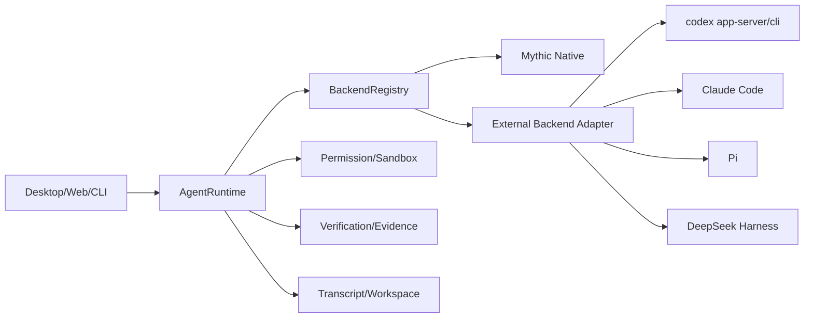
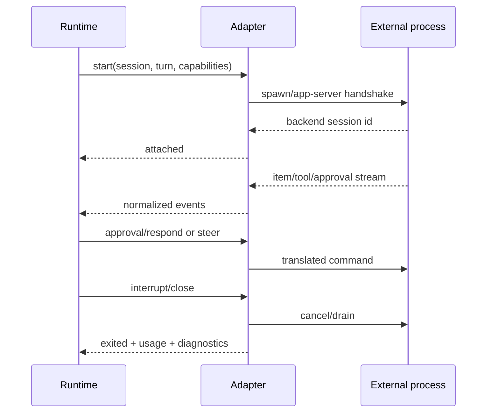

# Coding-first Agent Backend 规范

状态：v0.3-draft（规范合同；实现状态见 IMPLEMENTATION-MAP.md）  
范围：native runtime、Codex、Claude、Pi、DeepSeek Harness 及其他可插拔 Agent

## 设计结论

不把 `zcode-cli` 直接替换成 `codex-cli`，也不把每个外部 CLI 伪装成 `ModelProvider`。模型提供商只负责生成消息；coding Agent 还拥有工具循环、权限、sandbox、文件变更、验证和恢复语义。应新增 `AgentBackend` 层，并让 native runtime 与外部进程通过同一个 session/turn/item 协议接入。

推荐拓扑：



Runtime 是唯一 session owner。backend 不能自行写 transcript、绕过 PermissionService 或直接获得 workspace 永久写权限。

## Backend 合约

```ts
interface AgentBackend {
  id: string;
  version: string;
  handshake(input: BackendHandshakeInput): Promise<BackendHandshakeResult>;
  start(input: BackendStart): Promise<BackendHandle>;
  resume(input: BackendResume): Promise<BackendHandle | Unsupported>;
  steer(handle: BackendHandle, input: BackendSteer): Promise<void | Unsupported>;
  interrupt(handle: BackendHandle, input: BackendInterrupt): Promise<void | Unsupported>;
  respondApproval(handle: BackendHandle, input: ApprovalResponse): Promise<void | Unsupported>;
  close(handle: BackendHandle, input: BackendClose): Promise<void>;
}

interface BackendHandshakeInput {
  runtimeSessionId: string;
  runtimeProtocolVersion: string;
  requestedCapabilitySchemaVersion: string;
  requestedCapabilities: string[];
  providerToolSurface: "mythic-proxy-only" | "provider-native" | "mixed";
  workspaceIdentity: string;
  workspacePath: string;
  mode: "hosted" | "delegated";
  requestedScope: "explore" | "review" | "implement";
  ownerFencingToken?: string;
  sandboxRef?: string;
  worktreeHandle?: string;
}

interface BackendHandshakeResult {
  backendProtocolVersion: string;
  capabilitySchemaVersion: string;
  capabilities: BackendCapabilities;
  supportedScopes: string[];
  constraints: CapabilityConstraints;
  executionMode: "hosted" | "delegated";
  ownerFencingToken?: string;
  sandboxRef?: string;
  worktreeHandle?: string;
  unsupported?: Array<{ capability: string; reason: string; retryable: boolean }>;
  expiresAt?: string;
}
```

`BackendHandle` 不把 provider 私有句柄当作产品事实，但必须暴露受控 control plane（runtime correlation、capability、executionMode、processState、events、drain、reconcile）；所有输出仍转换为统一 item/event。

实现接口还必须提供有序事件流、健康状态和关闭排空语义：

```ts
interface BackendHandle {
  backendSessionId: string;
  runtimeSessionId: string;
  executionMode: "hosted" | "delegated";
  parentSessionId?: string;
  worktreeHandle?: string;
  sandboxRef?: string;
  ownerFencingToken?: string;
  capabilities: BackendCapabilities;
  processState: "starting" | "attached" | "running" | "draining" | "exited" | "lost";
  events(): AsyncIterable<BackendItemEvent>;
  health(): Promise<"ready" | "busy" | "degraded" | "lost">;
  drain(input: { deadlineMs: number }): Promise<"drained" | "timed_out" | "unknown">;
  reconcileWorkspace(input: {
    workspaceIdentity: string;
    workspaceRevision: string;
    gitRevision?: string;
  }): Promise<void>;
}

interface BackendStart {
  executionMode: "hosted" | "delegated";
  runtimeSessionId: string;
  runtimeTurnId: string;
  workspaceIdentity: string;
  workspacePath: string;
  workspaceRevision: string;
  logRevision: number;
  gitRevision?: string;
  ownerFencingToken?: string;
  worktreeHandle?: string;
  providerToolSurface: "mythic-proxy-only" | "provider-native" | "mixed";
}

interface BackendItemEvent {
  runtimeSessionId: string;
  runtimeTurnId: string;
  backendSessionId: string;
  providerItemRef?: string;
  providerSequence?: number;
  itemId: string;
  lifecycle: "started" | "updated" | "completed" | "failed";
  scope: "session" | "workspace";
  kind: string;
  payload: unknown;
  logRevision?: number;
  workspaceRevision?: string;
  gitRevision?: string;
  sideEffectState: "none" | "known" | "unknown";
  artifactRefs?: string[];
}
```

adapter 必须处理 stdout JSONL 的非法行、EOF、stderr、超时、restart、kill tree、provider session id 变化和 workspaceRevision reconcile；非法输出只能成为诊断 artifact，不能被解析成成功 item。`close` 先进入 drain，停止接受新请求，等待已取得的 control token 后再终止进程。

## Capability registry

Capability 不再使用一组无约束 boolean。adapter handshake 必须返回版本化、带作用域和限制的合同：

```ts
interface BackendCapabilities {
  schemaVersion: string;
  streaming: { level: "none" | "delta" | "item"; ordered: boolean };
  toolSurface: {
    read: boolean;
    edit: boolean;
    applyPatch: boolean;
    exec: boolean;
    persistentTerminal: boolean;
    git: boolean;
    diagnostics: boolean;
    testDiscovery: boolean;
    via: "mythic-proxy" | "provider-native" | "mixed";
  };
  interrupt: { level: "none" | "turn" | "process-tree"; abortResult: "known" | "unknown" };
  resume: { level: "none" | "turn" | "session" | "replay"; providerSessionStable: boolean };
  steer: { level: "none" | "queued" | "active-turn" | "tool-active" };
  queue: { level: "none" | "turn" | "session" };
  compact: { level: "none" | "provider" | "host" };
  fork: { level: "none" | "session" | "worktree" };
  approval: { level: "none" | "allow-deny" | "allow-deny-modify"; durablePending: boolean };
  sandbox: {
    level: "none" | "process" | "process-fs" | "process-fs-network";
    enforcedBy: "provider" | "mythic-executor" | "fs-proxy";
  };
  fileChanges: { level: "none" | "watcher" | "structured"; hasPreWriteFence: boolean };
  evidence: { level: "none" | "artifacts" | "structured"; artifactTypes: string[] };
  childAgents: { level: "none" | "opaque" | "structured" };
  worktree: { level: "none" | "isolated" | "isolated-and-lease-fenced" };
  usage: { level: "none" | "estimated" | "provider-reported" };
  constraints: string[];
}
```

interface CapabilityConstraints {
scopes: string[];
maxConcurrentTurns?: number;
maxOutputBytes?: number;
approvalTtlMs?: number;
allowedPaths?: string[];
network: "none" | "allowlist" | "unrestricted";
secretPolicy: "none" | "redacted-env" | "provider-managed";
expiresAt?: string;
}

每次 handshake 还要返回 `backendProtocolVersion`、`capabilitySchemaVersion`、backend version、supported scopes 和 expiry。未知或过期能力按 `unsupported {capability, operation, constraint}` 处理；adapter 不得静态声明 true 后在边界场景失败。

`AgentBackend` 的每个操作都带 `sessionId`、`turnId`、`commandId`、`idempotencyKey`、`workspaceIdentity`、`workspaceRevision` 和 owner fencing token。`BackendItemEvent` 必须包含 provider session/item ref、provider sequence、runtime correlation、item lifecycle、side-effect state、workspaceRevision 和 raw artifact ref。`resume`、`approval` 和 `interrupt` 的结果必须明确 `known` 或 `unknown`，不能由缺失事件推断成功。

### Operation envelope 与 lifecycle event

所有 backend operation 共享 envelope：`runtimeSessionId`、`runtimeTurnId`、`commandId`、`idempotencyKey`、`workspaceIdentity`、`logRevision`、`workspaceRevision`、可选 `gitRevision`、owner fencing token 和 traceId。`BackendResume`、`BackendSteer`、`BackendInterrupt`、`ApprovalResponse` 和 `Unsupported` 必须基于该 envelope 定义，unsupported/error 返回 operation、capability、reason、retryable 和 sideEffectState。

Backend lifecycle 与 item lifecycle 分开：`BackendLifecycleEvent` 的 kind 为 `handshake|started|capabilities|unsupported|draining|exited|lost|error`，并带 processState、providerSessionId、exit/signal、rawArtifactRef 和 sideEffectState。`BackendItemEvent` 的 workspaceRevision/logRevision/gitRevision 在 workspace-scoped item 中必填；非 workspace item 明确写 `scope="session"`，不能把缺字段当作未知成功。

Hosted implement 只有在 providerToolSurface=mythic-proxy-only 或 provider-native 的每个写入/执行工具都被 executor fence 包裹时才允许；provider 自带文件工具若无法代理或事前隔离，handshake 必须拒绝 implement，降级为 read-only 或 delegated worktree/FS proxy。事件转换和 diff watcher 不能拦截 provider 直接写盘。

## 外部 CLI adapter 生命周期



进程退出、协议版本不兼容、JSONL 无法解析、超时和工作目录丢失都必须转成明确的 backend error，并保留退出码、stderr 摘要和最后 sequence。adapter 重连时要先进行握手和 capability 协商，不能直接复用旧句柄。

## 各 backend 的接入策略

- **Mythic native**：默认 backend，直接使用 `AgentRuntime` 的 turn loop、PermissionService、ExecutionPort 和 VerificationService；能力最完整。
- **Codex**：优先使用稳定的 app-server/JSONL 协议；若仅有 CLI exec，则只能作为一次性子任务 backend，不能宣称支持 resume、steer、approval bridge。Codex sandbox 与 Mythic workspace lease 需要双向映射。
- **Claude Code**：通过其可脚本化接口或受控进程协议接入。将 tool call、permission prompt、file change 和终端输出转换为统一 item；无法获得结构化 evidence 时，只有在 executor/worktree/FS proxy 已事前 fence 且 diff/revision 可确认时，Mythic VerificationService 才能重新执行命令；否则直接 `unverified`/`unsupported`。
- **Pi**：以可组合 CLI/库接口接入，先支持 explore/review 只读 profile，再开放写入。只有 runtime executor/FS proxy 已提供事前 fence 且 approval 可桥接时才能开放写入；否则仅 explore/review，implement 返回 `unsupported`。
- **DeepSeek Harness**：可以复用 subagent adapter 思路，但 adapter 只负责启动、通信和能力映射；父子生命周期、workspace ownership、证据门禁仍由 Mythic runtime 所有。

## 失败与降级

| 情形                             | 处理                                                                                                      |
| -------------------------------- | --------------------------------------------------------------------------------------------------------- |
| backend 不支持 steer             | 返回 `unsupported`，保留当前 turn，要求新 turn 或 native fallback                                         |
| backend 不支持 resume            | checkpoint 标记 `backend_non_resumable`，允许从摘要新建 turn，不伪造原 turn 恢复                          |
| backend 不支持 approval          | 无 pre-write worktree/FS proxy fence 时 implement 启动前直接 `unsupported`；已有 fence 时才可阻塞等待用户 |
| backend 无结构化文件变更         | 仅允许有事前 fence 的 worktree/FS proxy；watcher 只做事后诊断，扫描失败为 `unverified`                    |
| backend 进程崩溃                 | 记录最后事件和 stderr，turn 进入 `resumable` 或 `failed`，由策略决定是否重启                              |
| 外部 Agent 请求 workspace 外写入 | runtime 重新做 path policy 与 approval，adapter 不得绕过                                                  |

## 安全与兼容边界

外部 Agent 默认运行在 runtime 分配的 cwd、环境变量白名单和 sandbox profile 中。凭据不通过 prompt 传递；adapter 日志不得记录 token、API key 和完整用户文件内容。协议版本通过 `backendProtocolVersion` 和 `schemaVersion` 协商，旧版本只可使用其能力交集。

## Adapter 具体落地顺序

| backend          | 第一接入面                                                                      | 第一阶段允许                                      | 暂不承诺                                                                                 |
| ---------------- | ------------------------------------------------------------------------------- | ------------------------------------------------- | ---------------------------------------------------------------------------------------- |
| Codex            | `codex app-server --stdio` 的 JSON-RPC/typed event；`codex exec` 仅作一次性调用 | explore、review、结构化 stream                    | 不把 `codex exec` 包装成可 resume 主 session；Codex sandbox 与 Mythic lease 必须显式映射 |
| Claude           | 官方可脚本化 Agent SDK（若当前安装和版本提供）或受控 CLI 进程                   | explore、review；捕获 permission/tool/output 事件 | 未确认协议前不假设 stream、resume、approval bridge 或 file-change schema                 |
| Pi               | 稳定的 stdio/库扩展接口                                                         | explore、review                                   | 未具备 worktree、approval、structured evidence 前不开 implement                          |
| DeepSeek Harness | 其 subagent/adapter transport                                                   | 作为外部 child 的 explore/review                  | 不把 adapter 的 transport 当作 Mythic session、workspace 或验证 owner                    |

每个 adapter 需要单独的 contract fixture：启动握手、能力协商、正常 item stream、schema 错误、stderr/exit、interrupt、approval（若支持）、resume（若支持）、workspace 变化和进程树清理。fixture 只验证 adapter 合同，不复制外部 Agent 的全部测试矩阵。

## 主 session 与 child 的放行规则

外部 backend 默认作为 child。只有同时满足以下条件，才可以被选为主 session：

1. runtime 能获得稳定 session id 和 ordered event stream；
2. turn admission、interrupt、resume/reconnect 和 compact 语义有可证明映射；
3. 所有写入和命令请求可经过 Mythic permission/sandbox 或有明确的 native provenance；
4. verification evidence 可绑定到当前 workspaceRevision；
5. protocol projection、remote replay 和 benchmark 与 native 语义一致。

缺少任一项时，backend 只能作为 explore/review/建议型 implement child，不能成为 Desktop 主 session 的隐含替代。

## 验收

必须用同一仓库、同一 workspace identity 和同一任务跑 native/Codex/Claude/Pi/DeepSeek，比较首次有效修改、验证通过率、恢复成功率、无效工具调用、权限违规和成本。单独“模型回答看起来正确”不能证明 backend 接入完成。

## 规范补充：BackendHandle 和进程边界

`BackendHandle` 不把 provider 私有句柄当作产品事实，但必须暴露受控 control plane（runtime correlation、capability、executionMode、processState、events、drain、reconcile）；所有输出仍转换为统一 item/event。

外部 adapter 默认不直接写 parent transcript。external implement 只能在 executor-enforced worktree 或 FS proxy 中写入；FileRevision/diff watcher 仅用于事后发现绕过并生成 permission_violation，不能补做事前 permission/CAS。adapter 只声明能力，不得绕过 Mythic 的 workspace owner、approval 或 sandbox。

Queue、compact、fork 和 shutdown 的 admission 始终由 Mythic Runtime/CommandInbox 所有；backend capability 只表示 provider 是否能协同执行。没有对应 provider 能力时，Runtime 仍可用 host compact/queue/fork，或返回结构化 unsupported，不能让 adapter 自行创建第二个 session owner。

## 外部写入边界与 Hosted/Delegated 模式

external backend 分为两种模式：

- **HostedBackend**：provider session 只是 execution context；Mythic Runtime 仍拥有 canonical session、turn、transcript、approval、compact 和 verification。provider 的 prompt/tool/session 状态必须通过 adapter 事件重建，不能成为第二个事实源。
- **DelegatedSession**：外部 Agent 在独立 worktree 和受控 process sandbox 中拥有整 turn 控制权。Mythic 只持有 parent session、stdout/event artifact、workspace diff 和 evidence。provider 不可恢复时，UI 必须显示 opaque/non-resumable，并从摘要创建新的 Mythic turn；不能伪装成 HostedBackend。

external implement 只能使用独立 worktree，或把全部文件写入路由到 FS proxy/tool server。真实 sandbox、网络和 secret 环境由 executor 强制，不能依赖 prompt、watcher 或事后 diff。没有事前 write enforcement 的 backend 只能 explore/review；watcher 只用于发现绕过、生成 `permission_violation` 和阻断提交。

HostedBackend 的 provider session id、raw transcript、provider checkpoint 和 usage 是 artifact/执行上下文，Mythic 的 SessionEvent、workspaceRevision、approval decision 和 evidence 才是产品事实。reconcile 失败时状态为 `backend_lost` 或 `unknown`，需要新 turn 或用户决策。

Hosted mode 只能由 Runtime 创建 canonical session/turn；Delegated mode 必须带 parent session/graph edge、独立 worktree handle、process sandbox ref 和 opaque transcript artifact ref。mode 在一个 turn 内不可切换；若要从 delegated 结果继续 hosted，必须创建新的 turn，引用 diff/evidence artifact，并重新 handshake。

## 外部 backend 证据状态

Codex app-server、Claude SDK/CLI、Pi 和 DeepSeek Harness 的协议与 capability 不能从产品名称推断。当前文档只把它们列为 adapter 目标；在各自源码/运行时 handshake、版本、sandbox、resume、approval 和 file-change fixture 完成前，均标记为 proposed/blocked，尤其 DeepSeek Harness 仅作为 transport/subagent 适配假设，不视为已验证合同。
