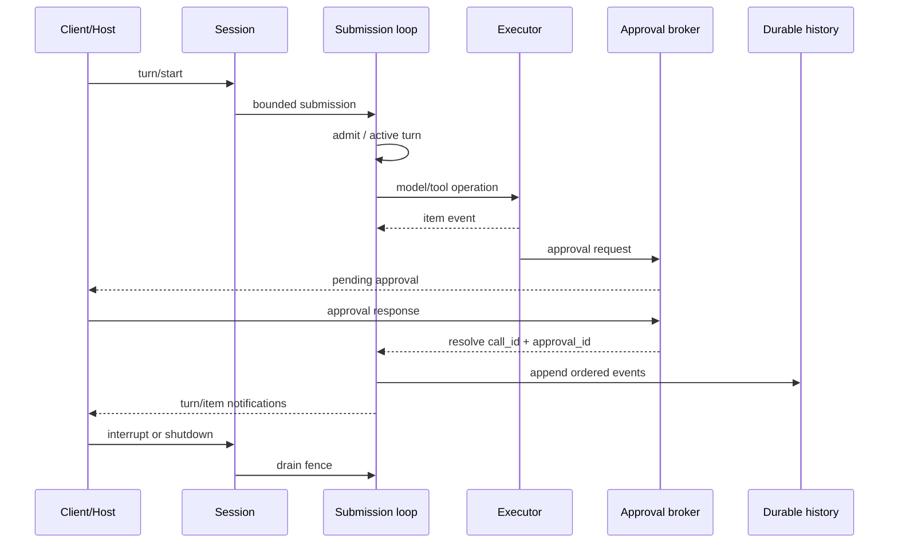

# Codex CLI 源码分析与 Mythic 映射

状态：规范草案 v0.3-draft（能力状态以 IMPLEMENTATION-MAP.md 为准）

分析对象：`F:/Project/codex/codex-rs`  
分析日期：2026-10-04  
目的：提取 coding-first Agent 的可迁移边界，不复制 Codex 的产品专属依赖。

## 1. 源码分层

| Codex 区域                                                                 | 事实职责                                                                                                                             | 对 Mythic 的启示                                                                                                       |
| -------------------------------------------------------------------------- | ------------------------------------------------------------------------------------------------------------------------------------ | ---------------------------------------------------------------------------------------------------------------------- |
| `core/src/session/session.rs`、`session/handlers.rs`                       | 一个 session 维护 state、active turn、input queue 和 services；submission loop 串行处理输入、interrupt、approval、settings、shutdown | Mythic 必须让 `AgentRuntime`/`CommandInbox` 成为 turn 和 transcript 的唯一所有者，不能让 UI、Host、adapter 各自跑 loop |
| `core/src/codex_thread.rs`                                                 | `CodexThread` 是 session、IO、持久化和 residency 的外壳；历史重建与 running-turn snapshot 分离                                       | Mythic 应将 durable transcript、active turn snapshot、Host attachment 分开，resume 不能依赖内存对象                    |
| `app-server/src/turn_admission.rs`                                         | 短锁原子地 admit turn 与 begin drain；permit drop 后 active 数量下降                                                                 | 关闭、重连和切换 owner 时需要 admission fence，防止新 turn 与 shutdown 竞态                                            |
| `app-server/src/request_serialization.rs`                                  | 按 Global/Thread/ThreadPath/Process/CommandExec/McpOauth 等资源 key 串行；SharedRead 可并行                                          | Mythic 应按 session/workspace/process key 做 FIFO exclusive，并允许明确的只读并行                                      |
| `app-server/src/thread_state.rs`、`request_processors/thread_lifecycle.rs` | server 保存 projection、listener generation、pending interrupt 和连接关系；Core 才是事实源；listener 可卸载/恢复                     | Host 需要可重建 projection、subscriber resume 和 stale listener 防护；Main 不保存任务业务状态                          |
| `core/src/exec.rs`                                                         | 负责 cwd、env、sandbox request、timeout、取消、进程组回收和 stdout/stderr 上限                                                       | 执行边界必须集中在 ExecutionPort；输出上限和取消不能散落在 prompt 或 UI                                                |
| `core/src/exec_policy.rs`、`execpolicy/`                                   | 规则决定 forbidden/prompt/allow；不与 sandbox materialization 混在一起                                                               | Mythic 分离 `ExecutionDecision`、`ApprovalPolicy` 和 `SandboxProfile`                                                  |
| `sandboxing/src/manager.rs`、`exec-server/src/sandbox_selection.rs`        | 根据权限 profile、文件根、网络和平台选择 sandbox；无法 enforce 时 fail closed                                                        | sandbox 在执行器落地，不能在 UI 拼 wrapper；不支持的远程能力必须明确失败                                               |
| `core/src/session` approval handlers                                       | pending approval 以 `call_id + approval_id` 关联 active turn；取消、断连和未知响应有明确处理                                         | Mythic 需要 durable pending request registry，审批回复必须幂等，未知回复不可重新执行命令                               |
| `core/src/compact.rs`、`compact_remote_v2.rs`                              | compact 前后有 hooks，替换 history 时保留初始 context、summary、metadata 和 window 信息                                              | compact 不是简单截断；必须保留目标、指令、changed files、验证失败、pending request 和事件锚点                          |
| `core/src/agent/api.rs`、`agent/registry.rs`                               | AgentControl、canonical AgentPath、parent ownership、spawn reservation、mailbox、interrupt、usage 和 shutdown                        | 子 Agent 需要图关系、admission、depth/max threads、QueueOnly/TriggerTurn 和失败清理，不只是启动一个进程                |
| `core/src/agent/control/residency.rs`、mailboxes                           | child 可卸载但保留未读 mailbox；只从 parent ownership 恢复；eviction 不影响 active turn                                              | 远程或内存压力下可卸载 child，但不能丢任务、越权恢复或重复触发 turn                                                    |
| `ext/agent/src/lib.rs`                                                     | 解析好的 prompt 在 parent thread fork 中启动，返回 thread/turn id；prompt discovery 与 runtime 启动分离                              | adapter 应区分“解析 invocation”和“启动 session”，并保留 parent trace、session source 和 child id                       |
| `app-server-protocol/src/protocol/v2`                                      | thread/start、turn/start、steer、interrupt、fork、resume、compact、approval、settings 是 typed protocol                              | Mythic 应 protocol-first；stable/experimental schema 生成，不能让每个 UI 手写事件解析                                  |
| `exec/src/exec_events.rs`、`event_mapping.rs`                              | JSONL 顶层事件为 thread/turn/item lifecycle，items typed（command、file change、MCP、agent message 等）                              | headless、Desktop、Web 共享同一 item 语义，工具结果不能只藏在日志文本里                                                |
| SDK `sdk/typescript`、`sdk/python`                                         | wrapper 使用 JSONL/app-server typed stream，区分 run、runStreamed、resume、approval handler                                          | Mythic 的 client 应围绕协议生成，保持 sync/async、stream/resume 和 capability version 一致                             |

## 2. 核心时序

Codex 的 session 运行可抽象为：

迁移到 Mythic 后，`Session` 对应 `AgentRuntime`，`Submission loop` 对应 `CommandInbox`/runtime queue，`Executor` 对应 `ExecutionPort` 和 file tools，`Durable history` 对应现有 session store。不能让外部 adapter 越过这些边界直接操作文件或持久化同一 transcript。

## 3. 可直接采用的原则

### 3.1 Core facts 与 projection 分离

Core 事件按 sequence 持久化；Host 订阅后生成窗口、远程和 UI projection。连接重建时从最后确认 sequence 继续，listener generation 防止旧连接把事件写回新 projection。`desktop-continuous` 可以保留实时流；`web-remote-replayable` 必须支持 snapshot + event queue 重放。

### 3.2 admission 和 drain 是同一个边界

`begin_drain` 与 `admit` 必须共享短临界区。进入 drain 后拒绝新 turn；已取得 permit 的请求仍可完成或被取消。这个语义应叠加在现有 owner/lease 和 CommandInbox 上，而不是用超时猜测“已经空闲”。

### 3.3 执行、策略、审批、sandbox 分层

Codex 的 `exec` 不决定 allow，`exec_policy` 不物化 sandbox，approval handler 不执行命令。Mythic 应保持同样的四层：

1. `ExecutionDecision`：当前调用是否 forbidden/allow/prompt。
2. `ApprovalPolicy`：用户、session grant、自动审查如何给 decision。
3. `SandboxProfile`：文件根、网络、平台 sandbox 如何 enforce。
4. `ExecutionPort`：真正启动、取消、超时、回收和采集 artifact。

### 3.4 child Agent 是有归属的 session

Codex child 有 canonical path、parent source、spawn reservation、mailbox 和 shutdown guard。Mythic 的 child 必须有 parent session、parent tool call、depth、并发上限、取消传播和可恢复状态；`accepted` 只能表示已接收，不能表示已经处理。

## 4. 不应直接照搬的内容

- Codex 的 OpenAI Responses API、ChatGPT 认证、云端 project/Guardian 和 Rust crate 组织不应成为 Mythic 的内部接口。
- `codex exec` 的无人值守默认审批策略不能作为 Desktop 默认；交互式 session 仍需要审批和 sandbox。
- Codex 的全部 app-server RPC 面不应一次复制；先冻结 Mythic 自己的最小 thread/turn/item/approval/capabilities 协议。
- 不把 Claude/Pi/DeepSeek 与 Codex 假设为相同的 tool schema、resume、steer 或 sandbox；所有差异必须在 capability contract 中显式表达。

## 5. 对现有 Mythic 计划的修正

| 现有计划                                                 | 源码对照后的调整                                                                                        |
| -------------------------------------------------------- | ------------------------------------------------------------------------------------------------------- |
| 把 coding phase 直接加进现有 `TurnMachine`               | 先作为 `CodingPhaseChanged` metadata 和 derived projection；等 replay/cold merge 稳定后再扩展基础状态机 |
| 用 `SubagentPort` 直接承载外部 Codex/Claude              | 新增 `AgentBackend` 与 process/session registry；`SubagentPort` 继续表示 native child runtime           |
| 通过 prompt 要求 agent 先读取 AGENTS                     | Context discovery 必须实现 scope、precedence、刷新和预算；prompt 只能解释结果                           |
| 把 `ApplyPatch`、`GitDiff`、`Diagnostics` 写入默认工具表 | 先实现真实 handler 和 protocol item，再加入注册 allowlist                                               |
| fail-open verifier 失败时继续把目标置 complete           | evidence gate 只能输出 `passed`、`failed`、`unverified`、`blocked`；模型没有直接 complete 权限          |
| `auto` 作为现成权限模式                                  | 当前 `auto` 明确未实现，先做 `build` 的有限策略并在 UI 标注可用范围                                     |

## 6. 结论

Codex CLI 的领先点首先来自运行时边界：单一 session loop、严谨的 admission、结构化 item/event、执行策略与 sandbox 分层、可恢复的 thread/subagent 图，而不是某个神奇 prompt。Mythic 已有不错的 runtime、远程和 workflow 基础，正确路线是补齐 coding-specific 的工具、上下文、证据和协议，再用适配器吸收外部 Agent 的长处。
