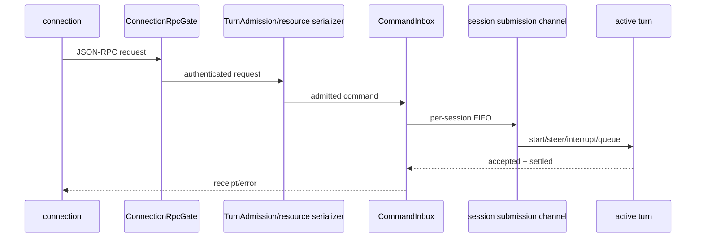

# Command admission 与请求串行化规范

状态：规范草案 v0.3-draft（能力状态以 IMPLEMENTATION-MAP.md 为准）

本文把 Mythic 当前 `CommandInbox` 语义与 Codex app-server 的 admission 层次拆开描述。文中带“现有实现”的字段必须保持兼容；带“拟议”的字段只能在新协议版本中增加，不能覆盖现有 `SessionEvent` 字段。

## 1. admission 顺序

一次输入必须按下面顺序进入执行。每一层都只能缩小可执行范围，不能绕过上一层：

`ConnectionRpcGate` 负责 initialize 前置条件、client capability、连接关闭和 shutdown drain。`TurnAdmission` 负责按 thread/session/resource key 串行化；session submission channel 负责单个 session 的顺序。`CommandInbox` 才是 Mythic 侧幂等、revision CAS 与 command 状态的事实源。任何 UI optimistic 状态都必须等待 `accepted` receipt 后再转换为事实。

## 2. CommandInbox 现有事实

每个 command 使用 `(sessionId, commandId)` 作为幂等键，并同时受到以下 gate 约束：

- per-command key gate：同一 key 的并发请求只允许一个 admission 结果；重复请求返回原 receipt，不重复执行。
- per-session FIFO gate：同一 session 的 accepted command 按 admission 顺序 settle；settle 后释放 gate，不能依赖超时释放。
- `baseLogRevision` 与 `baseLogEpoch` CAS：提交时验证 workspace/timeline 基线；过期请求返回 `stale` 或 `conflict`。
- `in-flight/live/settled` 三类事实：live input 必须 pin；settled 结果进入每 session 512 项幂等 LRU；清理 resident 时保留 pinned/durable facts。
- durable lookup：transcript、timeline、child、discarded 等 command 查询必须可重放；清理只允许移除未 pin 且可由 durable store 重建的事实。

建议保留当前状态名：`accepted`、`duplicate`、`stale`、`rejected`、`noop`、`failed`。`accepted` 只表示 admission 成功，不表示模型已经处理；tool 结果、turn 完成和 verification 仍必须通过事件流确认。

## 3. Codex 资源串行化映射

Codex 的 server-level `TurnAdmission` 与 `RequestSerializationQueues` 要映射为 Host admission，而不是塞进 renderer。资源 key 必须显式记录，例如：

| key                         | 典型请求                      | 规则                                                 |
| --------------------------- | ----------------------------- | ---------------------------------------------------- |
| `thread:<id>`               | start/steer/interrupt/compact | exclusive FIFO                                       |
| `workspace:<identity>`      | write/apply/merge             | exclusive；写入期间阻塞冲突 writer                   |
| `workspace:<identity>:read` | read/diagnostics/review       | 连续 shared read 可并发，遇到 writer 时停发新的 read |
| `connection:<id>`           | initialize/shutdown           | 每连接单独 gate                                      |

请求获取 permit 后才能启动 handler。连接关闭时丢弃尚未启动的 handler；已经启动的 handler 必须 drain/cancel 并等待最终状态。shutdown 必须等待已启动请求与 process group 完成，超时保留 `unknown/lost` 事实，不能伪造 completed。

## 4. 事件和查询

现有 canonical 事件使用 `SessionEvent.id`、`sessionId`、`turnId`、`type`、`timestamp`、`traceId`、`sequenceNumber`、`payload`。`eventId`、`sequence`、`schemaVersion` 如需加入 wire envelope，必须标为拟议扩展，并提供旧 `zcode-protocol-v4` 映射。协议 item 另有 `itemId`、`parentItemId`、`providerSequence`（拟议）和 `schemaVersion`（拟议）时，未知 item 必须保留为 opaque item，不能丢弃或改变原有 sequence。

查询接口应区分：

- `getCommand(commandId)`：返回 admission/settled receipt；
- `getTurn(turnId)`：返回 turn lifecycle 与 completion evidence；
- `replay(afterSequence)`：返回 durable 事件与仍在 retention 窗口内的 transient 事件；
- `snapshot()`：在 replay gap 或压缩后返回 projectionRevision、last sequence、pending interactions、active owner 与 workspaceRevision。

## 5. 验收

必须有 fixture 覆盖重复提交、两个 connection 同时提交同一 session、stale workspace/log revision、connection close、shutdown drain、writer/read 资源冲突、replay gap 与 512 项 LRU。测试应验证 command 不重复执行，不能仅验证 UI 收到一个事件。
