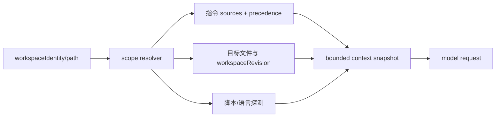
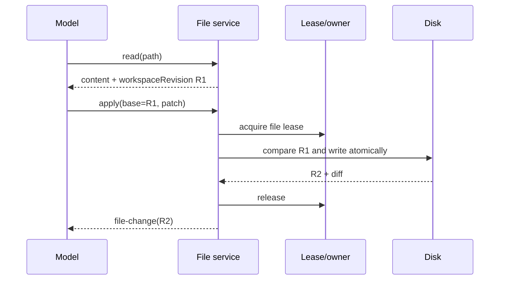

# Context Discovery 与 Editing 规范

状态：规范草案 v0.3-draft（能力状态以 IMPLEMENTATION-MAP.md 为准）

## 1. Context discovery

Context discovery 是 runtime 的可验证输入，不是 prompt 中的一句要求。每个 coding turn 开始时生成带 `workspaceIdentity`、`workspacePath`、`workspaceRevision`、`scope` 和 `truncated` 的 snapshot。

### 1.1 指令来源和优先级

对每个 target path，先按 root→nested 目录顺序收集 instruction source；跨层允许累积，越接近 target 的规则覆盖同一字段。每一层的同级选择顺序固定为 LOCAL_AGENTS.md → AGENTS.md → 已配置 fallback（CLAUDE.md、CODEX.md），同层只选第一个存在且通过 scope/ignore 校验的文件，不把同层多个文件拼接。imports 只能引用 target scope 内的文件并检测环；symlink 按 realpath 重新计算 scope；每次刷新记录 source、precedence、hash、scope 和 truncation provenance。系统/user instructions 永远高于项目指令，项目指令是 untrusted content，不能改变 permission、network、secret 或 verification gate。

### 1.2 目标作用域

如果 turn 修改多个目录，context builder 为每个 target path 建立 scope，并输出合并结果和冲突诊断。新文件、移动文件和删除文件的 scope 按操作前后路径分别计算。目录指令变更或外部 workspaceRevision 变化时，下一次写入前刷新受影响 scope，不能只复用 turn 开始的快照。

### 1.3 预算和敏感内容

Context snapshot 有文件数量、字节数和 token 预算；project docs 使用统一 `project_doc_max_bytes` 总预算。超预算时保留来源、优先级、哈希和截断原因并记录 warn，模型可以通过 Read 继续读取。凭据、私钥、`.env` 和用户标记的敏感文件默认只返回存在性和 metadata；工具显式读取时仍经过 permission policy。禁止把完整仓库或整个 git history 自动注入 prompt。

### 1.4 脚本和仓库事实

探测 package manager、语言/框架、monorepo package、测试/lint/typecheck/build 候选命令，并记录来源（package.json、mise、Makefile 等）。候选命令是建议，不是执行授权；真正执行仍经 Bash policy。探测失败要记录 `unverified`，不能让模型假设命令存在。

### 1.5 指令合并和注入防护

指令按 root→nested scope 累积，越接近 target 越具体；`LOCAL_AGENTS.md` 只作为同级 precedence 规则的一部分，imports、symlink、ignore、刷新和 provenance 必须记录。不能在每层只选一个文件后丢失父级安全约束。AGENTS、代码注释、tool output 和外部 Agent 文本一律视为 untrusted content；它们不能改变 system policy、permission、network、secret 或 verification gate。发现要求泄露凭据、跳过测试、关闭审批或伪造结果时，记录 `prompt_injection_detected` 并阻断相关 action。

## 2. Coding tool registration

工具能力必须在 registry 层 allowlist，在 turn 层再次按 profile/capability 过滤，并将最终可用工具集记录在 `tool.catalog` event。schema 顺序保持稳定，避免每个 provider 看到不同的隐含集合。

实现上应在 `registerBuiltInTools` 的 profile/options 层显式关闭 `includeWorkflow`、`includeAutomation`、`includeNodeRepl`、`includeBrowserUse`、`includeSkill`、`includeAgent` 等非 coding 能力；不能只在 system prompt 中说“不要使用”。`embeddedSearch` 与 `Glob/Grep` 的选择也必须记录在 tool catalog，避免同一 profile 在不同 host 得到不同 schema。

Phase 1 的 native coding MVP 必须提供可执行 handler、稳定 schema 和 protocol item：

| 工具                       | 权限                   | 必须语义                                                                 |
| -------------------------- | ---------------------- | ------------------------------------------------------------------------ |
| Read                       | 只读                   | 规范化 path、显式 workspaceRevision、范围和截断信息                      |
| Glob/Grep                  | 只读                   | pattern、scope、匹配摘要、预算和 provenance                              |
| Edit/Write                 | workspace write        | 调用 payload 显式带 base workspaceRevision；服务端 CAS                   |
| ApplyPatch                 | workspace write        | 多 hunk、add/update/delete/move、atomic journal、结构化诊断              |
| Bash/Terminal              | execution policy       | 持久进程、stdin、分页/续读、timeout、process tree、编码、artifact cursor |
| GitStatus/GitDiff          | workspace read         | dirty baseline、rename、submodule、外部修改和结构化 diff                 |
| Diagnostics                | workspace read/execute | compiler/linter/test diagnostics，path/line/column、source 和 severity   |
| TestDiscovery/TargetedTest | execution policy       | 从 package/build metadata 发现测试，记录选择理由和命令 provenance        |

未实现的 handler 不进入 tool catalog，也不能被 prompt 假设存在。

## 3. FileRevision 和写入边界

每个读写结果带 `FileRevision`（内容 hash、mtime/size、可选 git blob/working tree marker）。`Edit`、`Write`、`ApplyPatch` 都要求调用方提交 baseWorkspaceRevision；服务端在同一 atomic boundary 内重新读取、比较、写入和生成 diff。

外部修改、symlink/realpath 变化、owner 丢失、文件类型变化或 patch hunk 不匹配时返回 `stale_revision`/`conflict`，不自动覆盖，也不重复执行同一 tool call。用户确认后由模型重新 Read 并生成新 patch。

## 3.1 FileRevision 与 workspaceRevision 粒度

`FileRevision.id` 是单文件内容/metadata revision；`workspaceRevision` 是一次 commit journal 完成后由 changed-file revision 集合计算出的 aggregate hash；`logRevision` 是 CommandInbox 的数字序号；`gitRevision` 是 Git tree/base marker。多文件 ApplyPatch 必须先逐文件 CAS，再在 journal committed 后生成新的 aggregate workspaceRevision。pre-commit hunk 失败不产生 file/change；commit 中崩溃产生 durable recovery event，before/after 不确定的文件标记 `sideEffectState=unknown`，并关联 journal/artifact，replay 只能恢复 unknown，不能伪造 after revision。

## 4. ApplyPatch 设计

现有 `contracts/src/tools/apply-patch.ts` 只定义 schema。实现阶段必须新增独立 handler，不能继续通过 `core/src/tool/compat.ts` 把 ApplyPatch 静默降级成 Edit/Write。

handler 要求：

- 解析多文件 add/update/delete/move，拒绝空 patch、未知指令和路径越界。
- 预解析全部 hunk 并取得每个目标文件 FileRevision.id；任一 hunk 失败时整个 patch 不写入。
- 成功时一次性提交所有文件并返回 per-file structured patch、additions/deletions、newFileRevision.id 以及 aggregate workspaceRevision 和摘要。
- 失败时返回稳定 error code（invalid、file missing/existing、hunk not found、conflict、permission、IO），不返回“部分成功”。
- 事件流只在 atomic commit 后发布 file-change；失败只发布 tool error 和诊断。

## 4.1 Multi-file commit recovery

跨文件系统写入不宣称天然原子。ApplyPatch 使用 staged temporary files、commit journal 和 fsync：先校验全部 baseWorkspaceRevision，再写临时文件和 journal，按顺序替换并记录每个文件状态。进程崩溃后由 recovery worker 根据 journal 完成提交或回滚；无法判定时返回 `partial_unknown`，冻结相关 lease 并要求人工决策。成功、回滚和未知都要有 per-file revision/diff artifact，E6 不得把“无半写”当成无条件事实。

Edit、Write、ApplyPatch 必须在 tool payload 中显式携带 `baseWorkspaceRevision` 或 `readStateRef`；隐式使用最近一次 Read 不构成可重放 CAS 合同。FileRevision.id、CommandInbox 的 `LogRevision` 和 Git tree revision 必须分开命名。

## 4.2 ApplyPatch schema migration

当前 contracts 的 ApplyPatch 仅有 patch_text，不能直接支撑 parity 合同。Phase 0 必须新增版本化 input/output/error schema：input 带 baseWorkspaceRevision/readStateRef、目标 scope 和 patch text；output 返回 per-file old/new FileRevision.id 和 aggregate workspaceRevision、operation、diffRef、commitJournalRef；error 至少覆盖 invalid、missing、existing、hunk_not_found、conflict、permission、io、partial_unknown。delete/remove/move 也必须携带 expected per-file revision，不能用无 CAS 的 removeFile 绕过 fence；多文件事务接口必须支持 staging/journal/recovery。旧客户端只能走兼容 normalizer，不能把 schema-only 当作 handler 已实现。

## 5. 路径作用域

`workspacePath` 用于 cwd、Git 和展示；`workspaceIdentity` 用于归属和隔离。文件服务对以下范围分别判定：workspace root、显式 extra roots、用户指定 sibling repo、workspace 外路径、远程路径。每种操作（read/write/execute）都有独立 policy；当前 `path-policy.ts` 对 workspaceRoot 外路径不硬阻止的行为必须在 permission-sandbox 阶段改为显式 allow/ask/deny，而不是继续隐含放行。

路径决策需要处理 realpath、符号链接、大小写敏感差异、远程 workspace 映射和 Bash cwd。未能可靠解析路径时 fail closed 并要求用户确认。

## 5.1 Terminal 命令的文件副作用

Terminal/Bash 不是天然只读工具。coding profile 的 executor 优先在 FS proxy 或 sandbox-enforced worktree 中运行，并为每个 command 记录 preWorkspaceRevision、postWorkspaceRevision、changed-file journal、cwd、argv、fencing token 和 sideEffectState。若平台只能提供 pre/post snapshot 而不能事前拦截写入，命令必须标记为 unbounded-write：执行前取得 snapshot，执行后做 diff/revision reconcile；出现外部变化、进程崩溃或无法判定时产生 file-change/recovery artifact 和 `unknown`，不能把命令结果当作 CAS 成功，也不能让 external implement 进入主 session。

## 6. 验收

- 首次修改能显示指令来源、作用域和冲突；目标文件在嵌套目录时加载最近有效指令。
- ApplyPatch 在 pre-commit 的 hunk 定位失败时磁盘无部分写入；若进程在 commit journal 执行中崩溃，结果可以是 partial_unknown，相关 lease 冻结并等待恢复/人工决策。成功时所有 per-file revision 和 diff 可回放。
- 外部编辑后提交旧 revision 被拒绝，模型重新读取后可继续。
- coding profile 注册的工具与实际 handler 一一对应；不存在的 GitDiff/Diagnostics 不出现在 schema。
