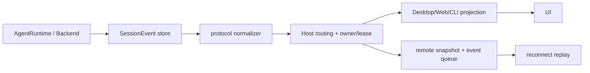

# Protocol、Projection 与 Remote 规范

状态：规范草案 v0.3-draft（能力状态以 IMPLEMENTATION-MAP.md 为准）

## 1. Protocol-first

Desktop、Web、CLI、headless exec 和 backend adapter 都通过同一协议访问 runtime。实现顺序为 contract/schema → event reducer → Host routing → UI projection；不能先在某个 UI 中添加私有状态再补协议。

以下名称是目标 canonical contract 的语义名称；实现时必须映射到当前 `zcode-protocol-v4` 的实际 command/method 名称，不能因为示例使用斜杠就直接破坏现有 wire compatibility。

建立连接先执行 initialize handshake：client name/version、workspace identity、支持的 stable/experimental features、MCP/raw event 选项、schema/wire version 和 capabilities。服务端返回能力交集；未知 feature 不得静默启用。

协议至少包含：

| 类别           | 请求/事件                                                                                           |
| -------------- | --------------------------------------------------------------------------------------------------- |
| lifecycle      | `initialize`、`capabilities`、`shutdown`                                                            |
| session/thread | `session/start`、`session/resume`、`session/fork`、`session/compact`（唯一 wire operation）         |
| turn           | `turn/start`、`turn/steer`、`turn/interrupt`、`turn/queue`                                          |
| approval       | `approval/requested`、`approval/responded`、`approval/expired`（统一 `approvalId`）                 |
| item           | message、reasoning summary、command execution、file change、verification、agent message、diagnostic |
| backend        | started、capabilities、stream、unsupported、exited、lost                                            |
| projection     | snapshot、event batch、ack、replay gap、stale owner                                                 |

JSON-RPC error taxonomy 至少区分 `invalid_params`、`unauthorized`、`stale_owner`、`busy`、`unsupported`、`conflict`、`backend_lost` 和 `internal`；客户端只能按 error code 选择重试、询问用户或降级。

现有 `SessionEvent` 的稳定字段是 `id`、`sessionId`、`turnId?`、`type`、`timestamp`、`traceId`、`sequenceNumber`、`payload`；normalized protocol 可以提供 `eventId`/`sequence` 便于跨 backend 对齐，但必须可逆映射回 canonical event。额外的 `workspaceIdentity`、可选 `remoteSessionId` 和 schema version 由协议 envelope 携带。TypeScript 类型和 JSON schema 从单一来源生成，避免 Desktop/Web/SDK 各自手写解析。

Canonical item 至少覆盖 `agent_message`、`reasoning_summary`、`command_execution`、`file_change`、`verification`、`mcp_tool_call`、`todo/plan` 和 `error`，每个 item 有 `started/updated/completed|failed|cancelled|unknown` 生命周期；`unknown` 用于进程崩溃、partial_unknown、backend_lost 或外部副作用无法判定，必须携带 sideEffectState 和 artifact ref。命令 stdout/stderr 和流式 delta 是 item update，不是 UI 私有日志。一个 command/file/permissions item 可以产生多个 server request；`itemId` 与 `approvalId` 必须分开，统一进入 PendingInteraction registry。

## 1.1 Operation 与 item 映射

runtime 旧入口 turn/resume、turn/fork、turn/compact 只能作为兼容别名，在 protocol adapter 归一化为 session operation；旧 requestId 归一化为 approvalId。canonical item 的生命周期由 stable itemId 和 started/updated/completed 组成，映射到现有 SessionEventType；未知 item 保留 opaque artifact，不改变 turn 状态。Host/relay 只缓存 transport snapshot，不拥有业务事实。

## 2. Core event 与 projection



Core 事件是唯一事实源。Host 可保存连接、attachment、last acknowledged `sequenceNumber` 和 listener generation，但不得保存 task queue、transcript、verification 或 workspace diff。projection reducer 必须幂等；重复 canonical `id` 不重复写入。

事件存储区分 durable 与 transient：模型 streaming、tool progress 等高频 transient event 可以按 retention 淘汰，但必须保留 cold merge 水位和最终 item/turn 结果；approval、file change、verification、turn lifecycle 和 error 属于 durable。重连遇到水位 gap 时请求 snapshot，而不是假设缺失 delta 可补算。

连接 gate 关闭后只阻止尚未开始的 handler；已经取得 token 的 handler 按 drain/cancel 语义完成。listener replacement 必须等待旧 listener 的 shutdown/complete，使用 generation 防止旧 worker 把事件投影到新 attachment。

新增 coding phase、backend lifecycle、evidence 和 file-change 事件时，必须同步：

- `packages/shared/src/zcode-protocol/index.ts` 及协议运行时校验；
- `apps/zcode-cli/packages/contracts/src/events/session.events.ts`；
- `bootstrap/src/zcode-protocol-v4` 的 event normalizer、cold event merge、product projection 和 replay；
- Desktop/Web 的 snapshot、stream、queue、reconnect reducer；
- headless JSONL/SDK schema。

## 2.1 Admission 顺序与去重

固定顺序为 connection/auth gate → CommandInbox key gate（先查同一 commandId 的 in-flight/settled receipt）→ owner/lease 与 base CAS 校验 → resource serializer permit → per-session submission channel → handler/active turn。重复命令在 key gate 返回原 receipt，不占用资源；stale/rejected 在 CAS/owner gate 终止并按 CommandInbox 的 remember 语义返回，不进入 submission channel。关闭和 shutdown 只阻止尚未取得 permit 的命令，已 accepted 的 handler 继续 drain/cancel。

## 3. Workspace identity 与 owner

所有请求都传递 `workspaceIdentity` 和 `workspacePath`：

```ts
const identity = workspaceIdentity?.trim() || workspacePath;
```

identity 用于去重、绑定、缓存、队列、持久化和请求关联；path 仅用于文件操作、cwd、Git 和展示。远程请求额外传 `remoteSessionId`，不能仅按路径路由。

Host owner/lease 决定哪个 window/attachment 可以提交 accepted input；runtime CommandInbox 决定 accepted input 的串行执行。stale run 通过 run/session/owner generation 拒绝，不能仅看连接是否在线。

`CommandInbox` 的 idempotency/query 语义属于 protocol contract：key gate 与 per-session gate、in-flight/live input pin、settled 512 项 LRU、baseLogRevision/baseLogEpoch CAS；workspace 写入使用 baseWorkspaceRevision、transcript/timeline/child/discarded durable lookup 和 clearSession 的 pinned 检查都必须在 replay/断线测试中保持一致。

## 4. Desktop 与 Web remote 语义

### 4.1 desktop-continuous

桌面窗口有连续 Host attachment，可以接收实时 item stream；断开后若 session 仍 active，Host 继续运行，重新连接以 last sequence 补发。UI 的 optimistic input 只在 accepted event 后转为事实。

### 4.2 web-remote-replayable

手机/远程连接使用 snapshot + event queue。relay 只负责鉴权、配对、心跳、转发和 attachment 调度，不保存任务业务状态。重连先校验 `workspaceIdentity + remoteSessionId + owner/lease`，再从 workspaceRevision/last sequence replay；出现 gap 时重新请求 snapshot。

### 4.3 连接关闭

On connection close: discard requests before admission; drain or cancel started handlers. Resolve pending approval by capability and policy; default is safe Abort. A resumable approval requires durable expiry and owner re-claim after reconnect; never auto-allow.

## 5. Headless 与 SDK

headless CLI 使用稳定 JSONL item/event，不另建简化事实模型。至少输出 thread/session started、turn started、item started/updated/completed、turn completed/failed、error，并保留 file-change、command、verification 和 backend events。`exec` 一次性模式可以不提供 resume，但要明确声明 capability。

## 6. 验收

- Desktop、Web、CLI 对同一 event stream 得到相同 session/turn/file-change/verification 状态。
- 断线重连不会重复执行 tool call，projection 能从 sequence 或 snapshot+queue 恢复。
- stale owner、workspaceIdentity 不匹配和 replay gap 都以结构化错误返回。
- 新事件未同步到 cold merge/projection 时，架构检查和 contract test 阻止发布。

## 规范补充：字段、事件和断线语义

`SessionEvent` 的现有 canonical 字段为 `id`、`sessionId`、`turnId`、`type`、`timestamp`、`traceId`、`sequenceNumber`、`payload`。`eventId`、`sequence`、`schemaVersion` 只能作为拟议 wire envelope 扩展，并且必须提供到现有字段的映射。Canonical item 由 `SessionEventType` 驱动，首版支持的 item 需要建立显式映射表；未知 item 保留为 opaque/raw artifact，不能丢失 sequence 或改变 turn 状态。每个 item 应带稳定 `itemId`，可选 `parentItemId`、`approvalId` 和 provider sequence，不能重复列出同一 item 类型。

On connection close: discard requests before admission; drain or cancel started handlers. Resolve pending approval by capability and policy; default is safe Abort. A resumable approval requires durable expiry and owner re-claim after reconnect; never auto-allow.

app-server admission 应保持 connection gate → CommandInbox key/owner/CAS gate → resource serializer → session submission channel → active turn 的顺序。资源 serializer 支持 exclusive FIFO 与连续 shared-read 批量并发；不同资源 key 可以并行。当前实现中的 512 是每 session settled idempotency LRU 的容量，不是 submission queue。submission channel 和 event buffer 必须分别定义容量、背压和 overflow 语义，不能把幂等表容量当作队列容量。

## 规范补充：sequence 的三种语义

现有实现中 `createSessionEvent` 默认 `sequenceNumber=0`；live sink 可以先发送 0，写入 event store 时才替换为 `latest+1`。部分 subagent mirror/live-only 事件可能永不入 store 并保持 0；v4 bridge/cold merge 会按 source sequence 排序并重新编号。因此协议必须区分 live sequence、persisted sequence 与 transport cursor/watermark。只有 persisted 事件保证可 replay；live-only 事件必须标注不可回放，replay gap 时由 snapshot/cold merge 补足，不能要求所有 live event 都有稳定持久 sequence。
