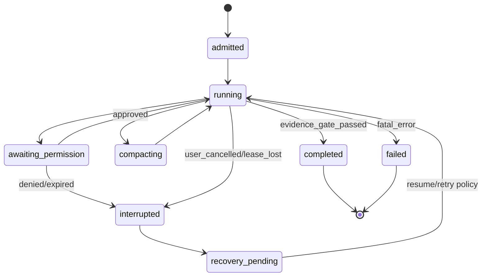

# Coding-first Runtime 运行时规范

状态：v0.3-draft（canonical runtime 语义；实现状态见 IMPLEMENTATION-MAP.md）  
范围：`apps/zcode-cli/packages/core`、`contracts`、`adapters`、Host 与 session store

## 目标

运行时必须让一个编码任务在长时间运行、工具失败、进程重启、远程断线和模型切换后仍可恢复。`AgentRuntime` 是 session、turn、工具调用和事件的唯一事实来源；Desktop、Web、CLI、远程 Host 和外部 Agent adapter 只提交命令并投影事件。Host 层 `CommandInbox` 负责 owner/lease、幂等和 admission，runtime 内部 queue 负责 active turn 和工具调度，两者是相邻边界而不是重复事实源。

当前 `TurnMachine` 只有输入处理、等待模型、流式输出、调度/执行工具、等待权限、聚合结果、完成/错误等阶段。`discovering`、`planning`、`editing`、`validating`、`reviewing` 只能先作为 coding profile 的派生 metadata，不能在没有事件和持久化定义的情况下宣称为新的持久化状态。

## 运行时所有权

| 事实                             | 唯一所有者                                                    | 其他层的职责                                                                   |
| -------------------------------- | ------------------------------------------------------------- | ------------------------------------------------------------------------------ |
| session、turn、tool admission    | Host `CommandInbox`（接收/幂等）+ `AgentRuntime`（执行/终态） | 提交命令、订阅事件                                                             |
| transcript、sequence、checkpoint | session store/runtime                                         | 读取、分页、恢复；高频 transient event 受 retention 管理，不能假设全部永久保留 |
| workspace identity、owner/lease  | Host workspace registry                                       | 路由与失效通知                                                                 |
| workspaceRevision 和原子写入     | FileSystem/FileRevision service                               | 通过公开接口读写                                                               |
| shell/process 生命周期           | ExecutionPort                                                 | 申请、取消和收集 artifact                                                      |
| approval pending/resolution      | PermissionService + approval broker                           | 展示请求、提交决定                                                             |
| coding phase 投影                | runtime event reducer                                         | UI 只渲染                                                                      |

所有会改变事实的命令必须先进入 `CommandInbox`，不能由 UI 或 adapter 直接调用文件系统、session store 或 process executor。

## 命令与事件

### 命令

下面是目标语义命名，不要求立即替换现有 v4 wire method；实现时通过 protocol adapter 映射到当前 zcode-protocol-v4，保持旧客户端兼容。

最小命令集合：

```text
session/start
turn/start {input, profile, backend?, workspaceIdentity}
turn/steer {turnId, input}
turn/interrupt {turnId, reason}
session/resume {sessionId, checkpoint?}
session/compact {sessionId, turnId?, policy}
session/fork {sourceSessionId, scope}
approval/respond {approvalId, decision, grant?}

兼容入口：旧的 `turn/resume`、`turn/compact`、`turn/fork` 和 `requestId` 在 protocol adapter 入口归一化为上述 operation、`sessionId` 和 `approvalId`，不得形成第二套事件。
session/shutdown {mode: drain|cancel}
```

命令采用幂等 `commandId`。重复命令返回第一次命令的结果，不重新执行工具。`turn/start` 只有在 admission 成功后才产生 active turn；关闭或 owner/lease 失效时拒绝新 admission，并等待已接收的操作达到终态。

### 事件

当前 `SessionEvent` 的 canonical 字段是 `id`、`sessionId`、`turnId?`、`type`、`timestamp`、`traceId`、`sequenceNumber`、`payload`。新增 coding 事件必须扩展 `contracts/src/events/session.events.ts`，并同步 zcode-protocol-v4 normalizer、cold merge、projection 和 replay；不能另造一套 `eventId/sequence` envelope。工具执行至少产生以下 canonical protocol item（其中部分由现有 SessionEventType 映射）：

```text
turn/started
phase/changed (projection notification: discovering|planning|editing|validating|reviewing|done)
item/created
tool/requested
approval/requested|approval/resolved
tool/started|tool/output|tool/completed|tool/failed
file/change (path, operation, beforeRevision, afterRevision, diffRef)
verification/recorded
turn/interrupted|turn/completed|turn/failed
```

`phase/changed` 只能通知 projection，不能作为 session 真相。canonical phase 由 turn/tool/file/verification/approval 等 durable 事件按 reducer 计算；replay/cold merge 必须从这些事件得到同一阶段。若未来要持久化 phase，必须先增加版本化字段、转移图、迁移和一致性校验，不能同时保留两套事实。已有等价的 turn/tool/permission/compact 事件应复用其类型，不要重复造第二套事件名。

首版 normalized item 与现有事件的映射建议如下：

| normalized item               | 现有 SessionEventType                                                                         |
| ----------------------------- | --------------------------------------------------------------------------------------------- |
| turn started/completed/failed | `TurnStarted`、`TurnComplete`、`TurnError`                                                    |
| command/file tool lifecycle   | `ToolCallScheduled`、`ToolCallStarted`、`ToolCallProgress`、`ToolCallResult`、`ToolCallError` |
| approval                      | `PermissionRequested`、`PermissionResolved`、`PermissionDenied`                               |
| model message/stream          | `ModelComplete`、`ModelStreaming`                                                             |
| compact                       | `CompactStarted`、`CompactCompleted`、`CompactFailed`                                         |
| child agent                   | `SubagentSpawned`、`SubagentMessage`、`SubagentStopped`                                       |

新增 file-change、verification、coding-phase、backend lifecycle 前先查是否可复用已有 payload；必须新增时同步 contract、normalizer、cold merge 和 projection。

事件分为三类：`durable`（turn lifecycle、tool terminal、approval、file change、verification、checkpoint、subagent final，写入 session store）、`replayable`（消息、计划、结构化 item 和可由 artifact 重建的诊断；必须写入 durable artifact/index，拥有 persisted sequence 或 watermark，不能只留内存）和 `transient`（ModelStreaming、ToolCallProgress、StreamingToolLedgerUpdated、ModelNetworkStatus 等高频更新，可按 retention 淘汰）。transient 淘汰必须保留 sequence watermark 和最终 item/turn 结果；cold merge 遇到 gap 时请求 snapshot。

## Turn 状态机



模型输出中的“已完成”不能直接转移到 `completed`。只有验证门禁确认目标证据后才允许完成；没有证据时为 `resumable` 或 `unverified`。

## 恢复与 compact

1. 每个已接受命令和每个工具终态先追加事件，再更新派生 snapshot；snapshot 落后时可从事件重建。
2. 恢复时以最后一个完整 `tool/completed` 或 `tool/failed` 为边界；`tool/started` 无终态的调用标记为 `orphaned`，禁止静默重放写操作。
3. compact 必须保留用户目标、约束、指令来源摘要、当前 workspaceRevision、changed files、验证证据、未解决错误、pending approvals 和子 Agent 引用。
4. compact 后保留 `compactionId` 与原始 transcript 引用，允许审计和重新展开；不能只截断文本。
5. 远程断线不改变 turn 所有权。Desktop continuous 使用实时事件；Web/remote replayable 使用 snapshot + sequence cursor + queue，重连后先补齐缺失 sequence。

## admission、并发与取消

- 同一 session 默认一个 foreground turn；只读 explore/review 可并行，但必须声明 resource key。
- 使用 `session`、`workspace`、`process`、`command` 等 resource key 建立 FIFO serialization；共享读可并行，写和 shell 默认互斥。可借鉴 Codex 的 admission fence：关闭时先阻止新请求，再等待已取得 permit 的操作排空。
- interrupt 是可观察的状态转移：停止接受新工具，取消可取消 process，等待不可取消操作的终态，然后发出 `turn/interrupted`。
- owner/lease 失效时阻止新的写入和 shell admission；已开始的工具按取消策略执行，不能用超时伪造完成。

Host `CommandInbox` 的现有实现约束必须保留：按 `sessionId + commandId` 先做 key gate，再按 session gate 串行 accepted admission；in-flight 和 live input 永久 pinned，settled ack 进入每 session 512 项 LRU；重复请求共享 final promise，不能重复执行。需要 log CAS 的命令校验 `baseLogRevision`，文件写入另校验 `baseWorkspaceRevision`，row-targeting 命令还校验 `baseLogEpoch`；durable lookup 覆盖 transcript、timeline、child 和 discarded command。只有无 pinned state 时才能 clear session。

## 交付门槛

运行时阶段必须先拥有事件契约、snapshot/replay 测试和 stale-run 防护，再接入 Desktop/Web。没有这些证据时，文档只能标记为设计中。

## 规范补充：canonical event inventory 与 typed payload 边界

首版 event normalizer 需要以 `apps/zcode-cli/packages/contracts/src/events/session.events.ts` 的 `SessionEventType` 为事实源，建立完整 mapping，而不是只覆盖 turn/tool/permission/compact 六类。至少要盘点：session created/resumed/forked/compacted/title/mode/ended；turn started/input/steer/delivery/dispatch/drained/rejected/discarded/queue reorder/complete/error；user/assistant/system/feedback；model request/selected/streaming/ledger/recovery/network/status/anomaly/complete/error；tool scheduled/started/progress/result/error/batch complete；background task、dynamic workflow；permission requested/resolved/denied/user auto resolution；workspace hook/run；compact started/completed/failed/boundary/microcompact boundary；rewind/checkpoint/target/verification；subagent spawned/message/stopped；interrupt/cancel/resume/error。每个映射必须标注 payload schema 文件、durable/transient/replayable retention 和未知事件降级策略。

`SessionEvent` 基础接口的 `payload: unknown` 为向后兼容 envelope，不是业务层最终类型。normalizer 必须按 `type` 使用 `SessionEventPayload` discriminated union 和 runtime schema 校验。现有 enum 与 typed payload union 若不一致（例如 SessionEnded、AssistantFeedbackUpdated、Interrupt、Cancel、Resume、Error 等缺少对应 payload），应在协议迁移任务中补齐 typed payload/creator，或明确标为 legacy/projection-only；新代码禁止假设所有 enum 都已有强类型 payload。

ModelStreaming、ToolCallProgress、StreamingToolLedgerUpdated、ModelNetworkStatus 属于高频 transient/turn-window retention；turn lifecycle、approval、file-change、verification、checkpoint 和 subagent final 属于 durable。retention 到期必须保存 sequence watermark，并通过 cold merge 或 snapshot 让 projection 可恢复，不能宣称所有事件永久持久化。

## 规范补充：事件序号与回放边界

`sequenceNumber=0` 是未持久化 live event 的合法值，不代表顺序错误。event store append 后才分配 persisted sequence；transport cursor 只表示连接已确认的持久事件水位。replay 仅针对 persisted event，mirror/live-only 事件应通过 snapshot、artifact ref 或 cold merge 恢复，不能因为 0 序号重放而重复执行 tool。

## 规范补充：revision 与 Host snapshot 边界

命令必须分别携带 `LogRevision`（CommandInbox number/CAS）、`workspaceRevision`（FileRevision 内容 hash/id）和 `gitRevision`（Git tree/base marker）。禁止在跨模块接口中使用裸 `revision`。Host/relay 可以缓存 runtime 生成的传输 snapshot、last sequence 和 attachment cursor，但不拥有 task queue、transcript、verification 或 workspace diff；snapshot 过期时必须向 runtime/session store 请求重建。
