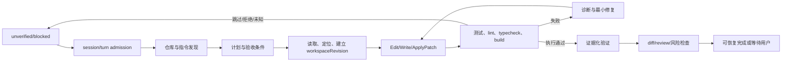

# Mythic Harness Coding-first Agent 总规范

状态：设计基线 v0.3-draft（实现前评审）  
日期：2026-10-04  
范围：`apps/zcode-cli/packages/core`、`contracts`、`adapters`、`bootstrap`，以及连接它们的 Desktop/Web/CLI Host

本规范的目标是把 Mythic Harness 做成持续完成软件工程任务的 coding-first Agent：它能理解仓库约束，进行多文件修改，运行验证，处理失败和中断，保留可恢复证据，并在 Desktop、Web、CLI 和远程连接中保持同一套运行语义。

## 0. Coding quality north-star

产品竞争力以 `patch correctness`、`verification truthfulness`、`recovery success`、`first useful diff`、成本/时延和多 backend 可比性衡量。只有真实 evidence 证明代码正确、工作区边界受控、失败可恢复，才算完成；工具数量、模型名称和 UI 事件数量不构成 coding 能力。

文档能力必须标注 `implemented`、`contract-only`、`proposed`、`blocked` 或 `deprecated`。未达到 `implemented` 的能力不能出现在默认 prompt 或 UI 的“可用”列表中，详见 `DECISION-LOG.md` 和 `IMPLEMENTATION-MAP.md`。

## 1. 架构决策

### 1.1 保留 Mythic native runtime 作为主会话内核

`AgentRuntime` 已经拥有 session、turn、runtime queue、权限、MCP、compact、checkpoint、remote workspace 和子 Agent 生命周期；Host 层 `CommandInbox` 负责协议 admission/idempotency。两者应继续作为各自边界的事实源，不能合并或重复写入。把 `zcode-cli` 直接替换成 `codex-cli` 会引入另一套 thread、transcript、审批、sandbox 和远程协议，破坏现有 `workspaceIdentity`、owner/lease、远程回放及 Host 边界。

Codex CLI 的可借鉴内容是边界和协议语义：单一 session loop、turn admission、事件投影、按资源串行化、执行策略与 sandbox 分层、结构化 file-change/command item、可恢复 subagent 图。不要复制 Codex 的 Rust 内部实现、OpenAI 认证和云端专用能力。

### 1.2 先做 native coding loop，再接外部 Agent

第一阶段只提升 Mythic native runtime 的编码闭环。第二阶段新增 `AgentBackend`/`ExternalAgentAdapter`，把 Codex、Claude、Pi、DeepSeek Harness 作为能力可声明的外部后端，先用于 `explore` 和 `review` 子任务，再按能力门槛开放 `implement`。外部 Agent 不是普通 `ModelProvider`：它拥有自己的 prompt、工具循环、审批、进程树和 session 语义，adapter 只负责协议转换和生命周期桥接。

### 1.3 采用能力协商，不伪装兼容

每个 backend 在握手时返回带约束的 capability level、`capabilitySchemaVersion`、scope、限制和 expiry。调用方只可以使用已声明的能力；不支持的能力返回结构化 `unsupported`，由父 Agent 选择 native fallback、建议模式或向用户说明。不能把外部 CLI 的一次性输出包装成“支持 resume/approval”。

### 1.4 统一事件与投影

Runtime、外部 adapter、Desktop、Web、CLI 和远程回放都使用同一组 `SessionEvent`/protocol item 语义。Core 事件是事实源，Host 只做路由和投影，UI 只维护草稿与 pending overlay。任何新增 coding phase、backend lifecycle、verification evidence、file change 或 approval 事件，必须同步 contracts、zcode-protocol-v4 normalizer/cold merge、Desktop/Web projection 和 replay。

## 2. 目标闭环

“完成”必须同时满足：用户目标已覆盖、实际执行过的验证命令有结构化记录、失败/跳过/外部变化已说明、当前 workspaceRevision 与提交的 diff 仍一致。没有执行证据时只能报告“已修改，未验证”；验证失败时不能报告“已完成”。

## 3. 状态所有者和不变量

| 状态                            | 唯一事实源                                                    | 边界要求                                                                                                                                                                                   |
| ------------------------------- | ------------------------------------------------------------- | ------------------------------------------------------------------------------------------------------------------------------------------------------------------------------------------ |
| session、turn、tool admission   | Host `CommandInbox`（接收/幂等）+ `AgentRuntime`（执行/终态） | UI 不得另建队列；shutdown 先关闭 admission，再等待已接收操作排空                                                                                                                           |
| transcript、checkpoint、compact | session store/runtime                                         | adapter 只能输出事件，不能把同一会话再写一份 transcript                                                                                                                                    |
| workspace identity              | Host/Workspace registry                                       | key 为 `workspaceIdentity?.trim() \|\| workspacePath`；identity 用于隔离，path 只用于文件、cwd、Git 和展示                                                                                 |
| workspace owner/lease           | Host/Workspace registry 与文件写入协调器                      | 保留 owner、lease、stale run 防护；workflow lease 不等同于文件写入 lease                                                                                                                   |
| 文件内容与 workspaceRevision    | FileSystem/FileRevision service                               | 所有写入走统一 CAS/atomic boundary；模型不能绕过工具直接写盘                                                                                                                               |
| shell/process 执行              | ExecutionPort/Process executor                                | 执行器 materialize sandbox、超时、输出上限和取消；策略层不拼 shell wrapper                                                                                                                 |
| approval、grant、sandbox        | PermissionService + approval broker + sandbox adapter         | decision、sandbox profile、execution policy 三层分离；断连或取消的 pending approval 默认 Abort                                                                                             |
| 验证 evidence                   | Verification service + artifact store                         | verifier 只能消费 evidence，不能创造 exit code 或测试通过结论                                                                                                                              |
| parent/child Agent 图           | Subagent registry/backend registry                            | parent 拥有 child；child 通过结构化事件回传，禁止旁路控制另一个 session                                                                                                                    |
| Desktop/Web/remote 状态         | Host projection                                               | Desktop 使用 `desktop-continuous`；手机/远程使用 `web-remote-replayable`；Main/relay 只缓存 runtime 生成的传输 snapshot/cursor，不拥有任务队列、transcript、verification 或 workspace diff |

关键不变量：一个 session 同时最多一个 foreground turn；同一 workspace 的写入按 owner/lease 串行；只读探索可以并行；canonical `SessionEvent` 使用稳定 `id`、`sessionId`、`turnId`、`sequenceNumber`，normalized protocol 可提供 `eventId`/`sequence` 别名但不得取代现有 contract，重复投影必须幂等。

## 4. 产品边界

### 默认 coding profile

代码仓库且用户未选择其他 profile 时启用 `coding`：

- Native coding MVP 的默认工具必须覆盖 `Read`、`Glob`、`Grep`、`Edit`、`Write`、`ApplyPatch`、持久 terminal/process、`GitStatus`、`GitDiff`、结构化 `Diagnostics`、test discovery 和 targeted test。某个 handler 未实现时从 catalog 移除并标记 `blocked`，不得在 prompt 中假设它存在。
- Web、automation、workflow、Node REPL、办公/CUA 工具默认不注入；任务需要时按 capability 显式开启。
- 首次修改前发现指令、项目脚本、语言和包管理器；指令按作用域和优先级合并，项目文件视为不可信输入，不能覆盖系统策略。
- 每次写入产生 file-change/diff 摘要；每次命令产生命令、cwd、退出码、诊断和 artifact 引用。
- 默认不自动提交、推送、发布、删除仓库或修改 workspace 外文件。

### 非目标

- 不把 Codex、Claude、Pi、DeepSeek 直接注册为模型 provider。
- 不在第一阶段重做 Codex 的完整 app-server RPC、云端认证、Guardian 或所有平台 sandbox。
- 不把所有外部 Agent 的 transcript 合并为一个可写事实源。
- 不用 prompt 文案替代未实现的工具、权限、证据或恢复能力。

## 5. 目标能力分级

| 等级 | 能力                                    | 放行条件                                                                 |
| ---- | --------------------------------------- | ------------------------------------------------------------------------ |
| L0   | native 只读探索、上下文发现、计划       | 事件可持久化，工具结果可回放                                             |
| L1   | native 多文件编辑与验证                 | ApplyPatch、workspaceRevision/CAS、evidence gate 通过                    |
| L2   | native 中断、恢复、compact、diff review | pending request registry、事件投影和 replay 通过                         |
| L3   | 只读 Explore/Review 子 Agent            | parent ownership、并发上限、取消和结构化结果通过                         |
| L4   | Codex/Claude/Pi/DeepSeek 外部子 Agent   | adapter contract、进程树、能力协商和 workspace 隔离通过                  |
| L5   | 外部 Agent 主 session backend           | resume、steer、approval bridge、evidence、远程回放全部通过同一 benchmark |

L5 不是默认目标；若 backend 能力不完整，native runtime 始终可以作为主 session。

## 6. 文档分层和依赖

本目录中的文档按以下关系阅读：

1. `CODEX-ARCHITECTURE-ANALYSIS.md`：Codex CLI 源码证据和不可照搬项。
2. `RUNTIME.md`：native turn loop、admission、context、工具结果和恢复。
3. `COMMAND-ADMISSION.md`：CommandInbox、resource-key serializer、connection gate 和 shutdown drain。
4. `PERSISTENCE-AND-RECOVERY.md`：durable/transient event、snapshot、artifact、checkpoint、rewind、fork。
5. `COMPACTION.md`：manual/auto/microcompact、provider history、queue/approval/interrupt 交互。
6. `CONTEXT-AND-EDITING.md`：指令发现、工具注册、ApplyPatch、revision/CAS。
7. `MODEL-AND-CODING-QUALITY.md`：ModelProvider/AgentBackend、prompt stack、检索、失败修复、路由和审查。
8. `VERIFICATION-AND-PERMISSIONS.md`：evidence、完成判定、审批、sandbox 和命令策略。
9. `AGENT-BACKENDS.md`：native/external backend、Codex/Claude/Pi/DeepSeek adapter。
10. `SUBAGENTS.md`：child Agent、外部进程、worktree/lease 和并发写入。
11. `PROTOCOL-AND-REMOTE.md`：session/turn/event 协议、projection、Desktop/Web/remote 语义。
12. `UX.md`：coding-first Desktop/Web/CLI 的用户行为和状态展示。
13. `ROADMAP.md`：分阶段实现、依赖和退出条件。
14. `EVALS.md`：任务集、指标和回放数据。
15. `BENCHMARK-AND-QUALITY-GATES.md`：实验分组、公式、统计、release gate 和回滚。
16. `DECISION-LOG.md`：跨文档决策、规范来源和状态标签。
17. `IMPLEMENTATION-MAP.md`：源码 owner、状态和迁移顺序。
18. `ACCEPTANCE.md`：实现阶段的关键验收场景。

上位约束仍来自 `specs/workflow-platform/SPEC.md`、`specs/restore-checkpoint/` 和仓库 `AGENTS.md`。本目录不得重新定义 workspace identity、owner/lease、remote session 或 Main/relay 的业务状态所有权。

## 7. 当前必须先修正的设计假设

| 现状                                                                                               | 规范修正                                                                                                               |
| -------------------------------------------------------------------------------------------------- | ---------------------------------------------------------------------------------------------------------------------- |
| `ApplyPatch` 只有 `contracts/src/tools/apply-patch.ts`，built-in registration 被注释，暂无 handler | 单独实现 ApplyPatch handler、解析器、atomic multi-file boundary 和 contract test 后才标记可用                          |
| `GitDiff`、`Diagnostics` 当前没有完整 built-in handler                                             | Phase 1 必须先补 handler、schema、权限和 protocol item；未实现时标记 blocked                                           |
| `PermissionService` 的 `auto` 返回 `mode.auto.unimplemented`                                       | auto 在 policy 实现和验收前保持不可用；build 可先做有限规则，不能改 prompt 冒充完成                                    |
| `failOpenGoalCompletionVerification()` 可产生 `passed: true`                                       | 改为 `unverified`/`blocked`，模型不能单独将目标置为 complete                                                           |
| Context adapter 通常只取 workspace 起点到 projectRoot 的一个优先文件                               | 增加 nested instruction scope、precedence、预算、刷新和敏感文件策略                                                    |
| `SubagentPort` child runtime 复用 parent execution/file system                                     | 只读 child 可并行；写入 child 必须有 worktree 或文件 lease，外部 adapter 不能直接复用此接口做主 session                |
| TurnMachine 没有 discovering/planning/validating/reviewing phase                                   | 保持基础模型循环稳定；coding phase 先作为持久化 metadata/derived state，并通过协议事件呈现，待事件迁移完成再扩展状态机 |

## 8. 阶段闸门

每一阶段只有在本阶段文档的验收场景和 `pnpm typecheck`、`pnpm lint`、必要的架构检查真实通过后才进入下一阶段。若环境无法执行，记录为未验证，不把计划写成通过。

- Phase 0：合同和事件冻结。
- Phase 1：native coding loop、ApplyPatch、context discovery、evidence gate。
- Phase 2：权限/sandbox、恢复/compact、diff review、远程 replay。
- Phase 3：只读 subagent 和写入隔离。
- Phase 4：Codex/Claude/Pi/DeepSeek adapter。
- Phase 5：benchmark 驱动的性能和质量优化，评估是否开放外部 backend 主 session。
