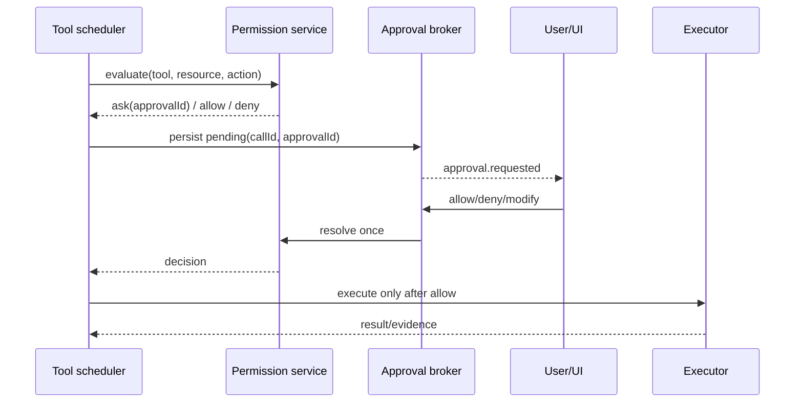

# Verification、Permission 与 Sandbox 规范

状态：规范草案 v0.3-draft（能力状态以 IMPLEMENTATION-MAP.md 为准）

## 1. Verification evidence

验证服务是编码 Agent 的完成闸门。模型可以提出候选命令和解释，但只有执行器产生的 evidence 才能证明事实。

```ts
interface VerificationEvidence {
  evidenceId: string;
  sessionId: string;
  turnId: string;
  commandId: string;
  kind: "test" | "lint" | "typecheck" | "build" | "diagnostic" | "review";
  command: string;
  argv: string[];
  cwd: string;
  workspaceIdentity: string;
  baseWorkspaceRevision: string;
  verifiedWorkspaceRevision?: string;
  gitRevision?: string;
  workspaceSnapshotHash: string;
  externalChangeDetected: boolean;
  startedAt: string;
  finishedAt?: string;
  exitCode?: number;
  signal?: string;
  status: "passed" | "failed" | "cancelled" | "unknown";
  artifactRefs: string[];
  diagnostics: string[];
  changedFiles: string[];
  fileResults: Array<{
    path: string;
    beforeFileRevision?: string;
    afterFileRevision?: string;
    diffRef?: string;
  }>;
  requiredCheckIds: string[];
  executionDecision: string;
  sandboxRef?: string;
  verifierVersion: string;
  truncated: boolean;
}
```

stdout/stderr 写入 artifact store；事件中保留 exitCode、首条错误、最后诊断、changed files、截断标记和可读取引用。`VerificationResult` 只能由 evidence reducer 生成：

- `passed`：所有用户明确要求且实际执行的必要检查都有 `passed` evidence，且 verifiedWorkspaceRevision 与检查输入一致。
- `failed`：至少一个必要检查明确失败。
- `unverified`：命令未执行、被拒绝、结果未知、输出被破坏或目标没有足够证据。
- `blocked`：继续所需的权限、依赖、用户输入或外部状态不可用。

### 1.1 禁止 fail-open 通过

当前 `target-completion-verification.ts` 会调用 `failOpenGoalCompletionVerification()`，现有实现可返回 `passed: true`。必须修改 contract，使 fail-open 只能返回 `unverified` 或 `blocked`，并且 `target.status=complete` 只能由 evidence-aware reducer 在 `passed` 时更新。模型 verifier 只可补充理由和 next action，不能单独产生通过事实。

### 1.2 验证与 revision

验证开始时记录workspaceRevision；验证完成后比较 changed files 和 workspaceRevision。若验证过程中有外部编辑，结果变为 `unknown`/`unverified`，不能把旧 workspaceRevision 的测试结果用于当前 diff。

## 1.3 VerificationEvidence 最小字段

每条 evidence 必须绑定 sessionId、turnId、commandId、baseWorkspaceRevision、verifiedWorkspaceRevision、可选 gitRevision、workspace snapshot hash、changed file set、externalChangeDetected、命令/cwd/provenance、artifact refs、exit/signal、diagnostics 和 verifier version。completion reducer 只有在 verified revision 与目标 diff 一致、externalChangeDetected=false 且必需检查均为 passed 时才能产生 passed；否则为 unverified/blocked。

## 2. 候选命令发现

Context builder 从 package.json、mise、Makefile、Cargo、pyproject 等发现候选命令。用户明确指定的命令优先；自动推断的命令必须显示来源并经过 permission policy。验证服务可以根据失败输出选择下一条候选命令，但每次选择都要记录原因，避免无限重试。

## 3. 权限三层

权限决策拆成三个独立对象：

1. `ExecutionDecision`：本次工具调用是 `allow`、`ask`、`deny`、`unsupported`。
2. `ApprovalPolicy`：用户模式、session grant、项目规则、来源（用户/模型/子 Agent）如何产生 decision。
3. `SandboxProfile`：文件根、网络、进程能力和平台 sandbox 如何执行限制。

`ExecutionPort` 只执行已经获准的调用，负责 timeout、取消、进程组回收和输出采集；不能自行扩大权限。项目指令是 untrusted，不得修改上述三层。

决策顺序固定为：先处理 plan-mode/显式禁止与 `requiresUserInteraction`，再处理 always-ask 和 project deny/ask，之后才考虑 session/workflow grant、workspace 内低风险 allowlist、global allowed tools，最后落到默认 ask/deny。`yolo` 只在用户显式选择且不处于 plan mode 时扩大决策；`auto` 当前仍直接 deny。规则命中必须记录 rule id、scope、source 和 expiry，便于回放和解释。

## 4. Profile 语义

| profile | 默认行为                                                                                  | 当前状态                                                                              |
| ------- | ----------------------------------------------------------------------------------------- | ------------------------------------------------------------------------------------- |
| `plan`  | 只读探索、候选命令发现、低风险诊断；写入和网络询问                                        | 可先实现                                                                              |
| `build` | workspace 内有 allowlist 的编辑和验证命令自动允许；安装、网络、删除、workspace 外路径询问 | Phase 1 目标                                                                          |
| `auto`  | 按 capability、路径、命令分类和 session grant 自动决定                                    | 当前 `PermissionService` 返回 `mode.auto.unimplemented`，完成 policy 前不可暴露为可用 |
| `yolo`  | 用户显式选择的高风险模式                                                                  | 仍保留 workspace identity、stale workspaceRevision、取消和命令超时边界                |

不要只把 prompt 中的 `auto` 描述改掉。UI 和 protocol 必须读取 policy capability，未实现时显示 disabled/unsupported。

## 5. 路径、命令和网络

每次 decision 的输入至少包括 tool、action、resolved realpath、workspaceIdentity、cwd、argv、network target、sandbox profile、来源、session grant 和过期时间。路径范围区分 workspace root、extra root、sibling repo 和外部路径；读取、写入、执行分别决策。符号链接无法安全解析时拒绝或询问。

命令策略以解析后的 argv、cwd 和项目脚本身份匹配，而不是用字符串前缀猜测。危险类别包括删除/重置、权限修改、安装依赖、网络访问、提交/推送、系统服务和 workspace 外执行。批准一条命令不自动批准任意相似字符串；可持久化的是明确的 rule + scope + expiry。

## 6. Approval 生命周期



pending approval 必须持久化 `callId + approvalId + input hash + workspaceRevision + expiry`。重复回复幂等；过期、断连、取消和未知 approval 默认不执行。`modify` 产生新的 input hash 并重新评估，不能在原调用上偷偷改变参数。

## 7. 外部 Agent 权限桥接

外部 Agent 不能直接继承 Mythic 的 yolo 或 sandbox。adapter 声明 `approval.level`、`approval.durablePending`、`worktree.level`、`sandbox.level` 和 sandbox provenance：

- `approval.level=none`：仅开放只读 explore/review；implement 返回 `unsupported`。
- `approval.level=allow-deny` 或 `allow-deny-modify` 且 `durablePending=true`：adapter 把外部请求映射成 Mythic approval，执行前必须得到 Mythic decision。
- provider 自持审批但没有 pre-write fence 时，不能把其事件当作 Mythic approval；implement 仍返回 `unsupported`。

若外部 Agent 能写 workspace，必须使用 executor-enforced 独立 worktree 或 FS proxy lease（含 fencing token）；diff watcher 只做事后诊断，默认 adapter 不给直接 cwd 写权限。

## 8. 验收

- 无命令或命令被拒绝时完成状态为 `unverified`/`blocked`，绝不能 `passed`。
- 测试失败后模型收到 exitCode、stderr artifact 和 changed files，能针对失败修复并重新验证。
- 同一 approval 重复响应不重复执行命令；取消后进程组被回收。
- workspace 外路径、网络和安装依赖在 `build` 下进入询问；当前 `auto` 未实现时无法通过 UI 或协议启用。

## 规范补充：权限决策优先级与动态 amendment

权限实现必须先计算 `ExecutionDecision`，再由 `ApprovalPolicy` 决定是否请求用户，最后由 `SandboxProfile` 限制可执行边界。建议优先级如下：

1. plan-mode transition；需要用户交互的操作先走 disallowed → ask。
2. `alwaysAsk` gate：auto deny → disallowed deny → project deny → session/workflow-owner allow → ask。
3. yolo bypass 只在 `planEnabled=false` 时可用；`auto` 当前返回 `mode.auto.unimplemented`，不能伪装成 allow。
4. disallowed deny；project deny → project ask；planEnabled 只允许 plan read-only/MCP/session capability；project allow 后继续。
5. WebFetch/workflow draft 可使用显式 preapproved；global allowedTools 只适用于其声明的工具。
6. edit → file edit allow；build/read-only 低风险可按 session state allow；critical/high、side effect、needsApproval、destructive 必须 ask，其余 low-risk 才能 allow。

执行审批必须先在 active turn 注册 one-shot callback，再发 `ExecApprovalRequest`。approval key 使用 effective `approvalId`（缺省回退 `callId`），subcommand/stdin 可有独立 approval id。事件应携带 command/cwd、reason、turn/call id、environment/network context、parsed command、available decisions 与 proposed policy/network amendments。等待超时、连接丢失、callback 缺失和未知 response 的安全结果都是 Abort；不能自动 allow。

Approved exec-policy/network amendment 必须在执行前持久化并关联 workspace/session/owner，随后才能应用到后续请求。Abort 必须 interrupt 当前 turn；callback 已消费后重复 response 返回 duplicate/settled，不得重复执行。所有决策和 amendment 都进入 durable event/evidence，供 replay 与审计。

模型 reviewer 的 kind=review 只能提供风险意见和 next action；completion gate 仍必须由 executor 产生的 test/lint/typecheck/build/diagnostic evidence 支撑。
