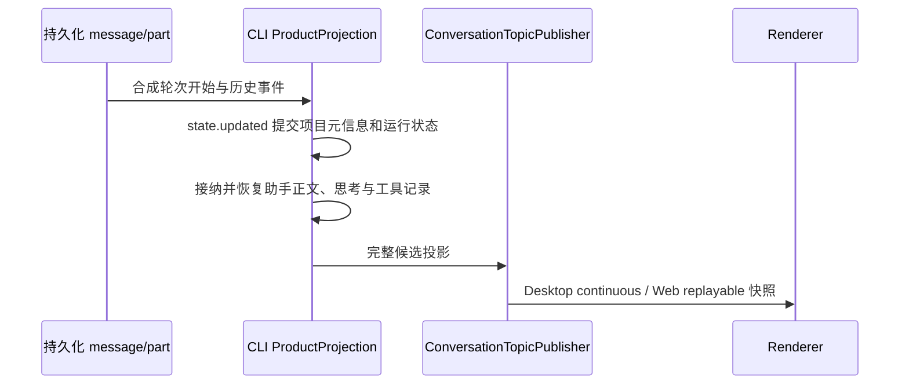

# 项目会话历史恢复

## 缺陷与产品规则

- 项目会话在应用重启或会话缓存释放后重新打开时，必须恢复已持久化的用户消息、助手正文、思考和工具记录。
- 带有 `projectWorkspace` 的轮次不能因为恢复项目归属信息而丢失助手内容；单文件夹与多文件夹项目遵循同一规则。
- 当前批量恢复使用可变快照累积器。轮次开始时直接替换 `ProductProjection.snapshot` 会使它与累积器分离：运行状态写入旧对象，后续正文和工具事件读取到未运行状态并被拒收。
- 项目元信息及共享上下文引用状态只生成既有 `state.updated` 增量，统一交给投影 apply 提交，不在事件 reducer 中直接替换快照。

## 状态所有者与恢复顺序

- 持久化 message/part 是已完成会话内容的权威来源；本次不修改数据库或历史记录。
- `ProductProjection` 拥有会话投影。批量恢复期间，它与累积器使用同一个候选快照；正文、控制状态与元信息沿同一条增量写入路径推进。
- `ConversationTopicPublisher` 在候选完整恢复后提交投影；Renderer 只接收和展示快照。项目 ID 仍来自持久化的输入配置，不从界面补造。

## 验收与边界

1. 使用带项目快照的持久化消息生成历史事件，批量恢复与逐事件恢复得到相同的正文、思考、工具行、项目 ID 和完成状态；两种订阅模式均能收到完整内容。
2. 共享上下文由 pending/reserved 转为 attached 时，批量恢复继续接纳后续助手事件，不因更新引用状态使快照分离。
3. 使用受影响会话的数据库做只读复验：已保存的 23 个节点完整恢复，助手内容拒收计数为 0；不输出真实正文。
4. 保留既有候选提交、旧轮次迟到事件隔离和两种传输模式的恢复边界；不修改协议、不新增状态、不迁移历史数据。

关键回归使用 `node:test` 与现有 `tsx` 执行；类型检查、Lint 和架构检查按仓库命令执行。实际桌面重启显示验收须与只读投影复验分开记录。
