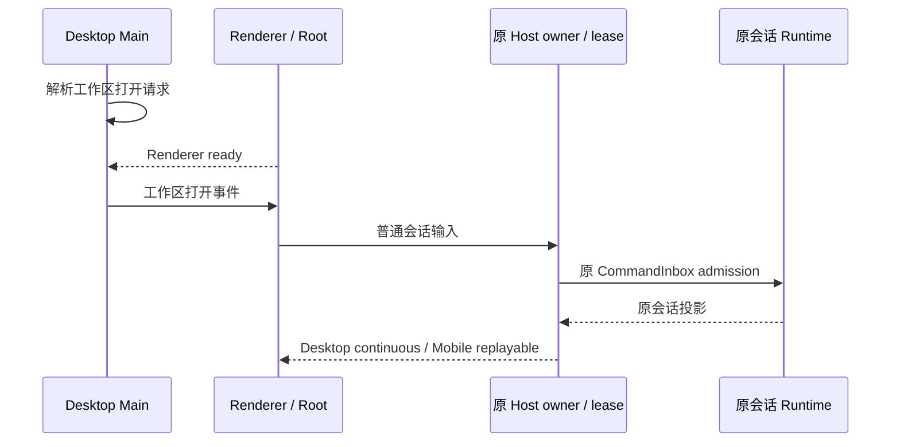

# 会话分享下线：实施与验证

实施日期：2026-10-05。按用户确认完整移除分享功能及对应代码，后续重新设计。另按确认删除开发版会话表的 `share_url` 字段和对应类型，不提供历史迁移，不删除现有数据库文件。

## 实际范围

| 层级              | 改动                                                                                                                                                                         |
| ----------------- | ---------------------------------------------------------------------------------------------------------------------------------------------------------------------------- |
| Services / Client | 删除 `conversation-share` 服务、HTTP 客户端、完整性检查和格式化逻辑，以及 accessor、注册、公开导出和 RPC 代理。                                                              |
| Desktop           | 删除 Host 本地/远程分享服务注册、attachment override、Main 分享 Deep Link 队列与分发、Preload 分享事件及 Renderer 平台适配。工作区打开仍沿原路由和 Renderer-ready 顺序处理。 |
| Web               | 删除整个分享页目录、公开/私有预览、导入路由、分享独立启动和主题分支，以及旧分享认证代理。Web 继续走普通应用启动流程。                                                        |
| UI                | 删除只读分享时间线、导入提示、分享上下文引用、普通输入中的分享拼接、专属草稿标记、分享滚动请求与 header 补偿，以及相关中英文文案和包子入口。                                 |
| Shared            | 删除分享契约、服务/平台 channel、平台分享事件、V4 分享命令、创建参数、上下文引用、snapshot/delta 来源状态和旧历史来源。                                                      |
| CLI               | 删除分享历史注入、导入创建、种子投影、来源词表、上下文预留/附加/取消/丢弃和存储事务。普通输入、Claude 历史导入和会话投影继续使用原路径。                                     |
| SQLite            | 删除新表 `share_url` 列、row/codec 类型和会话 insert/update 参数；没有为旧库添加 migration。                                                                                 |
| 文档              | 更新账号整改设计与实施记录、套餐移除规范，统一为完整下线。                                                                                                                   |

公共插件、普通 MCP、工作流、Cron、Subagent、普通附件和桌面/手机远控没有纳入本次删除范围。`clientScenes.ts` 的 `share_urls` 是远端场景元数据，不能据字段名称认定其属于会话分享，保留该字段。

## 所有者与事件顺序

没有新增可变状态、队列或写入路径。分享专属状态及接口直接删除，保留的链路如下：



分享 URL 不再触发分享导入或创建会话。没有保留只读分享服务、历史解析层或替代队列。

## 核心测试

实际执行：

```text
pnpm exec tsx --test packages/shared/test/conversationShareRetirement.test.ts apps/zcode-cli/packages/bootstrap/src/zcode-protocol-v4/conversation-topic-publisher.test.ts apps/zcode-cli/packages/adapters/src/storage/session-store/share-retirement.test.ts
```

结果为 4 / 4 通过：

1. 分享丢弃命令不再支持；普通 sendText 可用，旧 context_refs 不会传给执行链。
2. 分享历史来源不再接受；Claude 历史导入仍有效。
3. 普通历史恢复保留助手内容和 desktop continuous / web remote replayable 的订阅快照。
4. 使用实际异步 migration runner 创建内存数据库，确认没有 `share_url`，普通会话可创建、读取和更新。

## 检查结果与限制

| 检查             | 结果                                                                                                                                                                                                                                                      |
| ---------------- | --------------------------------------------------------------------------------------------------------------------------------------------------------------------------------------------------------------------------------------------------------- |
| 工作区基线       | `node scripts/check-workspace-freshness.mjs --no-fetch` 通过，仅核对缓存远端引用，不宣称远端最新。                                                                                                                                                        |
| 根类型检查       | `pnpm typecheck` 通过。                                                                                                                                                                                                                                   |
| Preload 类型检查 | `pnpm exec tsc -p packages/desktop/tsconfig.preload.json --noEmit --composite false --incremental false` 通过。                                                                                                                                           |
| CLI 定向类型检查 | bootstrap、adapters、core 的 `tsc --noEmit` 均通过，contracts 编译类型已刷新。                                                                                                                                                                            |
| CLI 全量类型检查 | `pnpm exec turbo run typecheck --cwd apps/zcode-cli --force` 通过，27 / 27 个任务成功。直接从 CLI 调用的本地 turbo 入口不可用，改用根入口执行；实际使用全局 turbo 2.9.14，并提示 telemetry workspace 的 lockfile 记录缺失。                               |
| 根 Lint          | `pnpm lint` 通过，0 errors / 17 个其他领域 warnings。                                                                                                                                                                                                     |
| CLI 定向 Lint    | 使用 CLI 自身 oxlint，显式检查本次涉及的 32 个文件；未通过，12 个既有 `max-lines` 超限和 7 个既有 warnings。本次移除造成的未使用类型导入已清理。对最初修改前的快照复核了其余文件超限和警告；migrations 原文件亦超过行数限制。没有调整规则或修复无关领域。 |
| 架构检查         | `pnpm architecture:check --changed` 通过，violations / baseline / new 均为 0。涉及 shared、services、client、desktop、ui、web 和 zcode-cli；已读取受控模块上下文。                                                                                        |
| 格式             | 根与 CLI 各用自身 oxfmt 对本次存续改动文件定向检查，均通过。                                                                                                                                                                                              |
| 差异空白检查     | 本次路径的 `git diff --check` 通过。                                                                                                                                                                                                                      |
| 交互验收         | 未启动或重启用户开发实例，未执行真实桌面/Web E2E。仍需确认 UI 无分享入口、分享 URL 不触发导入、普通会话和工作区打开可用。                                                                                                                                 |

本机 Node 为 24.19.0，`mise.toml` 指定 24.14.0；没有更改运行环境。最初 81 个文件的修改前快照与当前内容对比为新增 40 行、删除 7,342 行，净减少 7,302 行；该统计不包含后续草稿/数据库清理、新增 spec 与测试，也不混用整个工作树的账号整改差异。

未提交 Git。未删除用户文件，未提供旧分享链接、旧分享来源状态或旧数据库迁移。
