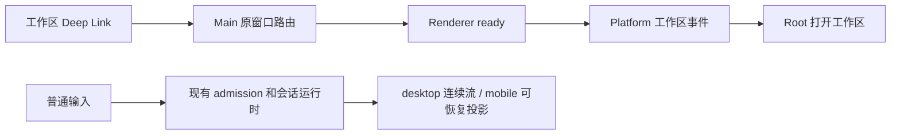

# 会话分享下线

## 产品规则

- 开发版本完整移除会话分享：发布、公开/私有预览、导入、继续对话和相关链接处理均下线。
- 删除分享页面、服务、RPC/IPC、平台事件、公开类型、文案及专属测试；不保留空服务或隐藏的调用链。
- 不兼容旧分享链接、已导入的分享或分享来源状态，不新增迁移、历史解析和重认证逻辑。不删除用户磁盘上的已有文件。
- 普通会话、附件、Claude 历史导入、工作区 Deep Link、桌面/手机远控和插件功能保留。

## 所有者与接口边界

- 删除 Services 的 `IConversationShareService` 及 Desktop Host/Client 的注册和代理。
- 删除 Main → Preload → Platform → Root 的分享导入事件，保留原窗口、工作区和远控事件所有者。
- 删除 Web 独立分享路由及只读展示组件；Web 按现有普通应用启动流程处理请求。
- 删除分享专属的 `shared_context` 历史消息、创建参数、上下文引用、状态投影、状态转换和存储接口；普通输入仍由现有会话 admission/运行时串行处理。
- 删除首次分享导入的草稿标记和只读块滚动补偿；删除 `share_url` 建表字段、SQL 写入和类型，不为旧数据库提供迁移。
- 不新增状态所有者、队列、持久化写入路径或远端请求。

## 事件顺序

分享链路整体移除，不以超时、空实现或兼容分支代替。

## 验收

1. UI、Web、Desktop 和 RPC 不再暴露分享入口、分享服务或导入事件。
2. V4 契约不再暴露分享导入命令、上下文引用和来源状态；普通输入和 Claude 历史导入契约仍可用。
3. 工作区 Deep Link 路径保留；`zcode://share/import` 不再触发导入或创建会话。
4. 删除功能的测试同步清理，保留相邻普通会话/投影测试；执行类型、Lint 和架构检查。
5. 新数据库不包含 `share_url` 列；普通会话创建、读取和更新仍可用。

## 设计文档关系

本 spec 替代 `specs/remove-zhipu-account-login/design.md` 中“保留匿名公开分享读取/导入”的旧范围，后续分享功能重新设计。
