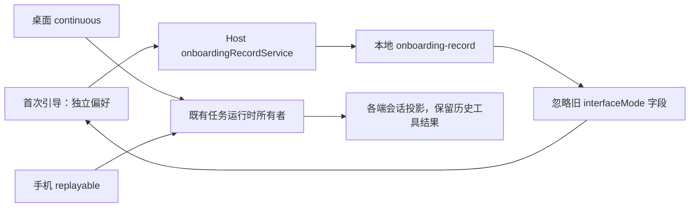

# 开发者界面：办公模式与不可用 CUA 产品残留移除

## 已确认范围

- 产品统一采用现有编程界面的行为，不再提供办公/编程模式切换。
- 移除模式设置、侧栏菜单、模式快捷键、模式广播、首次引导中的模式步骤和模式专用展示分支。
- 插件排序统一采用现有 code 排序；不更改市场源、安装作用域和插件生命周期。
- 保留全部现有使用端与远程入口、迁移、工作记忆及用户其他偏好。职业选择页按后续确认移除，首次引导直接进入助手偏好，详见 [引导规则](../onboarding-preferences/SPEC.md)。
- 清理当前构建不可用的 CUA 产品入口、设置、权限引导、后台权限观察及仅服务这些入口的装配。
- 保留浏览器自动化、普通权限请求、会话恢复，以及读取既有会话所需的 CUA 历史工具结果/协议契约。
- 不恢复原生 Computer Use 实现；不以新功能替代被移除的产品入口。
- node_repl 只注册浏览器能力，bootstrap 与插件宿主绝不注入或恢复 CUA broker 凭据。
- GUI、Protocol 和 TUI 权限提示统一使用通用授权文案，不再显示 CUA 专属“始终允许”或“以后不再询问”选项。

## 主动任务建议

- 主动任务建议保留为独立开关，新用户默认关闭；已有用户显式保存的开关继续生效。首次引导与设置均可修改，不再依赖界面模式。
- 工作记忆同样保持独立，首次引导新用户默认关闭，旧记录中的显式偏好继续保留。

## 状态所有者与迁移边界

- 移除 UI Zustand 中 interfaceMode 状态及写入、localStorage 读取和跨窗口广播。存量 zcode-interface-mode 键不再被消费，不能影响终端、代码审查或编辑器显示。
- 首次引导的偏好草稿由引导组件持有，持久化由 onboardingRecordService 所属 Host 执行；旧职业字段仅用于兼容已有记录和完成判断。
- onboarding-record 的运行时 schema 移除 interfaceMode 字段；读取旧文件时忽略该额外字段，保留职业、偏好与完成/关闭记录，不要求用户重做引导。
- 删除模式快捷键定义，旧自定义绑定按现有未知命令过滤行为处理。
- CUA 入口及观察器移除后不再发起权限轮询、Helper 重启、PiP 或原生安装调用。共享历史数据只读，不产生新 CUA 业务状态。
- 旧 broker 凭据不再捕获或回注；环境清理仍剔除 socket、token、refresh marker 和 authority，并拒绝将其透传给工具子进程。
- 不改变任务接收所有者、owner/lease、workspaceIdentity、remoteSessionId 或两种实时链路语义。

## 关键验收场景

1. 存量 office localStorage 和旧 onboarding 记录启动后仍进入开发者界面；职业、偏好、完成记录保留。
2. 首次引导不再包含模式页或职业选择页，仅显示助手偏好；设置、侧栏、快捷键均无办公模式入口。终端、审查、打开编辑器遵循原编程界面的平台边界。
3. 插件商店、输入框能力列表、空态推荐统一采用 code 排序。
4. 设置、插件管理与输入框不展示不可用 CUA 产品卡或授权引导；Root/会话挂载不启动 CUA 权限观察服务。
5. 浏览器控制入口与普通工具权限仍可用，既有会话的历史 CUA 结果不会导致解码/展示崩溃。

## 验证

- 在实现前补充旧引导记录解析与模式快捷键移除的关键回归用例。
- 实际验证 Web 引导/设置/开发工具入口，并记录桌面与手机未实测范围；不穷举平台矩阵。
- 执行根 pnpm typecheck、pnpm lint、pnpm architecture:check --changed；CLI 改动执行其现有 typecheck/lint。
- 保留工作区已有 Logo、图标和声明文件本地改动。

### 办公模式与 CUA 移除阶段结果（2026-09-30）

- 使用 `mise.toml` 指定的 Node 24.14.0：根 `pnpm typecheck`、`pnpm lint`、`pnpm architecture:check --changed` 均通过；Lint 为 64 个警告、0 个错误，架构违规为 0。
- 18 个关键回归用例通过，覆盖旧引导偏好、快捷键退出、CUA 入口清除、普通 MCP 与权限、浏览器 fresh kernel、历史结果及两种会话恢复语义。
- 根目录 113 个改动文件与 CLI 31 个改动文件格式检查通过；浏览器宿主临时 bundle 构建、加载与 runtime 创建成功。
- CLI 的 bootstrap、cli、core、node-repl-host、tui 五个受影响包类型检查通过。临时 Turbo 配置仅跳过依赖构建，执行 `tsc --noEmit`，避免覆盖已有声明文件改动。
- CLI Lint 实际执行失败：50 个已有 `max-lines` 错误、32 个警告，部分既有超限文件在本轮有删除改动。未将 CLI Lint 记为通过，未为本轮清理扩大重构范围。
- Web 已实测两步引导、主动建议默认关闭及独立保存、旧 office 配置兼容、设置/输入框无 CUA、浏览器设置保留、终端打开与 390×844 窄屏布局。
- 未实际运行原生桌面或手机远控链路；会话恢复语义由关键回归验证，不能等同于两端实机验证。
