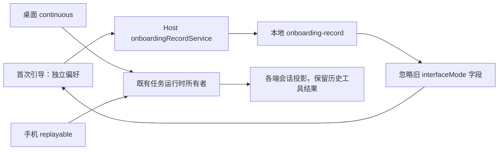

# 开发者界面：统一现有编程界面

## 已确认范围

- 产品统一采用现有编程界面的行为，不再提供办公/编程模式切换。
- 移除模式设置、侧栏菜单、模式快捷键、模式广播、首次引导中的模式步骤和模式专用展示分支。
- 插件排序统一采用现有 code 排序；不更改市场源、安装作用域和插件生命周期。
- 保留全部现有使用端与远程入口、迁移、工作记忆及用户其他偏好。职业选择页按后续确认移除，首次引导直接进入助手偏好，详见 [引导规则](../onboarding-preferences/SPEC.md)。

## 主动任务建议

- 主动任务建议保留为独立开关，新用户默认关闭；已有用户显式保存的开关继续生效。首次引导与设置均可修改，不再依赖界面模式。
- 工作记忆同样保持独立，首次引导新用户默认关闭，旧记录中的显式偏好继续保留。

## 状态所有者与迁移边界

- 移除 UI Zustand 中 interfaceMode 状态及写入、localStorage 读取和跨窗口广播。存量 zcode-interface-mode 键不再被消费，不能影响终端、代码审查或编辑器显示。
- 首次引导的偏好草稿由引导组件持有，持久化由 onboardingRecordService 所属 Host 执行；旧职业字段仅用于兼容已有记录和完成判断。
- onboarding-record 的运行时 schema 移除 interfaceMode 字段；读取旧文件时忽略该额外字段，保留职业、偏好与完成/关闭记录，不要求用户重做引导。
- 删除模式快捷键定义，旧自定义绑定按现有未知命令过滤行为处理。
- 不改变任务接收所有者、owner/lease、workspaceIdentity、remoteSessionId 或两种实时链路语义。

## 关键验收场景

1. 存量 office localStorage 和旧 onboarding 记录启动后仍进入开发者界面；职业、偏好、完成记录保留。
2. 首次引导不再包含模式页或职业选择页，仅显示助手偏好；设置、侧栏、快捷键均无办公模式入口。终端、审查、打开编辑器遵循原编程界面的平台边界。
3. 插件商店、输入框能力列表、空态推荐统一采用 code 排序。

## 验证

- 在实现前补充旧引导记录解析与模式快捷键移除的关键回归用例。
- 实际验证 Web 引导/设置/开发工具入口，并记录桌面与手机未实测范围；不穷举平台矩阵。
- 执行根 pnpm typecheck、pnpm lint、pnpm architecture:check --changed。
- 保留工作区已有 Logo、图标和声明文件本地改动。

### 办公模式移除阶段结果（2026-09-30）

- 使用 `mise.toml` 指定的 Node 24.14.0：根 `pnpm typecheck`、`pnpm lint`、`pnpm architecture:check --changed` 均通过；Lint 为 64 个警告、0 个错误，架构违规为 0。
- Web 已实测两步引导、主动建议默认关闭及独立保存、旧 office 配置兼容、终端打开与 390×844 窄屏布局。
- 未实际运行原生桌面或手机远控链路；会话恢复语义由关键回归验证，不能等同于两端实机验证。
