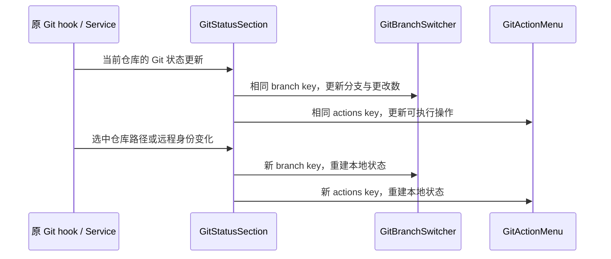

# Git 状态面板组件身份

## 规则与缺陷

- Git 工具区只展示一个当前分支切换按钮和一个 Git 操作菜单；Git 状态、会话状态与任务更改摘要刷新时不得累积重复按钮或丢失菜单。
- 当前分支名（例如 test）仅是按钮文案，不代表测试用例或重复分支数据。
- 两个组件是同一父元素的直接兄弟。原实现对它们使用相同的仓库 key，违反 React 的同级 key 唯一规则，协调更新时可能重复或丢失节点。
- 修复使用不同的组件标识前缀，并共享仓库身份部分：`repositoryIdentity?.trim() || repositoryPath`。普通刷新保持组件身份；切换源文件夹或远程仓库身份时，两个组件均重建，清理旧仓库的分支快照和操作草稿。
- 沿用既有 repositoryIdentity 解析、目标服务、分支加载和 Git 操作，不新增按钮去重、DOM 清理、刷新定时器或额外状态。

## 所有者与事件顺序

- 原 Git hook/service 拥有仓库状态和操作；GitStatusSection 只投影选中仓库。
- GitBranchSwitcher 和 GitActionMenu 分别拥有本地弹窗、快照和操作草稿，不能共享 React 组件身份。

## 核心验收

1. 面板展开后反复刷新 Git 状态、更新任务更改摘要，当前分支按钮和操作菜单各保留一个。
2. 从项目主目录切换到附加目录，再切回主目录，两个组件展示正确仓库信息，原菜单和草稿不串仓库。
3. 同路径、不同远程 workspace identity 保持隔离；本地目标继续使用路径 fallback。
4. 在桌面和窄 Web 面板中打开分支选择器及 Git 操作菜单，入口可用、没有重复当前分支行。
5. 执行可用关键回归用例、typecheck、lint 与架构检查；没有可用实机环境时，E2E 场景必须标记未执行。
