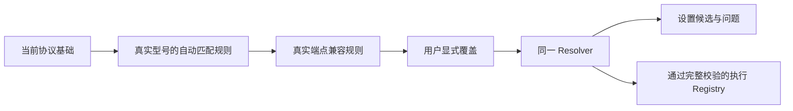
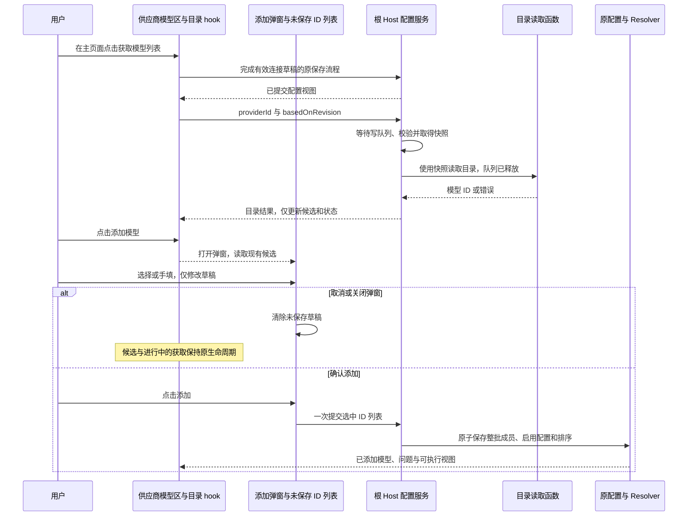
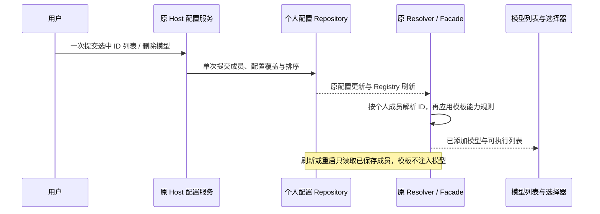

# 模型网关配置简化设计方案

日期：2026-10-07。状态：基础简化、获取按钮外移、模板模型自主管理及本轮五项交互整改已实现；验证见 [配置简化验收记录](./CONFIGURATION-ACCEPTANCE.md)。

目标：填写 API 地址、API Key 和 API 格式后，点击「获取模型列表」，再从可搜索的下拉列表选择模型；目录不可用时可以手填 ID。普通接入不要求理解容量、媒体能力或参数表达式。

已确认：获取模型列表按钮放在供应商主页面「模型列表」标题右侧、「添加模型」按钮左侧；获取只更新候选，不打开添加弹窗、不自动添加。添加弹窗负责搜索选择或手填，以及确认保存。未知模型允许先保存，首次使用前手动补充上下文、输出上限。内置数据维护及预设移除见 [模型基础数据整改方案](./MODEL-METADATA-IMPROVEMENT.md)。

## 1. 本期改动

| 改动                                 | 目的                                                 |
| ------------------------------------ | ---------------------------------------------------- |
| 供应商名称常显表单                   | 方便直接命名和修改，减少菜单操作                     |
| 模板模型由用户选择添加与删除         | 新建列表为空，取消自动展示的固定模型                 |
| 获取模型按钮、下拉搜索选择、手填备用 | 解决查找和复制模型 ID 的问题                         |
| 简单添加与高级编辑分开               | 简化普通接入，为特殊网关提供调整入口                 |
| 已知模型自动配置、未知模型补全       | 减少填写，确保执行时容量有明确依据                   |
| 真实型号规则与稀疏个人覆盖           | 自动配置已知型号，未知别名手填上限，请求使用原 ID    |
| 未知容量和通用推理混发整改           | 保证新增模型的实际请求正确性                         |
| 模型列表加载与保存                   | 切换连接时忽略旧结果、请求超时可重试、点击添加后保存 |

## 2. 用户流程

### 2.1 供应商名称与连接信息

复用现有供应商列表和详情布局。新增供应商支持自定义显示名称，创建后仍可随时修改；「新供应商」仅作为初始名称。

- 连接表单首项常显「供应商名称」输入框，直接编辑；顶部保留图标、名称、启停和删除入口，移除「更多 → 重命名」。复用现有名称草稿与保存路径。
- Enter 或失焦确认，Escape 取消；名称去除首尾空白，空名称恢复原值。
- 保存后，左侧供应商列表、详情标题及其他使用供应商名称的位置统一显示新名称，重新打开仍保留。
- 重命名只修改显示名称，Provider ID、连接配置和已添加模型保持原关联；已有模型目录继续可用。

连接区保留 API 地址、API Key、API 格式：

- 模板提供协议默认值，自定义连接可选择现有三种格式。
- 地址示例说明应填 API 根地址；沿用当前 URL 规则，不自动猜协议或裁剪路径。
- 连接草稿沿用 idle／失焦／cleanup 保存。
- 就近显示缺失字段或保存失败，区分「连接未完整」与「模型缺少配置」。
- Key 沿用现有密码显示和存储方式。
- 移除「获取 API Key」入口及其 UI 回调；用户自行填写密钥。

添加供应商统一显示模板卡片。顺序为：创建自定义、OpenAI、Anthropic、DeepSeek、Kimi、MiniMax、BigModel、Z.ai、阿里百炼、Xiaomi、xAI、OpenRouter、OpenCode。每个品牌只保留一个模板，BigModel 与 Z.ai 分开保留；名称、地址及 API 格式可在表单修改。保留的默认连接及删除范围见 [供应商模板去重](./TEMPLATE-CONSOLIDATION.md)。

模板只提供连接默认值和模型能力规则，不提供已添加模型列表。新建模板供应商的模型列表为空；现有供应商自动继承的模板模型也清空，由用户重新选择添加，已主动添加的个人模型保持原成员关系。开发版本不将模板预置模型迁移为个人模型。

### 2.2 添加模型

供应商主页面分开提供获取和添加入口；添加弹窗只包含模型选择或手填、简短配置提示和保存操作：

```text
供应商主页面

模型列表             [ ↓ 获取模型列表 ] [ ＋ 添加模型 ]
获取状态或错误提示
已添加模型列表

添加模型弹窗

模型     [ 搜索并多选网关模型       v ]
          找不到模型？手动输入模型 ID

配置提示：内置预设 / 待完善配置

                         取消   添加 N 个模型
```

1. 在供应商主页面点击「获取模型列表」加载候选；再次点击重新获取。获取成功只更新候选，不打开弹窗、不添加模型。用户点击「添加模型」后，下拉展示真实模型 ID 和「已添加」标记。
2. 搜索在已取得的目录内进行。搜索词与模型草稿分开，搜索文本不会自动成为待保存 ID。取消或关闭添加弹窗只清除未保存的模型草稿；同一供应商连接未变化时，再次打开仍复用候选。
3. 目录支持多选，勾选不关闭下拉，搜索保留勾选；触发按钮显示选中数量，弹窗展示可移除的已选 ID。点击「添加 N 个模型」才一次保存整批，不自动选择候选或切换会话模型。已添加型号不可勾选。
4. 手填入口始终可用，仍一次输入一个 ID；目录失败或为空时仍可添加。切换目录／手填时清空另一入口的未保存选择，避免提交隐藏的型号。
5. 保存失败保留全部选择或手填输入；成功后关闭弹窗，新行可见。Host 逐个应用已有能力规则，未知型号保存后在行内提示「待完善配置」，不增加批量高级配置或逐个解析请求。
6. 整批成员、启用配置和排序在同一次 Repository 更新中提交。空批次、本批重复或与现有成员冲突时整批失败，不允许部分保存；沿用原权威层成员与版本校验。

目录 hook 使用 idle、loading、success、error 四种操作状态。连接未完整由连接表单判断；空列表和搜索无匹配由当前数据派生。主页面模型列表区域显示连接未完整、加载、空目录和安全错误反馈；成功时显示「已获取 N 个模型，点击添加模型选择」。加载期间获取按钮显示「获取中…」并禁用重复点击。弹窗尚未获取时提示先在供应商页面获取列表，为空时显示空目录提示，也可直接手填；获取加载或失败不妨碍打开弹窗手填。

重新获取期间暂停旧候选选择，成功后整体替换目录；失败在主页面显示错误，手填入口继续可用。

复用已有搜索选择、输入和弹窗组件。长模型目录使用下拉列表自己的滚动容器，鼠标滚轮可上下浏览，不能被外层弹窗的滚动锁拦截；下拉打开时背景页面保持锁定。搜索、多选和未保存 ID 仍由原组件持有，不增加滚动状态或手写滚轮转发。Enter 在下拉中只选候选，不提交外层；输入法确认不触发保存；Escape 先关下拉。窄屏软键盘打开后输入和保存按钮仍可访问，遵守 DESIGN.md 的字号、焦点和菜单规范。

### 2.3 已添加模型与补全

列表沿用启停、排序、编辑、删除和测试。只增加必要的缺配置提示：

- 所有用户添加的模型均可删除，包括与模板能力规则匹配的模型；能力自动配置不会将它变成不可删除的固定成员。
- 删除沿用原模型删除操作，一次提交移除个人成员、对应配置覆盖和排序项。刷新、重启或保存连接后不恢复；重新添加同一 ID 时重新解析模板能力规则。
- 获取模型列表只产生候选，不能改变已添加成员。目录中已添加标记从当前成员派生，删除后可以再次选择。

- 完整配置显示「已配置」，不称为「已验证」。
- 未知模型缺少上限时显示「待完善配置」及缺失项，不进入执行 Registry。
- 连接错误定位连接字段；模型错误定位相应配置；停用沿原规则处理。
- 当前会话模型变得不可用时提示修复，不静默改选另一模型。

「完善配置」打开同一个编辑弹窗，显示模型 ID、上下文和最大输出上限。已知型号显示内置默认值，未知型号手动填写必要上限。特殊能力与映射保持收起；补全与高级编辑共用草稿和保存命令。

高级编辑显示实际生效值和来源，可覆盖现有媒体、推理及特殊兼容项。保留推理映射和输出上限映射入口，以处理特殊网关；普通用户不必填写表达式。

恢复操作保持简单：

- 清空某个手动字段，恢复该字段的继承值。

保存后留在网关。

## 3. 配置解析：必要整改

### 3.1 按真实型号解析规则

继续由 ModelConfigRules／Provider Resolver 按真实模型 ID、API 格式和实际地址解析内置规则。

个人模型规则只保留型号身份和稀疏覆盖：

```ts
{
  (providerId,
    modelId, // 实际请求使用的 ID
    config); // enabled 与稀疏用户覆盖
}
```

自动匹配必须有明确的型号规则依据；通用规则命中或配置恰好完整，都不能冒充识别了具体型号。未知型号的两个上限来自用户覆盖。

### 3.2 唯一解析顺序



必须保持以下规则：

- 个人显式覆盖优先，预览与执行共用同一解析结果。
- 请求始终使用用户填写的 modelId；个人覆盖不改变供应商地址、Key 或 headers。
- 端点兼容规则依据当前实际连接，不补回未知型号容量。
- 移除未知模型的 200K／32K 通用容量，改由可靠型号规则或用户填写提供。
- 通用配置不混发多厂商推理字段，具体型号与协议规则只发送所需参数。
- 没有可选推理档位时，内部保留单一 default 与空对象映射，UI／CLI 隐藏无意义的档位选择。
- 输出上限按当前协议与端点映射为一个明确字段，特殊网关可在高级区覆盖。

未知型号沿现有通用基线使用文本输入输出和标准工具调用格式；媒体、原生搜索和结构化输出默认关闭，不发送额外推理参数。用户补齐上限不等于已实测服务商能力。

### 3.3 保存与执行分开

未知模型可以只保存 ID。缺少必要上限时保留在设置候选中，手动补齐两项上限后再按现有完整校验发布。未填写与非法输入分别处理；用户明确填写的无效值不能保存。

新添加、编辑统一保存稀疏覆盖，移除面向用户的智能／手工切换。涉及旧手工写法的当前读写消费者按实际引用一并调整。

## 4. 模型目录：一个读取接口

### 4.1 独立按钮获取

供应商主页面「模型列表」标题右侧的「获取模型列表」按钮是唯一的目录请求入口，位置在「添加模型」按钮左侧。获取只更新候选；打开或关闭添加弹窗、打开下拉、搜索、选择模型和保存连接均不发起目录请求。同一供应商编辑界面内连接未变化时复用已取得结果，再次点击按钮可重新获取。

相关连接字段变化后，旧目录失效，提示重新点击按钮获取；手填模型 ID 始终可用。

### 4.2 最小服务合同

在已有 IProviderSettingsService 上增加一个目录读取方法：

```ts
listAvailableModels(input: {
  providerId: ProviderId;
  basedOnRevision: number;
}): Promise<readonly ModelId[]>;
```

- UI 经现有服务 hook 调用根 Host，不直接 fetch，也不把 Key 作为新接口参数传入。
- 先完成有效连接草稿的原保存流程，基于已提交视图的 revision 发起读取，不夹带未确认名称。
- Host 等待原 Provider 写队列，按现有 revision 规则校验并读取连接快照；随后释放队列，再执行网络读取。
- 请求开始前版本冲突沿用重新加载／重试规则。读取结果是临时候选，不写配置、不进入 Registry。



### 4.3 两个简单协议适配

| 当前 API 格式                      | 目录实现                         |
| ---------------------------------- | -------------------------------- |
| OpenAI Chat Completions／Responses | 共用一个标准 OpenAI 目录读取函数 |
| Anthropic Messages                 | 一个标准 Anthropic 目录读取函数  |

按所选协议从当前 API 根地址生成目录请求，复用当前鉴权、headers 与地址语义。

DeepSeek 官方 `https://api.deepseek.com/anthropic` 的 Messages 连接使用独立官方目录 `https://api.deepseek.com/models` 与相同 Key 的 Bearer 鉴权，聊天连接和 API 格式不变。仅按实际 HTTPS 官方源和精确 `/anthropic` 路径匹配（允许末尾斜杠），不按供应商名称或模板匹配；第三方网关及其他路径沿原规则，不猜地址或在失败后向其他端点尝试发送密钥。

协议分页由 Host 的读取函数内部完成，使用同一次操作的有限期限；成功一次返回完整 ID 列表，失败返回错误。

返回值只取合法非空 ID 并去重，不据此推断容量和能力。第三方网关不开放标准目录时，用户仍可手填。实施前依据实际协议合同核实路径、鉴权、分页与响应字段。

### 4.4 必须保留的异步边界

1. UI 使用当前服务实例、Provider ID、局部请求代次与相关连接字段比较，丢弃迟到结果。名称、排序变化不影响已取得的目录。
2. 地址、Key、协议或 headers 的草稿变化时暂停旧候选选择；点击获取按钮后，先完成有效连接草稿的保存，再按已保存连接读取。响应不覆盖用户已选择或手填的 ID。
3. 一个界面操作只保留一个进行中的读取，加载时避免重复点击，失败后可再次点击获取按钮。
4. Host 读取复用现有代理、noProxy、CA/TLS 与资源释放；有限期限覆盖请求及响应 body 读取。Host 释放时结束未完成请求。供应商编辑界面卸载、切换供应商或相关连接变化后，通过局部代次拒绝迟到结果；关闭添加弹窗不清除候选，也不使该供应商当前连接的获取结果失效。
5. Key、敏感 headers 和原始错误响应体不进入候选、日志或错误回显。目录失败不回滚已保存连接、不删除已有模型。

实现由一个局部 hook、一个公开服务方法和两个协议读取函数组成。

## 5. 复用的状态与平台边界

| 事实                           | 所有者                        | 本期处理                                                     |
| ------------------------------ | ----------------------------- | ------------------------------------------------------------ |
| 连接草稿、名称确认             | 现有供应商编辑组件            | 复用原保存路径与脏状态                                       |
| 添加选择、取消与保存           | 添加弹窗局部状态              | 仅持有未保存 ID 列表，一次调用原 Host 的批量成员写入         |
| 已有模型编辑草稿               | 原模型草稿 hook               | 高级编辑沿用原单模型事务                                     |
| 目录加载与结果                 | 当前供应商模型区的局部 hook   | 主页面与添加弹窗共享临时候选，无全局 store；不随弹窗关闭清除 |
| 已保存配置、revision、成员关系 | 原 Host 配置服务与 Repository | 复用原子写入、队列与冲突处理                                 |
| 有效值、来源、问题             | 原 Resolver／Facade           | UI 只读投影                                                  |
| 测试反馈                       | 当前界面操作                  | 沿用临时反馈，无永久认证                                     |

模型设置与目录读取使用根／本机 Host。目录不依赖工作区 cwd、Agent 或已添加模型，首次未打开项目时也能读取。

模板成员清理仅修改仓库内置配置和模板 schema：移除模板的 `builtinModelIds`，保留独立的能力规则。`personalModelIds` 仍由原 Host 配置服务管理，不增加排除列表、第二条保存路径或历史迁移。Resolver 和 Facade 继续派生列表、能力与可执行性；删除当前选中模型后沿用原不可用提示，不自动切换到其他模型。



个人配置继续使用原 codec 与远端分发合同传递稀疏覆盖，目标 Host 使用其内置规则重新解析。

原分发顺序保持：

```text
本机个人配置变更 → 原 Source 编码 → 原 Target 解码保存
→ 目标 Resolver 重算 → 原分发结果
```

## 6. 基础测试文案与反馈

沿用现有测试按钮与正式请求链。当前请求为 1 Token、最低公开推理档位，并验证流收到 finish；成功文案应准确说明是基础请求验证，不承诺回答质量、工具能力、所有档位或最大上下文。

测试前需完整配置；失败显示现有安全错误并允许手动重试。配置变化后清除旧测试反馈。

## 7. 代码影响与实施顺序

| 范围                | 主要位置                                                                                                                                                                                                                                   | 必要改动                                                                                    |
| ------------------- | ------------------------------------------------------------------------------------------------------------------------------------------------------------------------------------------------------------------------------------------ | ------------------------------------------------------------------------------------------- |
| 添加与编辑 UI       | packages/ui/src/settings/model-provider-section/ 下的 AddModelsDialog、ModelCatalogPicker、ProviderTemplatePicker、ProviderModelMetadataDialog、ProviderCardSections、ProviderFormControls、ProviderModelDraftState、useProviderModelDraft | 常显名称表单、模板排序、移除获取 Key 入口、独立获取按钮、多选与单个手填、轻量补全、稀疏草稿 |
| 保存协调与目录 hook | InlineEditableProviderCard、ProviderDraftSave；packages/ui/src/hooks/useModelProviders.ts、useModelCatalog.ts                                                                                                                              | 复用名称确认与保存顺序，目录生命周期跟随当前供应商连接                                      |
| 配置投影            | packages/ui/src/lib/providerSettingsFormTypes.ts、providerSettingsFormProjection.ts                                                                                                                                                        | 来源与缺失项投影                                                                            |
| 型号规则与解析      | config/provider/zcode-builtin.json；packages/provider/src/config/、resolver.ts、facades.ts、config-service.ts                                                                                                                              | 真实型号解析、删除预设字段、去除未知容量与混发参数、整批成员一次原子保存                    |
| 目录读取与装配      | packages/services/src/model-provider/modelCatalog.ts、providerFacadeServices.ts、providerRuntime.ts、packages/services/src/node.ts                                                                                                         | 增加读取方法，注入现有 Host 网络出口，适配 DeepSeek 官方独立目录                            |
| 当前配置读写合同    | packages/provider-node/src/provider-config-file-codec.ts；packages/shared/src/provider-provisioning.ts；原 provisioning source／target                                                                                                     | 仅同步新格式必需的字段和校验                                                                |
| 文案与单档推理显示  | ModelConfigHelp、现有 UI／CLI 档位消费者、zh-CN／en-US                                                                                                                                                                                     | 简化提示、隐藏不可选择的单档                                                                |

实施顺序：

1. 将供应商命名、独立按钮获取、下拉搜索选择和明确添加的行为更新到对应 spec。
2. 完成最小规则整改和存储合同，验证未知保存、手填上限及真实型号解析。
3. 接入目录读取与简单添加界面，复用原保存事务。
4. 同步高级编辑、必要消费者和文案，完成关键验证。

## 8. 必要验证与完成标准

| 场景               | 关键断言                                                                                                                                                         |
| ------------------ | ---------------------------------------------------------------------------------------------------------------------------------------------------------------- |
| 供应商命名         | 新增供应商可自定义名称，创建后可再次重命名；保存后列表与标题一致、重新打开仍保留，原模型关联不变                                                                 |
| 简化入口与排序     | 名称字段常显且 Enter／失焦保存、Escape 取消；无重命名／获取 API Key 入口；自定义加 12 个品牌模板按指定顺序显示，BigModel 与 Z.ai 分开保留                        |
| 批量添加           | 搜索多选、长目录滚轮上下浏览且背景不滚动、取消不保存、确认一次保存全部；已添加项不可选；批内或已有重复整批拒绝，失败保留选择；手填仍单个，切换清除隐藏选择       |
| DeepSeek 目录      | 官方 Anthropic 连接请求同源 `/models`，Bearer 与连接不变；第三方 `/anthropic` 仍走原 Anthropic 目录，无试错重定向                                                |
| 模板模型成员       | 新建列表为空；现有自动继承模型取消；添加原模板 ID 自动解析能力且可删除；删除后保存连接、刷新与重启不恢复，重新添加可用                                           |
| 正常接入与失败备用 | 主页面获取按钮位于添加模型左侧；点击才读取目录，成功不打开弹窗、不添加模型；打开弹窗、下拉搜索选择和单独保存连接不发请求；确认添加后才保存模型，目录失败仍能手填 |
| 未知模型与别名     | 纯 ID 可保存，缺限额不发布；手填上限不改真实 ID；补齐后统一解析                                                                                                  |
| 个人覆盖           | 内置规则更新后用户覆盖保留，清空字段恢复继承，正式请求参数与预览一致                                                                                             |
| 异步和事务         | 保存失败不读目录，换连接的迟到结果失效；关闭再打开弹窗复用候选，关闭不使正在获取的结果失效；重复添加不覆盖，取消不落盘                                           |
| 协议与序列化       | 两个标准目录适配用必要 fixture 验证；新个人配置与分发 codec 一次 round trip                                                                                      |

交互验证完成主页面获取、打开添加弹窗、取消后再打开复用候选、确认添加的一条主流程；验证主页面加载与错误反馈、连接变化后的候选失效，并在窄屏检查两个按钮、键盘、焦点和保存可达性。

代码实现阶段按仓库要求读取架构上下文，执行 pnpm typecheck、pnpm lint、pnpm architecture:check --changed 及相关测试。

完成标准：新增供应商可自定义名称并在创建后重命名；支持标准目录的连接可以在主页面获取列表，再主动打开添加弹窗下拉选模型，关闭弹窗仍保留当前连接候选；特殊网关可手填；已知型号无需填写高级参数；未知型号能保存并明确补齐路径；用户填写的真实 ID、显式覆盖与正式请求保持一致。

## 9. 源码依据

- [现有表单](../../packages/ui/src/settings/model-provider-section/ProviderModelMetadataDialog.tsx)与[连接保存](../../packages/ui/src/settings/model-provider-section/ProviderDraftSave.ts)。
- [现有规则解析](../../packages/provider/src/config/model-config.ts)、[完整校验与执行发布](../../packages/provider/src/resolver.ts)、[Facade 事务与 revision](../../packages/provider/src/facades.ts)。
- [UI 现有服务与代次边界](../../packages/ui/src/hooks/useProviderSettingsView.ts)。
- [基础文本测试](../../apps/zcode-cli/packages/core/src/runtime/methods/workspace-generate-text.ts)。
- [个人配置分发合同](../../packages/shared/src/provider-provisioning.ts)。
