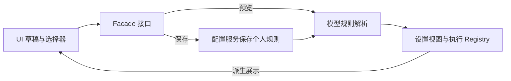

# 模型基础数据与配置表单整改方案

日期：2026-10-08。状态：已实施，验收结果见第 6 节。

本次整改直接补充和整理 `config/provider/zcode-builtin.json`，先覆盖 OpenAI、Anthropic、DeepSeek、KIMI、MiniMax、智普六家；清理官方已下线或停止提供的型号；完整移除「能力预设」选择器及其配置和解析逻辑。已知型号按真实模型 ID 自动获得内置配置，未知型号由用户手动补齐必要上限。

## 1 内置规则补充与清理

以六家供应商的官方模型文档、API 文档和停服公告为依据，直接更新仓库内置 JSON，随应用构建发布。核对型号时记录官方来源链接与核实日期。

### 补充内容

先盘点六家当前提供的文本模型及其正式 API ID，与现有规则逐项比对，补齐缺失型号，纠正已变化的配置。

截图中 `gpt-5.5`、`gpt-6-luna`、`gpt-6.1-sol`、`gpt-6-sol` 属于现有容量规则的覆盖缺口，应优先核实。网关目录返回型号 ID 只能证明该网关列出了型号；上下文、输出上限和能力需要另外核实，不套用相邻型号的数值。

| 核实内容               | 内置配置位置                                      |
| ---------------------- | ------------------------------------------------- |
| 正式型号 ID 与官方别名 | `modelRules` 的型号匹配规则                       |
| 总上下文窗口           | `properties.contextWindow`                        |
| 最大输出 Token         | `optionSpecs.maxOutputTokens.max`                 |
| 媒体和工具能力         | 已有 `inputFormat`、文字输出和工具能力字段        |
| 推理和结构化输出方式   | 已有型号与 API 格式规则及请求参数映射             |
| 官方端点差异           | `providerSiteRules` 的实际地址与 API 格式限定规则 |

官方资料未确认的字段保持缺省，不编造容量或能力。上下文和输出上限未确认的型号不能仅凭名称变成可执行模型，仍由现有完整配置校验决定。

仅有「支持推理」的说明不足以新增推理档位或请求表达式；具体协议参数以官方 API 文档为准。

### 清理标准与位置

仅清理官方明确已下线或停止提供的型号。发布时间较早、属于上一代或不再主推，都不能单独作为删除依据；停服日期尚未到达的型号继续保留。

每个确认退出的型号同步检查以下位置，删除专属条目并收窄包含该型号的混合匹配规则，保留其他有效型号的配置：

| 规则位置             | 清理内容                       |
| -------------------- | ------------------------------ |
| `modelRules`         | 型号、官方别名的容量和能力规则 |
| `modelApiRules`      | 该型号专用的协议参数映射       |
| `providerSiteRules`  | 该型号专用的端点覆盖           |
| `templateModelRules` | 模板中对应型号的启用配置       |

保留其他型号共用的 API 和端点规则。内置数据维护不修改个人供应商、个人模型成员或手动覆盖；模板供应商继续由用户选择添加模型。

`templateModelRules` 中的 `enabled: false` 只表示默认禁用，不是停服证据；移除该条目会恢复通用默认值，不能把删除禁用条目当成完整清理。已由用户添加的型号继续保留为个人成员；若移除了它依赖的容量规则且没有个人上限配置，该型号会按现有校验进入待完善状态。

## 2 匹配与解析

按明确的基础型号 ID、已知厂商前缀及有官方依据的版本和别名映射自动识别。只有能唯一确定对应型号时才使用基础数据；无法识别的网关别名由用户手动配置，不能按名称相似度猜测。

供应商差异只在实际地址和 API 格式明确对应时应用。供应商显示名称及模板名称不能决定端点限制；同名型号在不同端点的限制分别保留，不合并取最大值。

复用当前 `ModelConfigRules` 与 Resolver：


精确型号规则位于通用和家族规则之后，避免通用容量覆盖新型号数据。纠正容量时保留有效的请求选项与表达式；清理被精确规则取代的重复容量定义，保留实际端点的差异。

移除 `capabilityProfileId`、预设目录、型号替换及其专用覆盖分支，解析和实际请求统一使用用户添加的真实模型 ID。保留现有通用、型号、API 和真实端点规则；个人显式覆盖最后应用。

内置数据更新后继续保留个人显式覆盖；保存只写用户手动配置的字段，清空字段才恢复继承，避免把全部默认值复制为个人配置。

## 3 表单调整

普通编辑表单只显示模型 ID、上下文窗口、最大输出 Token 和高级配置入口：

```text
编辑模型配置

模型 ID          [ gpt-5.6-sol ]
上下文窗口       [ 1050000     ]
最大输出 Token   [ 128000      ]

> 高级配置

                         取消  保存
```

删除「能力预设」选择器及相关提示。已有高级配置继续提供媒体能力、推理档位和请求参数映射等手动调整。

已识别型号显示内置默认值，用户可按网关实际限制覆盖。未知模型仍可保存，完善配置时提示「请设置上下文容量与最大输出上限」；未补齐必要上限前保持待完善状态，填写后沿现有完整配置校验判定是否可用。

编辑继续使用现有模型草稿及保存事务，保存失败保留草稿，取消不保存。

## 4 改动范围与原因

本轮有两项独立工作：维护内置数据，以及完整删除能力预设。维护模型数据只需修改内置 JSON；其余生产文件都属于删除预设的必要清理，可分别实施和提交。

预设相关的 18 个生产文件中，功能删除集中在预设目录、解析分支和选择器，其余主要是删除同一个 `capabilityProfileId` 字段及其传参、校验和文案。预设目前沿下列链路使用，完整删除时需要同步清理各处引用：



### 4.1 内置数据维护

修改 `config/provider/zcode-builtin.json`：补齐六家现役型号规则、修正配置、清理停服型号及引用，并更新 revision。

### 4.2 预设功能删除

| 位置                                                                              | 实际改动                             |
| --------------------------------------------------------------------------------- | ------------------------------------ |
| `packages/provider/src/config/capability-profiles.ts`、同目录 `index.ts`          | 删除预设目录、查找、验证及其公开导出 |
| `packages/provider/src/config/model-config.ts`                                    | 删除预设替换型号和专用覆盖分支       |
| `packages/ui/src/settings/model-provider-section/ProviderModelMetadataDialog.tsx` | 删除预设选择器及导入                 |

### 4.3 同一字段的清理

以下文件沿原接口和保存路径删除预设字段，保留其他配置行为：

- `packages/provider/src/config/rule-data-schema.ts`：删除个人规则中的字段定义。
- `packages/provider/src/facades.ts`、`resolver.ts`：删除接口字段、解析传参、预设校验和视图投影。
- `packages/provider/src/config-service.ts`、`packages/services/src/model-provider/providerRuntime.ts`：删除保存参数及预设保留分支，复用原保存事务。
- `packages/ui/src/settings/model-provider-section/` 下的 `ProviderModelMetadata.ts`、`useProviderModelDraft.ts`：删除草稿字段和预设切换依赖。
- 同目录的 `ProviderFormControls.tsx`、`ProviderCardSections.tsx`、`InlineEditableProviderCard.tsx`：删除预览、保存调用中的传参。
- `packages/ui/src/lib/providerSettingsFormTypes.ts`、`providerSettingsFormProjection.ts`：删除表单字段及投影。
- `packages/ui/src/i18n/locales/zh-CN.ts`、`en-US.ts`：删除预设文案，未知型号提示改为手填必要上限。

### 4.4 Spec 同步

本方案替代旧设计中的能力预设规则。实施时同步更新 `specs/model-gateway/SPEC.md` 和 `CONFIGURATION-IMPROVEMENT.md`：清除预设入口、引用字段及切换行为，保留已知型号自动配置、未知型号手填上限和稀疏个人覆盖。

## 5 实施顺序与验收

先按官方资料建立补充、修正和删除清单，再修改内置 JSON 并验证规则。随后同步 spec、删除预设配置、解析分支及 UI，验证表单与保存行为。两项工作分别提交。基础数据更新后完整重建并重新启动 Desktop Host 与 Agent；验证时不能只热更新 Renderer。

| 场景               | 核心断言                                                                                                     |
| ------------------ | ------------------------------------------------------------------------------------------------------------ |
| 六家型号与规则覆盖 | 本轮核实并补齐的型号可自动解析容量和能力，原有效 API 请求参数映射保留；断网可解析                            |
| 停服型号清理       | 已确认下线的型号专属条目和引用清理完整，混合规则中的有效型号及共用映射保持可用                               |
| 供应商限制         | 明确官方端点采用供应商覆盖，自定义 URL 使用基础值或个人覆盖，不按显示名判断                                  |
| 未知型号与个人覆盖 | 未知型号补齐两项必要上限后可通过完整校验；请求 ID 不变；个人 64,000 上限在数据更新后保持，清空后才继承       |
| 页面与同步         | 模型编辑没有预设选择器；取消和保存失败保留原有行为；更新不恢复已删除成员，个人覆盖配置及分发 round trip 通过 |

沿用内置 Release 的完整解析校验，补充规则覆盖、停服条目清理与个人覆盖的核心用例，调整 `packages/services/test/modelGatewayConfiguration.test.ts` 和 `packages/ui/test/providerModelDraft.test.ts` 中的预设相关断言，并完成一条已知型号编辑、未知型号手填及取消保存的隔离 E2E。实施后执行 `pnpm typecheck`、`pnpm --dir apps/zcode-cli typecheck`、`pnpm lint`、`pnpm architecture:check --changed` 及改动文件格式检查；实际新增测试按其入口执行，不假定存在统一 test 命令。

本轮实际验收结果如下，历史验收记录保留当时已执行的事实。

## 6 本次实施与验收

内置 revision 从 31 更新为 32。数据直接维护在仓库 JSON，模型目录仍只负责提供可选 ID，不引入外部元数据下载或同步链路。

### 6.1 实际数据更改

| 厂商      | 本次补充或修正                                                                                                                                                                                                                                        |
| --------- | ----------------------------------------------------------------------------------------------------------------------------------------------------------------------------------------------------------------------------------------------------- |
| OpenAI    | 补齐 `gpt-5.5[-pro]`、`gpt-6-sol`、`gpt-6-luna`、`gpt-6.1-sol`；补充仍在服务的 GPT-5/5.1/5.2、GPT-4.1/4o、o1/o3/o4-mini 等文本型号。四个重点型号均为 1,050,000 上下文、128,000 输出。GPT-5 Pro 的输出上限为 272,000，GPT-5.2 Pro 不支持 JSON Schema。 |
| Anthropic | 补齐 Opus/Sonnet 5.5、Opus 4.7/4.8、Opus/Sonnet 4.6 与 4.5。4.6 为 1M/128K、四档 effort；4.5 为 200K/64K。Opus 4.5 只映射 effort；Sonnet/Haiku 4.5 保留默认档位，不错误发送 adaptive。                                                                |
| DeepSeek  | 当前 Flash/Pro 及仍可调用的 Flash 别名修正为 1,048,576 上下文、393,216 输出；官方 Anthropic 的中途 system 支持只对 Flash 开启，Pro 保持关闭。                                                                                                         |
| KIMI      | K3 输出上限由默认值 131,072 修正为服务上限 1,048,576，补齐严格 JSON Schema 能力。K2.6/K2.7 Code 的 98,304 缺少官方依据，删除该声明，保留已确认的上下文、媒体和推理字段；使用时需要补充输出上限。                                                      |
| MiniMax   | M3 输出上限修正为 524,288；现有 M2.x 为 204,800。补充 M3.1 Flash Preview 基础能力及五档 effort。M3 开关分别映射 Messages/Chat 的 disabled/adaptive、Responses 的 none/high；M2.x 不暴露关闭思考。                                                     |
| 智普      | GLM-5、5.1、5-Turbo、5.2、5.3/Flash/FlashX 输出上限核正为 131,072；修正 4.1V FlashX 输出上限为 16,384，4-Flash-250414 为 32,768；补齐 4.6V/4.1V 官方媒体能力和 GLM Chat 推理映射。                                                                    |

基础匹配收窄到明确型号与已有的网关前缀、标签，避免把未知的新版本当成已知型号。`gpt-5.3-codex-spark` 单独保留官方确认的 128K 与纯文本能力，输出上限不套用普通 Codex。

移除 Kimi K2.5 和全部现存 moonshot-v1 的基础规则、API 映射及模板引用，官方下线日期为 2026-08-31。其他已确认停服的旧 OpenAI/Claude 型号在本轮修改前没有独立基础条目，不新增禁止用户手填的全局黑名单。

DeepSeek V4 Flash/Flash Vision Exp 的旧模型于 2026-09-10 退役，但 ID 仍转发到新 Flash，所以保留有效名称。V4 Pro 最新公告取消停服计划，继续保留。MiniMax、GLM 和仍未到停服日期的 OpenAI/Claude 型号不按“年代久”删除。现有第三方端点的独立覆盖保留，个人覆盖仍最后应用；模板模型列表继续为空，由用户主动添加。

### 6.2 官方维护依据

下列资料核验日期为 2026-10-08，后续更新时以当日官方文档和停服公告为准。

| 数据                        | 官方依据                                                                                                                                                                                                                                                                                                           |
| --------------------------- | ------------------------------------------------------------------------------------------------------------------------------------------------------------------------------------------------------------------------------------------------------------------------------------------------------------------ |
| OpenAI 当前型号、容量和协议 | [GPT-5.5](https://developers.openai.com/api/docs/models/gpt-5.5)、[GPT-6.1 Sol](https://developers.openai.com/api/docs/models/gpt-6.1-sol)、[GPT-6 使用指南](https://developers.openai.com/api/docs/guides/latest-model)、[型号目录](https://developers.openai.com/api/docs/models)                                |
| OpenAI 停服                 | [Deprecations](https://developers.openai.com/api/docs/deprecations)；未来停服日期不作为当前删除依据                                                                                                                                                                                                                |
| Anthropic 型号、容量、推理  | [模型总览](https://platform.claude.com/docs/en/models/overview)、[Effort](https://platform.claude.com/docs/en/build-with-claude/effort)、[Thinking](https://platform.claude.com/docs/en/build-with-claude/thinking)                                                                                                |
| Anthropic 停服              | [Model deprecations](https://platform.claude.com/docs/en/about-claude/model-deprecations)                                                                                                                                                                                                                          |
| DeepSeek 精确整数与协议能力 | [模型目录 API](https://api-docs.deepseek.com/api/list-models/)、[更新日志](https://api-docs.deepseek.com/updates/)                                                                                                                                                                                                 |
| KIMI 容量与下线             | [K3 快速开始](https://platform.kimi.com/docs/guide/kimi-k3-quickstart)、[Chat API](https://platform.kimi.com/docs/api/chat)、[模型列表与下线公告](https://platform.kimi.com/docs/models)                                                                                                                           |
| MiniMax 最大值与映射        | [Messages API](https://platform.minimax.cn/docs/api-reference/text-chat-anthropic)、[Chat API](https://platform.minimax.cn/docs/api-reference/text-openai-api)、[Responses API](https://platform.minimax.cn/docs/api-reference/responses-create)、[模型概览](https://platform.minimax.cn/docs/guides/models-intro) |
| GLM 最大输出和媒体          | [精确参数表](https://docs.bigmodel.cn/cn/guide/start/concept-param#max_tokens)、[型号概览](https://docs.bigmodel.cn/cn/guide/start/model-overview)、[Flash/FlashX](https://docs.z.ai/guides/vlm/glm-5.3-flash)、[GLM-4.6V](https://docs.z.ai/guides/vlm/glm-4.6v)                                                  |

GLM 概览中 4.1V Flash 和 4-Flash-250414 的 16K 描述与精确 `max_tokens` 参数表不同，本轮使用后者的 32,768。M3.1 Flash Preview 当前仅 M Plan/MiniMax Code 提供，GLM-5.3 FlashX 当前不支持 Coding Plan；不修改模板端点或承诺不同账户通用可用。

当前执行器使用流式请求，合同没有 `supportsStreaming` 字段。`enabled` 是可被个人覆盖的用户开关，不能表达不可覆盖的协议限制。本轮不新增这类假限制；只保留真实的工具能力、推理档位和参数映射。官方不支持流式的 GPT-5.5 Pro、o1 Pro、o3 Pro 只补容量，实际运行不在本次验证范围。官方 Chat 工具限制按真实 URL 限定，不应用到其他网关。

### 6.3 验证结果

完整配置 Schema 和表达式解析、六家代表性容量、停服清理、未知版本不误匹配、端点差异、个人覆盖、目录请求和草稿继承的关键回归共 12 项，通过 12 项。

本轮界面验收与全仓检查记录补充于 [配置验收记录](./CONFIGURATION-ACCEPTANCE.md)，不覆盖已有历史执行事实。
