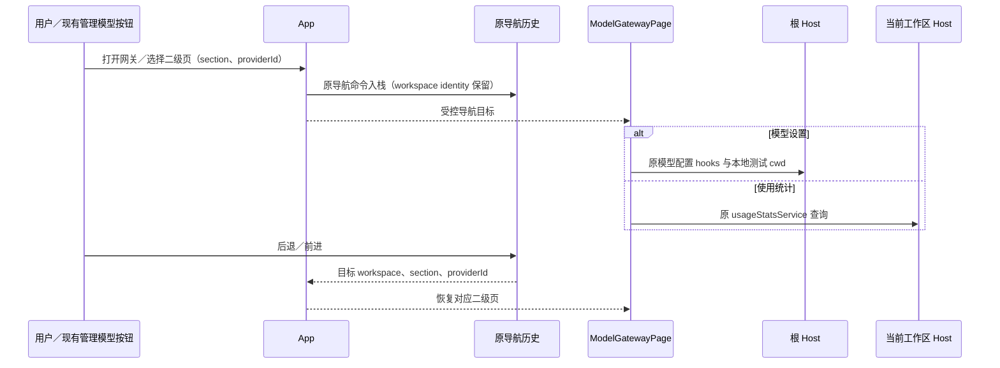

# 模型网关一级入口

## 产品规则

- 新增一级菜单「模型网关」，沿用现有一级图标栏与工作区主视图。入口放在插件市场之后、设置之前；二级菜单仅包含「模型设置」「使用统计」，标题为「模型网关」。
- 每次从其他一级模块（含设置）进入模型网关，默认选择模型设置。在网关内重复点击一级入口只展开二级栏，保留当前子页。
- 二级页切换与显式跳转共用一个导航目标；后退、前进恢复对应子页。带 providerId 的模型管理跳转继续定位目标供应商。
- 网关导航沿用项目 scope 解析；当前任务 cwd 属于项目非主目录或保留的任务范围时，打开与回放仍激活所属项目和 Host，不能只匹配 tab 主目录。模型连通性 cwd 也从所属项目 tab 读取本地工作区路径。
- 聊天工具栏管理模型、会话缺模型修复、子智能体管理模型均跳转网关的模型设置。设置页移除模型设置与使用统计，以及迁出后为空的数据与统计分组；其他设置入口保持原行为。
- 模型配置仍由根／本机 Host 提供；远程工作区的模型连通性测试仍使用已有本地 cwd 解析，不能把远程路径传给本机执行。
- 使用统计仍跟随当前工作区所在 Host，汇总该 Host 的 CLI 会话用量；不按当前项目过滤、不跨 Host 合并。页面注明统计属于本机或远端 Host。模型配置和统计的服务作用域分别保持原边界。
- 模型设置正文复用现有供应商列表和详情分栏，不增加全局导航层级。保存路径不变：连接草稿沿用 idle／失焦／cleanup 提交，名称沿用确认规则，模型元数据对话框沿用保存／取消。
- 侧栏显隐、宽度、窄屏抽屉与一级导航可达性复用现有壳层。选二级分类关闭窄屏抽屉；遮罩和 Escape 仍可收起。工作区草稿、终端会话与运行时沿用原保活机制。
- 窄屏模型编辑器沿用供应商紧凑列表，空模型提示随文字换行撑开高度，不能越过提示框边界。
- 本轮只迁移现有功能和导航，不新增账号、供应商 API、模型路由服务或计费来源；开发版本不建立旧设置分类与 Provider ID 的历史兼容层。

## 状态所有者与接口

| 状态或事实                     | 唯一所有者                                       | 其他层的使用方式                                                                        |
| ------------------------------ | ------------------------------------------------ | --------------------------------------------------------------------------------------- |
| 当前一级模块、网关二级导航目标 | App                                              | Shell 和 ModelGatewayPage 读取受控目标；点击分类调用原导航命令扩展                      |
| 前进／后退历史                 | zcodeSessionStore 的原导航历史                   | 增加 model-gateway 记录，含 section、workspacePath、workspaceIdentity 与可选 providerId |
| 供应商选择与编辑表单           | 原 ModelProviderSection／编辑组件                | 显式 providerId 意图消费后清理；不重复保存配置                                          |
| 模型配置与连通性测试           | 根 Host 的原 hooks/service                       | ModelGatewayPage 显式使用 base services 和本地测试 cwd                                  |
| 统计数据与时间范围             | 当前 Host 的 usageStatsService／原 AppUsagePanel | UI 标明 Host；数据读取、错误与重试沿原路径                                              |
| 侧栏显隐与宽度                 | useAppPanels／WorkspaceShellLayout               | 页面仅 portal 二级菜单，不创建另一个侧栏状态                                            |

模型网关导航接口放在 UI lib，提供严格类型的 section 与可选 providerId。沿现有 UI 导航事件模式转发显式打开请求，App 是唯一消费与应用目标的所有者；页面不另存一份当前二级分类。设置的导航接口删除已迁出类别和模型定向意图。

## 失败与生命周期边界

- 设置中跳转网关时通过已有显式导航标记退出设置，避免主视图被退出 hook 重置为对话。
- Host 断连、无活跃 CLI 或统计读取失败沿原错误／重试语义，不转为正常空统计，也不回落到另一个 Host。
- 模型保存仍通过原 hooks；切换二级页不会引入第二条提交路径或离开确认弹窗。未确认的模型元数据仍遵循原取消规则。
- 历史回放只恢复导航，不重复入栈；同一个当前目标重复选择不产生重复历史记录。

## 核心验收

1. 宽屏一级入口、二级分类与正文一致；从其他一级模块进入默认模型设置，在使用统计重复点击网关一级入口保留统计。设置中已无两个迁出分类和空分组。
2. 聊天管理模型、缺模型配置、子智能体管理模型直达网关；定向 providerId 正确。模型与统计切换、后退／前进恢复目标；返回项目仍保留草稿。
3. 模型配置在远程上下文仍使用本机服务，统计使用当前 Host；有针对性的服务作用域验证不扩展成平台矩阵。
4. 390px 窄屏二级菜单保留文字，分类选择后收起抽屉；矮窗口分类仍可滚动，遮罩和 Escape 可关闭。
5. 执行核心导航测试、实际浏览器交互、pnpm typecheck、pnpm lint、架构与改动文件格式检查；原生窗控和真实远端未运行时明确记录。
