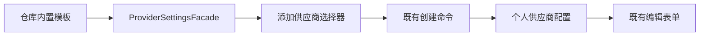

# 供应商模板去重

日期：2026-10-08。

## 产品规则

添加供应商只显示“创建自定义”及以下 12 个品牌，每个品牌一个入口，按表格顺序排列。BigModel 与 Z.ai 是两个独立入口。

| 品牌       | 保留的模板 ID                  | 默认 API 格式 | 默认 Base URL                                   |
| ---------- | ------------------------------ | ------------- | ----------------------------------------------- |
| OpenAI     | `openai`                       | Responses     | `https://api.openai.com/v1`                     |
| Anthropic  | `anthropic`                    | Anthropic     | `https://api.anthropic.com/v1`                  |
| DeepSeek   | `deepseek`                     | Anthropic     | `https://api.deepseek.com/anthropic`            |
| Kimi       | `moonshot-kimi`                | Anthropic     | `https://api.moonshot.cn/anthropic`             |
| MiniMax    | `minimax`                      | Anthropic     | `https://api.minimaxi.com/anthropic`            |
| BigModel   | `bigmodel-api`                 | Anthropic     | `https://open.bigmodel.cn/api/anthropic`        |
| Z.ai       | `zai-api`                      | Anthropic     | `https://api.z.ai/api/anthropic`                |
| 阿里百炼   | `qwen-alibaba-model-studio-cn` | Anthropic     | `https://dashscope.aliyuncs.com/apps/anthropic` |
| Xiaomi     | `xiaomi-mimo`                  | Anthropic     | `https://api.xiaomimimo.com/anthropic`          |
| xAI        | `xai`                          | Responses     | `https://api.x.ai/v1`                           |
| OpenRouter | `openrouter`                   | Anthropic     | `https://openrouter.ai/api`                     |
| OpenCode   | `opencode-go-responses`        | Responses     | `https://opencode.ai/zen/go/v1`                 |

名称使用品牌名，不显示套餐、API 格式、地区后缀。供应商名称、地址、API 格式仍直接在已有表单修改。默认连接只作为填写起点；不同产品、地区或模型需要的协议由用户修改，不新增协议自动切换。

模板模型列表继续为空，模型由用户主动添加；可重复创建同品牌的个人供应商，并自行命名，模板去重不限制用户配置多个连接。

## 数据与边界

`config/provider/zcode-builtin.json` 是模板的唯一来源，revision 更新为 33。删除 Z.ai/BigModel 的标准 API 模板、百炼国际模板及 OpenCode 的其余五个模板，共 8 个；同步删除它们的 `templateModelRules` 引用。保留现有型号容量规则、API 映射及按真实 URL 匹配的端点差异，因为手动修改连接后仍需使用。

UI 沿既有 `ProviderSettingsView.providerTemplates` 显示模板，仅更新优先排序，不引入分组状态、别名兼容或第二份模板目录。`zai-api`、`bigmodel-api` 保留，Shared 和 CLI 的模板 ID 合同不变。图标来源记录移除被删模板 ID。

用户已明确允许被删模板关联的现有供应商失效后自行重建。本轮不迁移、不补只读别名、不改个人配置文件；Resolver 继续显示原有 `missing-template` 配置错误，不擅自改写其名称、地址或模型成员。

## 验收

- 配置中恰好有 12 个品牌模板，无重复品牌和失去模板的模型引用；保留的默认连接与表格一致。
- 添加供应商显示自定义加 12 个模板，顺序一致；只有一个 OpenCode，名称无 Go/Zen/协议后缀。
- 新建 OpenCode 默认 Go URL/Responses、空模型列表；修改名称、URL 与 API 格式后保存重开正确。
- 使用独立临时配置做关键界面验证，不操作用户真实供应商；执行根类型检查、Lint、架构与改动文件格式检查。

本轮验收结果追加到 [配置验收记录](./CONFIGURATION-ACCEPTANCE.md)，保留前几轮实际执行事实。
