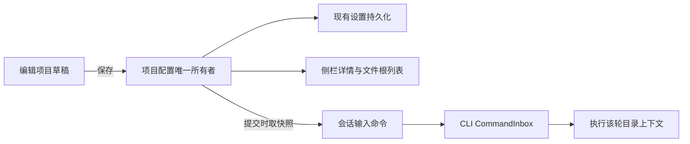
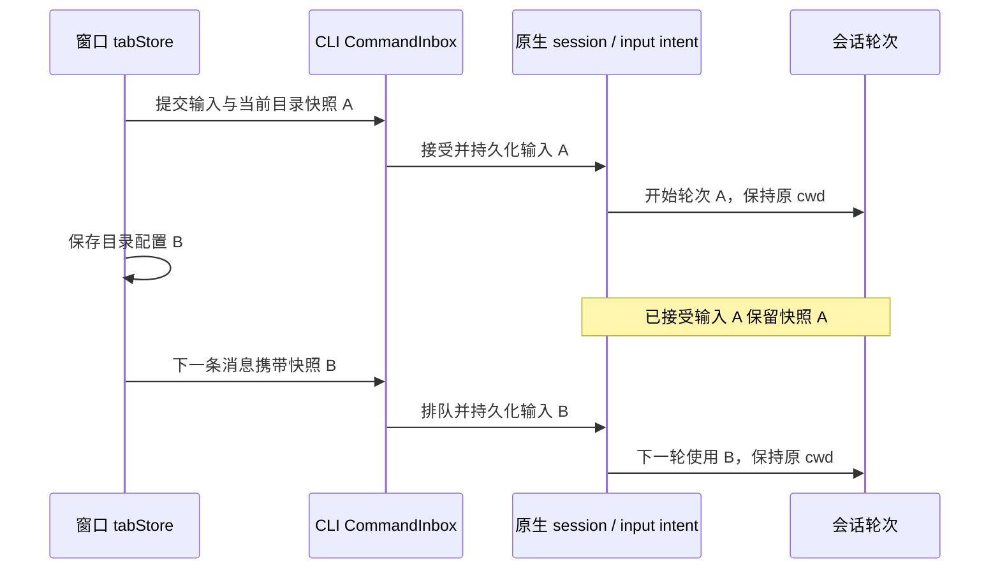

# 多文件夹项目

状态：代码已实现，自动检查通过，交互与远端实机验收待完成。日期：2026-10-01。

## 产品规则

- 一个项目拥有稳定身份、可编辑名称、一个或多个源文件夹，以及唯一主文件夹。现有单目录项目自然迁移，历史任务保留。
- 左侧保持「分区 → 项目 → 任务」。项目详情浮层展示名称、任务数量、全部源文件夹路径与「编辑项目」入口。
- 编辑项目弹窗支持改名、添加/移除文件夹、设置主要目录、取消和保存。取消不修改配置；至少保留一个文件夹。移除项目或文件夹只解除关联，不删除磁盘内容。
- 同一会话中的 AI 可以读取和修改关联的全部源文件夹，沿用现有工具权限。明确目录上下文，不通过伪造用户消息实现。
- 修改目录列表后，已有会话从下一条提交的消息起使用最新配置；已接受、排队或正在执行的轮次保留提交时的配置。已有会话保留原工作目录，新会话使用保存后的主文件夹。
- 运行中的引导输入若携带不同的目录配置，则进入下一轮队列，避免改变当前轮的目录上下文。重试与恢复沿用原输入快照；子 Agent 继承父轮目录配置。
- 文件面板提供多个根目录的浏览和搜索，结果能识别所属目录。Git 操作明确选择仓库，各仓库独立展示状态、分支与提交。终端默认使用当前会话的执行目录。
- 同一项目的源目录必须位于同一执行环境：本机，或同一远程连接环境。保留每个目录的 workspaceIdentity 与实际 workspacePath，不混合不同 Host。
- 项目配置与任务归属独立于主目录；改名、设为主要或移除关联目录不丢失已有任务、侧栏分区和项目身份。
- 项目按历史任务目录聚合会话。有项目 ID 的任务按该 ID 归属；无项目 ID 的旧任务仅从迁移时的原目录认领，添加附加目录不会自动并入该目录的其他历史任务。

## 状态与接口边界

- tabStore 同时拥有活动项目与已移除项目历史：活动配置只存在于 `tabs[].project`，移除后移动至 `closedProjects`，二者按项目 ID 互斥；设置中的 `lastWorkspaceSession[].project` 与 `closedWorkspaceProjects` 是同一次持久化的派生快照。重新添加原目录或历史主目录恢复原项目 ID、源文件夹配置及任务 scope，不重新认领其他项目任务。

- 项目配置有一个唯一状态所有者，视图和运行请求从该配置派生；复用现有设置持久化链路，不引入 localStorage 与设置双写。
- workspaceIdentity?.trim() || workspacePath 继续用于执行环境隔离；项目 ID 不冒充 workspaceIdentity。workspacePath 保持单个真实路径。
- 编辑弹窗只拥有未保存草稿，保存成功后统一更新项目状态。目录选择和校验走 UI hooks/服务；远程目录使用对应环境服务。
- 会话运行时拥有已接受输入；每次提交携带不可变的目录配置快照。保留 owner/lease、stale-run 防护与原有 admission 顺序，不新增客户端队列。
- `createSession`、`sendText` 和 `sendGoalCommand` 携带 `projectWorkspace`，canonical input intent 持久保存该快照。原生 session 保存独立的 `workspaceProjectId`，任务摘要、索引和 `ConversationSnapshot.meta.projectId` 从它投影，不复用仓库标识 `projectID`。
- Desktop continuous 与 Web remote replayable 共用业务配置，保留各自流式交付和恢复语义。项目变更不启动额外 Host。

## 核心验收

1. 单目录项目直接添加第二个目录，修改名称、设置主要目录后保存；详情浮层与编辑弹窗一致，重启后恢复；取消编辑无副作用。
2. 同一会话能读取两个目录并分别修改文件；提交时的项目目录作为明确上下文传入运行时。
3. 已有会话执行或排队时编辑目录列表，该输入保留原列表；下一条输入采用新列表；旧会话 cwd 不变，新会话使用新主目录。
4. 主目录变更后，历史任务仍归原项目，分区与项目顺序保留；移除关联不删除文件。
5. 文件树与搜索支持所有根，Git 按仓库操作；同名文件能区分来源。
6. 相同路径但不同远程身份不能串用；手机恢复连接复用已有 Host 会话，不混入本机目录。

仅补充覆盖配置迁移、提交快照和关键交互的测试，不建立穷举矩阵。实际执行结果记录在 ACCEPTANCE.md。
