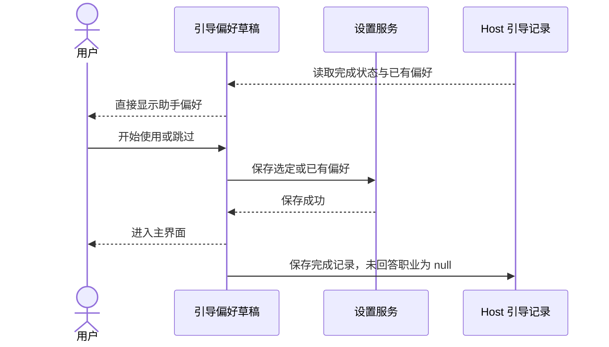

# 首次引导：直接进入助手偏好

## 产品规则

- 用户已确认移除职业选择页；首次触发、设置手动打开和快捷键重开都直接显示助手偏好。
- 不再展示或采集职业，不再上报 `work_direction`。移除职业列表、职业网格、返回职业页和两步进度指示。
- 保留现有工作记忆、主动任务建议和会话迁移选项。主动建议新用户默认关闭，已有显式偏好继续生效。
- “开始使用”保存当前偏好；“跳过”保留已存偏好，新用户使用关闭默认值；关闭或 Esc 不改偏好。
- 不调整迁移向导、模型连接、各端入口、营销侧栏或全局规则复制行为。

## 状态所有者与兼容边界

- 引导组件仍是偏好草稿的唯一所有者，通过现有 settings hook 保存偏好，通过 onboardingRecordService 所属 Host 保存完成或关闭记录。
- 保留现有完成判断、账号认领和偏好恢复路径，不新增持久化状态或广播。
- `settings.onboardingOccupation` 继续作为旧完成判断的兼容标记：保留已有值，新用户完成时沿用 `other` 标记；该值不再代表本次职业回答。
- 本地记录 schema 不变：新用户的 `occupation` 为 `null`，旧记录已有职业值继续保留。保留完成时间和关闭决定，避免存量用户重做引导。
- 继续保留曝光与结束事件；结束事件仅记录三项偏好、退出动作及单页步骤 `1`。退出去重仍按本次真实曝光执行。
- 保存顺序维持现有逻辑：保存设置成功后关闭页面，再追加完成记录；记录失败仅记录日志。异步预填不能覆盖用户已经修改的偏好。

## 关键验收场景

1. 新用户直接看到工作记忆、主动建议和迁移三项偏好；没有职业选项、下一步、返回职业页或两步进度。建议默认关闭；保存后刷新不重弹。
2. 旧完成或关闭记录不会被重新自动引导；手动打开直接进入偏好，已有记忆和建议正确预填。跳过或关闭不重置已有设置。
3. 无职业回答的完成记录可以读取并正常识别为已完成；旧职业、偏好和完成时间继续兼容。
4. 在中文、英文及一个窄屏 Web 视口检查偏好页和操作按钮可用。不穷举平台或偏好组合。

## 验证

- 复用现有旧记录和默认偏好回归，补充无职业回答的完成判断关键用例。
- 实际执行 Web 交互验收，并如实记录原生桌面与真实手机未实测范围。
- 执行 `pnpm typecheck`、`pnpm lint`、`pnpm architecture:check --changed` 及改动文件格式检查。

### 静态与关键回归结果（2026-09-30）

- Node 24.14.0：实现完成后的首次根 `pnpm typecheck` 通过，根 `pnpm lint` 为 0 错误、64 个已有警告。验收期间同一工作区又出现范围外变动，最新复跑被 `packages/services/src/session/taskIndexRepo.ts:328` 空括号表达式阻断：typecheck 报 TS1109，Lint 为 1 错误、65 个警告；不将首次结果记为当前完整通过。
- 新增无职业完成记录的服务回归与既有兼容用例共 4/4 通过。
- 改动前后 `pnpm architecture:check --changed` 均为 0 违规、0 基线、0 新增；此次仅修改 UI 引导与中英文文案，服务侧仅新增关键测试，没有新跨模块依赖或状态所有者。
- 引导五个源文件相对 HEAD 净减少 321 行，包含前一阶段的模式移除；职业与多步骤 UI、映射和埋点逻辑退出，完成记录与偏好写入顺序保留。
- 已检查 8 个本轮改动文件格式。职业引导源文件曾被回写为旧两步版本，已保留副本并重新应用本次确认范围的单页实现。后续 Web 复验被任务列表相关缺文件阻断；实际通过与未完成范围另记在 [验收记录](./ACCEPTANCE.md)。
