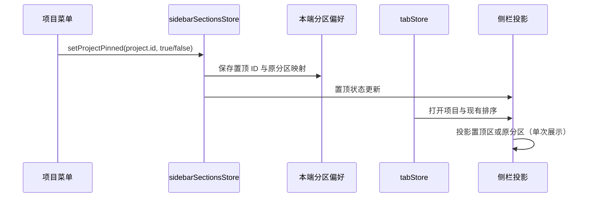

# 项目置顶

日期：2026-10-01。状态：代码已实现，自动检查通过，实机交互待验收。

## 产品规则

- 项目的更多菜单和右键菜单提供「置顶项目／取消置顶」，延续现有项目菜单的图标和密度。
- 置顶项目只在侧栏现有「已置顶」区域展示，排在独立置顶任务前；项目仍可展开任务、打开文件树、编辑和移除。没有置顶任务时，置顶项目也能单独显示该区域。
- 置顶不改变原分区归属。取消后回到原分区；原分区已删除时回到默认「项目」分区。置顶期间移动分区，更新取消置顶后的归属。
- 多个置顶项目沿用现有项目顺序和拖拽排序；取消置顶不额外改写原项目顺序。
- 置顶使用稳定的 project.id，改名、更换主目录或重启不丢失状态。本端保存置顶偏好，边界与现有项目分区一致。
- 时间线和归档视图保留置顶区。任务置顶的数据和服务接口保持原有职责；关闭项目只使该项目离开当前列表，再次打开同一项目时仍可恢复置顶状态。

## 所有者与接口

- `sidebarSectionsStore` 是 `pinnedProjectIds` 的唯一所有者，通过 `setProjectPinned(projectId, pinned)` 变更，与分区偏好使用同一持久化入口。
- `tabStore` 继续拥有项目定义、打开项目及其排序。置顶状态不写入项目定义、任务服务或 Agent 协议。
- Sidebar 根据打开项目和置顶 ID 派生视图，每个项目仅渲染一次；原分区映射不因置顶被覆盖。置顶项目自身的展开状态决定任务查询与分页，不受原分区折叠影响。
- 旧本端偏好没有 `pinnedProjectIds` 时按空列表读取，不改动已有分区和折叠记录。

## 核心验收

1. 从自定义分区置顶项目，原分区不再重复展示；取消后恢复原分区。无置顶任务时也显示置顶项目，项目的更多菜单和右键菜单均可操作。
2. 折叠原分区后置顶项目仍可展开任务；切换时间线或归档视图仍可找到置顶项目。
3. 刷新后保留置顶状态；置顶期间更换分区或删除原分区，取消后返回最新有效归属。
4. 拖拽多个置顶项目，保留原有项目排序逻辑；改名或切换主目录不改变置顶身份。

验证以少量状态持久化测试和关键交互场景为主，不建立穷举矩阵。执行类型检查、Lint 与架构检查；交互验收受限时记录实际原因。
