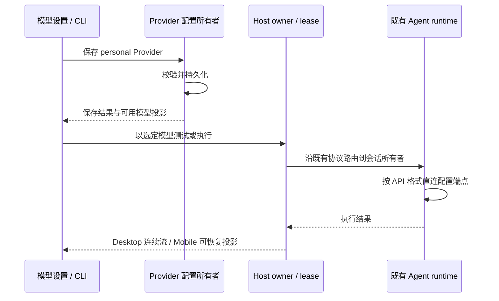

# 智普账号移除：实施与验收记录

实施日期：2026-10-05。已按确认范围完成代码整改，未提交 Git commit。外部集成与额外 Desktop 类型检查的限制见第 4 节。

## 1. 实际落地范围

| 领域             | 最终行为与代码位置                                                                                                                                                                                                                                                |
| ---------------- | ----------------------------------------------------------------------------------------------------------------------------------------------------------------------------------------------------------------------------------------------------------------- |
| Provider 来源    | `config/provider/zcode-builtin.json` 保留 20 个 Key 模板、删除账号 Provider；`packages/provider-node/src/zcode-builtin-provider-config-source.ts` 只读 bundled 配置，停用旧远端模型配置下载。个人配置继续由原 Registry 和 Repository 管理。                       |
| Key 与模型       | `packages/services/src/model-provider/providerRuntime.ts`、模型设置服务与 `packages/ui/src/settings/ModelProviderSection.tsx` 保留端点、协议、Key、模型 CRUD、启停、排序与连接测试。四个智谱模板 ID、套餐/标准端点保持，统一 `access.type=api-key`。              |
| 公共配置         | `packages/services/src/client-config/clientConfigService.ts` 承接匿名 workflow、budget、应用更新策略，不再借账号服务读取；策略读取失败不阻断普通模型执行。                                                                                                        |
| 账号执行链       | 删除 OAuth 登录、回调、刷新、凭证恢复、Account Provider overlay、账号 gateway、账号身份请求头和专属重试。普通 API 错误仍按供应商响应显示。                                                                                                                        |
| Desktop 与 Web   | `packages/desktop/src/main/desktopDeepLink.ts` 保留工作区及公开分享 Deep Link；删除 OAuth 注册和 preload callback。Web 删除账号登录和回调路由。                                                                                                         |
| CLI              | 删除 login/logout、浏览器 OAuth 参数与 `/login`、`/logout`；`apps/zcode-cli/packages/bootstrap/src/auth-api-key.ts` 将手填 Key 写入 personal Provider；`apps/zcode-cli/packages/cli/src/command-center/api-key-setup.ts` 提供 `/apikey`，继续遮罩输入和脱敏历史。 |
| 侧栏与设置       | 删除四个快捷入口、个人账号、套餐卡、额度提示。侧栏底部保留设置与远控；设置保留模型、外观、浏览器、记忆、Subagent、命令、Hooks、本地使用统计及引导。                                                                                                               |
| 自动化           | 删除 Off-Peak UI、协议、服务、数据表与 scheduler 分支；保留 Cron。公共推荐按 `on_finish` 的 `NAVIGATE:AUTOMATIONS:OFFPEAK` 动作过滤退役项目，其他推荐匿名加载。                                                                                                   |
| 插件与 MCP       | 隐藏 `requiresPaidPlan` 和结构化 `auth.type=zcode_official` 专属资源，安装边界拒绝专属依赖。保留公共插件、普通 MCP、环境变量、自定义请求头、通用 MCP OAuth 与 localhost callback。不按名称或描述中的“官方”字样隐藏插件。                                          |
| MCP 错误协议     | 删除账号专属的 `official_origin_untrusted`、`not_authenticated`、`coding_plan_required`，保留通用 OAuth 授权失败类型。                                                                                                                                            |
| 分享             | 移除云端发布和私有分享；保留服务端允许匿名读取的公开分享预览及导入，不注入账号 JWT。                                                                                                          |
| 统计、反馈与遥测 | 统计只聚合本地会话，读取错误不再分类为套餐或 Key 鉴权问题。删除账号额度、订阅、Off-Peak 归因、JWT、用户 loader 和账号 attribution；保留设备标识、本地 feedback ticket 与匿名客户端请求。                                                                          |
| 同步与存储       | provisioning 仅携带 personalConfig，保留锁、CAS、幂等与回滚。新任务 schema 不含 Off-Peak，删除账号历史迁移，不提供旧 Provider 兼容层，不清空真实用户目录。                                                                                                        |

## 2. 状态所有者与事件顺序

未新增第二条配置写入路径或队列所有者。workspaceIdentity、remoteSessionId、owner/lease、stale run 防护、Desktop continuous 与 Mobile replayable 的现有边界继续保留。未配置可执行模型时提示配置 Provider，设置和公共能力仍可访问。

涉及 Provider/Provider Node、Services、Shared、UI、Desktop、Web 与 CLI 层。当前工作树的已跟踪文本差异为新增 1,845 行、删除 66,946 行，净减少 65,101 行；该统计包含已有本地改动且不含未跟踪新文件，不能作为本任务独立改动量。

## 3. 账号整改阶段的验证记录

以下为账号整改阶段的验证记录。

| 验证                                                         | 实际结果                                                                                                                                |
| ------------------------------------------------------------ | --------------------------------------------------------------------------------------------------------------------------------------- |
| `pnpm typecheck`                                             | 通过。根脚本包含 Desktop Host，不包含全部 Desktop 独立配置。                                                                            |
| `pnpm exec turbo run typecheck --cwd apps/zcode-cli --force` | 通过，27 / 27 个任务成功。                                                                                                              |
| `pnpm lint`                                                  | 通过，0 errors、17 warnings；未扩展去修复其他领域警告。                                                                                 |
| `pnpm architecture:check --changed`                          | 通过，baseline 0、new 0、violations 0。                                                                                                 |
| 核心测试                                                     | 账号整改阶段的临时 fixture 曾通过 10 / 10，覆盖自定义模型、匿名配置、插件过滤和同步边界；临时测试已清理。 |
| Web build                                                    | `pnpm --filter @zcode/web build` 通过；仍有 chunk / dynamic import 警告。                                                               |
| Desktop build                                                | `pnpm --filter @zcode/desktop exec tsup` 通过，Main、Host、Preload、Scheduler 均成功。                                                  |
| Desktop Agent                                                | `node scripts/build-desktop-agent-cli.mjs` 通过并更新 Windows bundled Agent。                                                           |
| 收尾                                                         | 清理本任务临时脚本、日志、额外编译生成文件与隔离数据。保留用户原有开发实例和其他本地改动。                                              |

### 桌面交互验收

使用完全隔离的 home、userData、session、storage、workspace 和 SQLite 路径运行 Electron，经 CDP 操作真实界面完成：

1. 无账号凭据启动进入工作区，侧栏底部只见设置和远控；普通推荐保留，闲时推荐消失。
2. 模型设置没有账号/套餐入口，目录保留 20 个模板及四个智谱 Key 模板。
3. 创建个人 DeepSeek Provider，改为本地 OpenAI Chat Completions 端点，填写测试 Key，新增 `fixture-model` 和 32.8K 上下文。
4. 连接测试返回“DeepSeek / fixture-model 连接成功”。退出并重启后，端点、协议、Key 和新增模型仍在，连接测试再次成功。
5. 使用统计显示本地空数据与图表，没有套餐页和账号额度。
6. 公共市场正常加载 GitHub、GitLab、飞书等插件；安装 GitHub 插件成功，无智谱登录要求。

连接测试使用 `127.0.0.1` HTTP fixture 和虚构 Key，未调用真实付费模型。截图：[重启后模型连接成功](evidence/custom-model-test.png)、[公共市场与已安装插件](evidence/public-market.png)、[工作区底部入口](evidence/workspace.png)。

## 4. 明确限制

- 额外执行 Desktop 独立 `tsconfig.main.json`、`tsconfig.preload.json`、`tsconfig.renderer.json` 的 `tsc --noEmit` 仍失败，分别有 79、3、115 条诊断。不能据根类型检查通过宣称所有 Desktop 配置都通过。
- 已核对的既有问题包括 Main 的 `rootDir/include` 不含跨目录共享文件、`IStorageService` 既有导出/引用不一致、Preload 引用的窗口类型未在 Shared 根入口导出。Renderer 存在 `window.zcode` 和 CSS 类型声明加载问题。未对全部额外诊断建立基线，其余诊断不统一归类为既有错误；独立配置错误没有扩大成本次账号整改的修复范围。
- 未验证真实供应商 Key、真实第三方 OAuth、真实 SSH/Bot/手机远控、Cron/Subagent 完整执行或匿名反馈/遥测服务端接收。核心边界测试与桌面 UI 验收不代表这些外部集成都已实测。
- 公开分享仅保留服务端允许匿名读取的预览与导入；未验证真实服务端的匿名访问许可。
- 本机 Node 24.19.0，仓库要求 24.14.0。freshness 的 GitHub fetch 受网络限制；验证基于当前本地检出，未宣称远端最新。

## 5. 复审修复：实际插件配置中的账号资源

复审已复现：市场条目只有 `source`，插件 `.mcp.json` 中声明 `auth.type="zcode_official"` 时，条目仍显示且安装成功，加载时才禁用 MCP。

- `marketplace-plugin-policy.ts` 统一市场元数据、实际 manifest 与 MCP 定义的账号判定，并复用原 manifest 优先级和 synthetic manifest 规则。
- `mcp-definitions.ts` 从原 `mcp.ts` 拆出定义读取；同步市场/运行时和异步安装检查共用路径解析、结构归一化、覆盖顺序。原 `mcp.ts` 的定义读取导出保留，不改变普通 MCP 和第三方 OAuth 的调用入口。
- 市场读取检查可用本地插件目录，隐藏已确认的账号资源；独立远端插件仍沿原 source resolver 获取源码，每次在缓存激活、installed record 和默认启用之前检查。拒绝后沿原 cleanup/rollback 路径退出，不新增分类缓存或历史清理。
- 补充两个核心回归用例：本地 `.mcp.json` 条目隐藏且直接安装无记录，普通 OAuth 插件仍可安装；独立 git source 在引用文件中声明账号 MCP 时拒绝安装且不创建缓存/安装记录。两个用例在修复前失败、修复后通过。

本轮验证：

| 检查                         | 实际结果                                                                                                                                                                                                       |
| ---------------------------- | -------------------------------------------------------------------------------------------------------------------------------------------------------------------------------------------------------------- |
| `pnpm typecheck`             | 通过                                                                                                                                                                                                           |
| CLI 类型检查                 | `pnpm --dir apps/zcode-cli typecheck` 因找不到本地 turbo 未运行；通过等价入口 `pnpm exec turbo run typecheck --cwd apps/zcode-cli --force` 完成，27 / 27 成功。最后的局部调整另执行 adapters `typecheck`，通过 |
| `pnpm lint`                  | 通过，0 errors / 17 warnings                                                                                                                                                                                   |
| CLI 全量 Lint                | 本地 turbo 入口不可用；等价全量入口执行后失败，已产出的错误均为现有文件 `max-lines` 超限，不记录为通过                                                                                                         |
| 本次 4 个插件源文件单独 Lint | 无新增诊断；只剩原 `marketplace.ts` 的文件长度超限。两个新增模块低于 400 行                                                                                                                                    |
| 架构检查                     | baseline 0 / new 0 / violations 0                                                                                                                                                                              |
| 核心测试                     | 三个账号整改测试文件合计 12 / 12 通过                                                                                                                                                                          |
| 格式检查                     | 本次 4 个插件源文件、测试和 design spec 均通过                                                                                                                                                                 |
| 工作区新鲜度                 | 本轮 GitHub fetch 连接重置；按当前检出继续，不声明远端最新                                                                                                                                                     |

本轮没有修改 UI 呈现或传输协议，安装 owner、依赖事务和默认启用的状态所有者保持不变。远端源码缺少市场账号标记时，浏览列表不主动下载源码；实际安装仍会在写入前拒绝。未验证真实远端仓库的网络下载或第三方 OAuth 授权，git 回归用例使用临时本地仓库。
