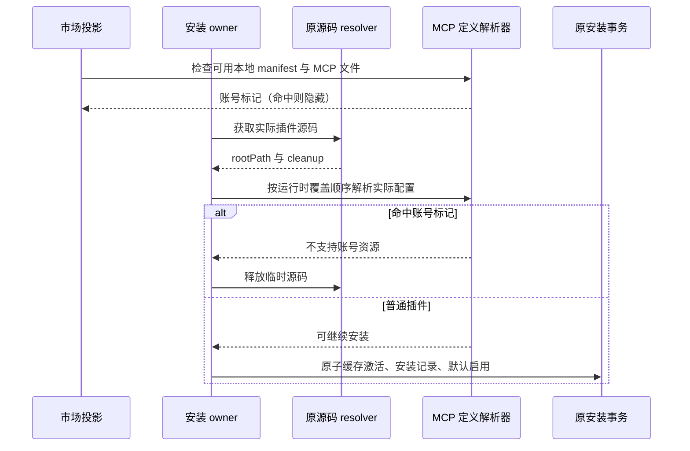

# 移除智普账号体系、保留自定义模型：整改设计

## 1. 文档状态

| 项目       | 内容                                                                             |
| ---------- | -------------------------------------------------------------------------------- |
| 状态       | 代码整改完成；已执行验证及剩余限制见 [实施记录](IMPLEMENTATION.md)               |
| 适用版本   | 当前开发版本                                                                     |
| 设计日期   | 2026-10-05                                                                       |
| 变更类型   | 跨 Shared、Provider、Services、Desktop、Web、CLI 和 UI 的行为删除与边界重构      |
| 旧数据策略 | 不做旧账号、旧 Provider 选择和旧历史记录兼容；使用新 schema 和隔离的干净开发数据 |

本设计基于当前检出的源码，定义产品规则、状态所有者和删除边界。用户确认后已完成代码整改，实际落地范围、测试和界面证据见 [实施记录](IMPLEMENTATION.md)。首次分析时基线检查通过；复审执行 `node scripts/check-workspace-freshness.mjs` 因 GitHub 连接重置未能完成 fetch，因此只能确认当时本地 `dev` 与已保存的 `origin/dev` 一致，不能确认远端最新状态。

## 2. 已确认的产品范围

### 2.1 要移除的范围

同时移除以下两套账号体系：

- Z.ai OAuth 账号。
- BigModel OAuth 账号。

同步移除应用内依赖这两套账号的功能；供应商的手动套餐 Key 模板按 2.2 保留：

- Start Plan。
- Individual Coding Plan。
- Team Coding Plan。
- Off-Peak 空闲模型。
- 账号额度、余额、订阅、重置和用量监控。
- 需要 Coding Plan 凭据的官方 Server MCP。
- 账号登录、退出、账号恢复、重新登录和账号失效提示。
- Desktop、Web、CLI 中的 Z.ai/BigModel 登录入口。

### 2.2 要保留的范围

保留手动 API Key Provider，包括：

- `zai-api`
- `bigmodel-api`
- `zai-standard-api`
- `bigmodel-standard-api`

这些模板属于手动 API Key 调用，不属于应用内 OAuth 登录。四个模板的 ID、协议、端点和可选模型继续保留，不能把 Coding Plan 端点替换成普通计费端点。

| 模板                                        | 当前语义                                                              | 整改后的行为                                                                 |
| ------------------------------------------- | --------------------------------------------------------------------- | ---------------------------------------------------------------------------- |
| `zai-api`、`bigmodel-api`                   | Coding Plan 专用 Key，当前 access type 为 `zhipu-coding-plan-api-key` | 手动填写适用于套餐端点的 Key，直接请求模板端点，不查询应用内账号、订阅或额度 |
| `zai-standard-api`、`bigmodel-standard-api` | 普通计费 API Key，当前 access type 为 `api-key`                       | 保留普通计费端点和手动配置流程                                               |

设计采用统一 `access.type="api-key"`：删除无独立传输行为的 `zhipu-coding-plan-api-key` 类型，用模板 ID、名称与 endpoint 区分两种 Key。这样不需要为开发版保留兼容类型。套餐 Key 的供应商订阅要求仍由供应商控制，去掉本应用登录不代表普通计费 Key 能调用套餐端点。

保留自定义模型完整能力：

- API Key、Base URL、请求头和 API Format 配置。
- OpenAI-compatible、Anthropic、Responses 等协议。
- 自定义模型新增、编辑、删除、启用、禁用和排序。
- 默认模型选择和模型元数据配置。
- Provider 连接测试。
- 本地 App Usage 统计。

保留插件和 MCP 的通用能力：

- 公共插件市场的浏览、安装、启用、禁用和卸载。
- 不要求 Coding Plan 的普通插件。
- 用户自行配置的 MCP Server。
- 通用 MCP OAuth。它与 Z.ai/BigModel 账号 OAuth 是两套机制，不能一并删除。

市场条目 `requiresPaidPlan=true` 表示套餐资源；manifest 含 `auth.type="zcode_official"` 表示智普账号认证资源，其中也存在只要求账号、不要求套餐的路径。二者都落入本次删除范围，按用户确认从公共市场列表、搜索和推荐中隐藏，详情和安装调用不再提供可用入口。不能仅凭插件名称、官方来源或 `z.ai` 域名判断账号依赖。

公共市场 `zcode-plugins-official` 同时承载普通官方插件和社区插件，不能整体删除。某个公共插件如果自身要求第三方 API Key 或第三方 OAuth，仍按该插件自己的配置流程运行。账号专属资源不只包含截图中的金融 MCP，也可能是带套餐标识的技能或其他分类插件。

### 2.3 当前设计不处理的范围

- 不保留旧 OAuth Token、账号 Provider、旧默认模型和旧历史选择。
- 不做旧 Provider ID 的只读解析或会话迁移。
- 下线依赖账号 JWT 的云端发布与私有分享；保留服务端允许匿名读取的公开分享预览和导入。
- 不因移除账号而删除 `zai-light`、`zai-dark` 主题，它们只是主题品牌。
- 保留普通动态工作流、定时自动化、Subagent 模型配置、独立 HTTP Token、SSH/Bot Channel 认证和远程恢复链路。
- 不增加自动清空真实用户目录或整个任务数据库的启动逻辑；开发验证使用明确指定的干净数据目录。

## 3. 目标架构

```text
设置页输入 API Key
    ↓
Personal / Custom Provider 配置
    ↓
Provider Config(access = api-key)
    ↓
Model Selection Service
    ↓
model execution 注入 apiKey
    ↓
模型请求
```

以下链路整体删除：

```text
OAuth 登录
    ↓
oauth:* / zcodejwttoken
    ↓
Account Provider Overlay(access = zhipu-account)
    ↓
Start / Coding / Team / Off-Peak
    ├─ 账号额度与订阅
    ├─ 官方 Coding Plan MCP
    ├─ 账号专属模型网关
    └─ 账号登录状态 UI
```

唯一的模型配置事实由 Provider Settings/Provider Config 所有；UI 不再维护账号登录状态，也不再通过账号可用性决定是否允许进入模型设置页。

## 4. 关键产品规则

1. 应用启动不等待 OAuth 恢复，不启动账号 Token 刷新，不因没有账号而打开登录页。
2. Provider Registry 只 materialize 自定义 Provider 和 API Key Provider；不再生成 `account:*` Provider。
3. 自定义 API Key Provider 不触发 Coding Plan entitlement、额度刷新或账号认证请求。
4. 四个手动 Key 模板统一使用 `api-key`，保留各自的端点；不再使用账号 gateway 改写请求。
5. 套餐或智普账号专属插件从市场列表、搜索和推荐中隐藏；安装和运行的业务入口不再接受这些资源。普通公共插件仍可安装和运行。
6. 官方 Server MCP 的账号认证端口、Coding Plan Key 注入和额度计量全部移除；普通 MCP adapter、MCP 配置和通用 MCP OAuth 保留。
7. App Usage 继续读取 Agent 的 `usage/stats` 聚合；Coding Plan Usage、额度和重置接口删除。
8. 删除反馈、遥测中的账号身份、JWT 和登录归因；保留现有匿名/设备路径，外部接口的匿名可用性单独验证，不新增未经确认的服务端认证协议。
9. 没有可用模型时显示“配置模型供应商”，允许进入设置；执行前保留无模型检查。API Key 错误只显示供应商请求错误，不触发智普重登录、账号自动切换或套餐重试。
10. 普通 Cron、工作流、Subagent 和远程连接继续使用原有唯一所有者；只删除其中的账号/Off-Peak 分支。

## 5. 分层整改清单

### 5.1 Shared 协议和类型层（P0）

目标：从公共契约中删除账号 Provider 和账号 OAuth 的产品语义，同时保留普通 Provider、公共插件和通用 MCP。

重点文件：

- `packages/shared/src/oauth.ts`
  - 删除 Z.ai、BigModel OAuth Provider ID、Token Set、Callback 和账号 Session 类型。
- `packages/shared/src/model-provider-types.ts`
  - 删除 `account:zai-*`、`account:bigmodel-*` 及 Coding/Team/Start Plan 判断函数。
- `packages/shared/src/model-provider-family.ts`
  - 删除账号 family、账号 plan mode 和 entitlement 映射；保留 API Key 模板所需的品牌 family 信息。
- `packages/shared/src/zcode-protocol/index.ts`
  - 删除 `zhipu-account` access union、账号不可用原因、账号请求头 DTO 和账号配置命令。
- `packages/shared/src/channels.ts`
  - 删除 OAuth Service channel 和账号专属 RPC。
  - 保留通用 MCP、插件管理、Provider Settings 和普通模型选择 channel。
- `packages/shared/src/off-peak-types.ts`
  - 删除账号 Off-Peak Provider ID、任务模式和相关协议字段。
- `packages/shared/src/official-mcp-auth.ts`、`official-mcp-tool-error.ts`
  - 删除 Coding Plan 官方 MCP 认证契约和账号专属错误码。
  - 保留普通 MCP 协议类型。
- `packages/shared/src/usage-stats.ts`
  - 只保留 App Usage request/response；删除 CodingPlanUsage、entitlement、reset 和 MCP quota DTO。
- `packages/shared/src/zcode-protocol/index.ts`
  - 除 `zhipu-account` schema 外，还要删除 `providerUpdateAccountConfig`、`accountAccess`、Off-Peak 字段以及 Official MCP auth interaction method。
- `packages/shared/src/plugin-marketplaces.ts`、`plugin-types.ts`、`plugin-sync.ts`
  - 保留公共插件市场契约；使用现有 `PluginStoreListing.requiresPaidPlan` 标记账号专属资源。
- `packages/shared/src/account-provider-state.ts`
- `packages/shared/src/coding-plan-subscription.ts`
- `packages/shared/src/coding-plan-reset.ts`
- `packages/shared/src/usage-quota.ts`
- `packages/shared/src/plan-identity.ts`
- `packages/shared/src/provider-family-connection-selection.ts`
- `packages/shared/src/official-glm-model-id.ts`
  - 上述账号专属模块删除或裁剪；此文件中的 `OFFICIAL_GLM_MODEL_IDS` 仍用于普通 GLM 模型遥测白名单，保留这部分，不能因“official”命名整体删除。
  - `provider-provisioning.ts` 只保留 personal/custom 配置同步字段，删除 OAuth、账号 identity、Team selection 和 account key 字段。
- `packages/shared/src/index.ts`
  - 同步删除上述已删除模块的公开导出，保留插件、普通 MCP 和 API Key Provider 导出。

### 5.2 Provider 配置与 Registry（P0）

重点文件：

- `config/provider/zcode-builtin.json`
  - 删除全部 `account:zai-*`、`account:bigmodel-*` Provider Rules 和默认模型选择。
  - 保留四个 API Key 模板及其模型清单。
- `packages/provider/src/config/provider-data-schema.ts`
- `packages/provider/src/config/provider-config.ts`
- `packages/provider/src/config/schema.ts`
- `packages/provider/src/config/rule-data-schema.ts`
- `packages/provider/src/resolver.ts`
- `packages/provider/src/registry-service.ts`
- `packages/provider/src/sources.ts`
- `packages/provider/src/config-service.ts`
- `packages/provider/src/account-provider-resolution.ts`
- `packages/provider/src/account-provider-service.ts`
- `packages/provider/src/account-provider-state.ts`
- `packages/provider/src/facades.ts`
- `packages/provider/src/effective-model-selection.ts`
- `packages/provider/src/index.ts`
- `packages/provider-node/src/provider-config-runtime.ts`
- `packages/provider-node/src/provider-registry-runtime.ts`
- `packages/provider-node/src/model-selection-facade.ts`

需要删除：

- `zhipu-account` 配置类型和 account overlay。
- account Provider 强制启用、entitled 判断和 OAuth 连接选择。
- `providerFamilyDomain`、`providerFamilyConnectionSelections` 中的账号状态。
- Account Provider 的动态配置覆盖。
- `accountState`、account-provider 分类和 account-plan selection kind。
- Registry 的 account source、双 source revision 对齐和 `basedOnZCodeBuiltinRevision` 账号同步屏障；保留配置刷新、generation、生命周期和普通模型有效性校验。

需要保留：

- `api-key` Provider。
- Personal Provider 配置仓储。
- Provider Registry、连接测试和模型配置。
- 四个手动 API Key 模板。

### 5.3 Services 和运行时装配（P0）

删除 OAuth 和账号服务装配：

- `packages/services/src/oauth/`
- `packages/services/src/model-provider/accountProvider*`
- `codingPlanProviderAvailability.ts`
- `zaiStartPlanBilling.ts`
- `bigmodelStartPlanZcodeJwt.ts`
- `packages/services/src/coding-plan-subscription/` 的账号与套餐职责；通用配置方法先移出，见 5.13，再删除原服务。
- `packages/services/src/model-provider/accountProviderTeamPlanRequestKey.ts`
- `legacyTeamOrganizationResolver.ts`
- `packages/services/src/model-provider/accountRequestAuthService.ts`
- `packages/services/src/model-provider/legacyZCodeConfigProviderReader.ts`
- `packages/services/src/model-provider/legacyPersonalProviderConfigImporter.ts`
- `packages/services/src/bigmodel/teamPlanApiKey.ts`
- `packages/services/src/bigmodel/codingPlanEntitlement.ts`

同步修改：

- `packages/services/src/node.ts`
  - 删除 OAuthCredentialRepo、Account Provider、CodingPlanSubscription、Official MCP、Off-Peak 的注册和注入。
- `packages/services/src/accessor.ts`
- `packages/services/src/index.ts`
- `packages/client/src/remoteServiceAccess.ts`
  - 删除对应 Service Accessor 和 RPC 代理。
- `packages/services/src/model-provider/providerConfigRuntime.ts`
  - 只保留 personal/custom Provider 运行时。
- `packages/ui/src/lib/codingPlanProvider.ts`
  - 删除将手动 API Key Provider 当作 entitlement source 的逻辑；四个模板统一 `api-key`，不参与应用内套餐状态。
- `config/provider/zcode-builtin.json`
  - `zai-api`/`bigmodel-api` 明确标注“Coding Plan API Key（手动配置）”，保留套餐 Key 与普通计费 Key 的区别，删除应用内 OAuth、购买和额度引导。
- `packages/services/src/zcode-agent/zcodeAgentService.ts`
  - 删除账号请求鉴权交互、官方账号 MCP 和 Off-Peak wiring；实际模型执行适配器位于 CLI，见 5.9，不在 Services 中新增平行执行入口。
- `packages/services/src/model-provider/providerProvisioningSource.ts`
- `packages/services/src/model-provider/providerProvisioningTarget.ts`
  - envelope 只保留 personal/custom Provider 和 API Key；删除 OAuth session、account-provider key、账号设置和 account refresh。
- `packages/services/src/feedback/feedbackService.ts`
  - 账号凭据依赖在本层拆除，匿名反馈策略见 5.10。

CLI 和普通 API Key 的边界必须单独处理：

- `apps/zcode-cli/packages/bootstrap/src/auth-login.ts`
- `apps/zcode-cli/packages/adapters/src/auth/coding-plan-api-key.ts`
- `apps/zcode-cli/packages/adapters/src/auth/shared-credentials.ts`

当前 CLI 的手动 Coding Plan API Key 仍通过 `persistStandaloneCodingPlanConnection` 写入
`account-provider:*` 和 standalone account identity。保留四个 API Key 模板时，必须把这条写入路径改为 personal/custom Provider 的 `api-key`；不能只删除 OAuth 函数，否则 CLI API Key 配置会一起失效。

### 5.4 Usage Stats（P0）

保留：

- `packages/services/src/usage-stats/usageStatsService.ts` 的 `getAppUsageSnapshot`。
- `packages/ui/src/settings/usage-stats/AppUsagePanel.tsx`。
- `packages/ui/src/hooks/useUsageStats.ts` 的 App Usage 分支。

删除：

- `getCodingPlanUsageSnapshot`。
- Coding Plan reset、quota、entitlement 和 remote monitor API。
- `packages/services/src/usage-stats/providers/bigmodelUsageQuotaProvider.ts`。
- `zcodeMcpQuotaProvider.ts` 中的账号额度路径。
- `CodingPlanUsagePanel.tsx`、Coding Plan 图表和额度重置 UI。
- `WorkspaceSidebarFooterUsageSummary.tsx` 中的 Coding Plan 汇总。
- `StartPlanContextBalance.tsx`、`CodingPlanUsageRemainingPanel.tsx`、V4 quota banner 和相关 Store。
- `packages/ui/src/chat-input-toolbar/CodingPlanContextUsage.tsx`、`CodingPlanUsageNotice.tsx`、`CodingPlanUsageHeaderAction.tsx`
- `packages/ui/src/v4/startPlanQuotaReminderStore.ts`，并裁剪 `packages/ui/src/v4/composer/V4ComposerToolbar.tsx` 中的账号额度部分；保留模型选择和普通工具栏。
- `packages/ui/src/hooks/useUsageEntitlement.ts`、`usePlanIdentitySnapshot.ts`、`useStartPlanRecommendation.ts`
- `packages/ui/src/lib/codingPlanUsageSources.ts`、`sidebarUsageCodingPlanProviderPreference.ts`、`codingPlanQuotaResetCoordinator.ts`
- `packages/ui/src/components/coding-plan-quota-reset/`

`UsageStatsSection` 最终只保留 App Usage tab，不再根据 Provider ID 构造 Coding Plan tabs 或 sources。

### 5.4.1 Off-Peak 完整收口（P0）

Off-Peak 不是单一模型入口，而是包含 UI、任务持久化、调度、运行时和协议的完整功能。移除账号体系时必须整体删除，不能只隐藏设置页：

- `packages/ui/src/store/offPeakTaskStore.ts`
- `packages/ui/src/hooks/useOffPeakEligibility.ts`
- `packages/ui/src/hooks/useOffPeakTaskNotifications.ts`
- `packages/ui/src/settings/AutomationsSection.tsx` 中的 idle/off-peak tab
- `packages/ui/src/settings/OffPeakEditView.tsx`
- `OffPeakTaskList.tsx`、`OffPeakHistoryTab.tsx`、`OffPeakEditActionsMenu.tsx`
- `packages/ui/src/lib/offPeakTelemetry.ts`
- `packages/ui/src/lib/codingPlanQuota*`
- `packages/ui/src/v4/startPlanQuota*`
- `packages/services/src/session/offPeak*`
- `packages/services/src/session/taskIndexRepo.ts`
- `packages/services/src/session/tasksDatabase/startup.ts`、`schema-v1.ts`、`migrations.ts`
- `packages/desktop/src/host/offPeakDispatchPlan.ts`
- `packages/desktop/src/host/index.ts` 中的 Off-Peak runtime/run subscriptions
- `packages/desktop/src/scheduler/offPeakDispatchSettlement.ts`
- `packages/desktop/src/scheduler/schedulerProtocol.ts`、`packages/desktop/src/scheduler/index.ts`
- `packages/desktop/src/main/desktopCronScheduler.ts` 中的 Off-Peak 分支
- `packages/desktop/src/main/desktopHostProcess.ts`、`broadcastHub.ts` 中的 Off-Peak wiring
- `packages/shared/src/channels.ts` 中的 OffPeakTask/OffPeakRun 及 scheduler 中的 Off-Peak 消息；保留普通 Cron channel
- `apps/zcode-cli/packages/contracts/src/tools/off-peak.ts`
- `apps/zcode-cli/packages/contracts/src/interfaces/off-peak.port.ts`
- `apps/zcode-cli/packages/core/src/tool/handlers/off-peak.ts`
- `apps/zcode-cli/packages/bootstrap/src/zcode-protocol/off-peak-tool-policy.ts`
- `apps/zcode-cli/packages/bootstrap/src/zcode-protocol/offpeak-port.ts`

补充 UI 投影：裁剪 `packages/ui/src/App.tsx` 的 Off-Peak 通知订阅、`packages/ui/src/TaskListItem.tsx` 的月亮标签、`packages/ui/src/v4/ConversationTurnGroup.tsx` 的 Off-Peak 卡片，以及 `packages/ui/src/ToolCallBlocks/renderers/offpeak-create.tsx`。普通 `cron-create`、任务列表和对话回放保留。

开发版从新 schema 中删除 `tasks.off_peak_task_id`、`OFF_PEAK_SCHEMA`、Off-Peak 表、索引和初始化代码，不保留旧任务兼容层。使用新的隔离数据目录验证，不在应用启动时自动删除整个数据库。普通 Cron 的 claim、调度生命周期、资源遥测和执行结果保持原语义。

### 5.5 UI 登录和根状态（P0）

删除或重构：

- `packages/ui/src/WelcomeScreen.tsx`
  - 删除 OAuth 卡片；将 API Key 表单改为“添加自定义 Provider”。
- `packages/ui/src/hooks/useOAuth.ts`
- `packages/ui/src/hooks/useTokenRefresh.ts`
- `packages/ui/src/hooks/useCredentials.ts`
  - 只删除账号专用 `useAuthToken`；保留基础 `useCredentials` 和通用 Credential Service，供 SSH、MCP 等独立凭据使用。
- `packages/ui/src/root/useRootOAuthEffects.ts`
- `oauthCachedSessionRestore.ts`
- `oauthLoginAttemptGuard.ts`
- `useProviderAvailabilityLoginEntryGuard.ts`
- `useRootWorkspaceActions.ts` 的 OAuth logout。
- `Root.tsx`、`App.tsx`、`store/index.ts` 中的 user、OAuth restore、login request 和登录 loading。
- `WorkspaceSidebarFooter.tsx` 的账号头像、登录、登出、账号权益 badge。
- `packages/ui/src/login/LoginApiKeyForm.tsx`、`LoginApiKeyForm.helpers.ts`
  - 保留 API Key 配置逻辑，但移出 login/auth 语义；不再渲染 OAuth provider 图标或登录状态。
- `packages/ui/src/ModelConfigSelect.tsx`
  - 删除 OAuth/account mode 的显示和选择分支，保留普通 Provider/模型选择。
- `packages/ui/src/lib/providerFamilyDomainMigration.ts`、`providerFamilyDomainSettings.ts`、`providerTelemetryIdentity.ts`
  - 删除账号 family/plan 状态依赖；保留普通 Provider identity 和主题/遥测所需的中性标识。

模型设置页：

- `ModelProviderSection.tsx` 只保留 custom/personal Provider CRUD。
- `constants.ts` 删除 `PRESET_PROVIDER_SPECS`、`CODING_PLAN_PROVIDER_SPECS` 的账号条目。
- `Navigation.tsx`、`Detail.tsx`、`StatusCards.tsx` 删除 Plan 卡片、余额、额度、登录和断开操作。
- `useModelProviderNavigation.ts` 删除 Coding/Team/Start Plan 导航。
- `useCodingPlanEntitlements.ts`、`codingPlanStatusPanelViewState.ts`、`codingPlanLoginOptions.ts` 删除。
- `ProviderTemplatePicker.tsx` 保留四个 API Key 模板，并把它们归入自定义 Provider。

同时清理账号断联提示、重新登录动作和 `login.oauth.*` 文案；保留 API Key 文案、公共插件文案和通用 MCP OAuth 文案。

### 5.6 Official MCP 与公共插件市场（P0/P1）

两条路径必须拆开：

| 能力                             | 处理                                                                         |
| -------------------------------- | ---------------------------------------------------------------------------- |
| 套餐或智普账号专属资源           | 删除账号凭据解析、官方认证 Header、额度计量和相关安装/执行入口；市场隐藏条目 |
| 公共插件市场                     | 保留目录、搜索、安装、缓存、启停、卸载和能力管理                             |
| 普通插件自带 MCP                 | 保留 MCP adapter 和用户配置流程                                              |
| 用户自建 MCP OAuth               | 保留 `apps/zcode-cli/packages/adapters/src/mcp/oauth-*`                      |
| 内置 Browser/文件/表格等普通插件 | 按其现有非账号依赖继续保留                                                   |

重点文件：

- `packages/services/src/official-mcp/officialMcpCredentials.ts`
- `packages/services/src/official-mcp/officialMcpIssuanceAudit.ts`
- `packages/services/src/zcode-agent/zcodeAgentService.ts` 中的 `officialMcpAuthHeadersResolver`、Official MCP interaction 和 issuance audit wiring
- `packages/shared/src/official-mcp-auth.ts`
- `apps/zcode-cli/packages/adapters/src/model/official-coding-plan-gateway.ts`
- `apps/zcode-cli/packages/adapters/src/mcp/official-auth.ts`
- `apps/zcode-cli/packages/adapters/src/plugins/mcp-official-auth.ts`
- `apps/zcode-cli/packages/adapters/src/mcp/index.ts`
- `apps/zcode-cli/packages/bootstrap/src/zcode-protocol/official-mcp-auth-port.ts`
- `apps/zcode-cli/packages/bootstrap/src/zcode-protocol/mcp.ts`
- `apps/zcode-cli/packages/bootstrap/src/zcode-protocol/server-types.ts`
- `apps/zcode-cli/packages/contracts/src/interfaces/mcp.port.ts`
- `apps/zcode-cli/packages/bootstrap/src/zcode-protocol-entrypoint.ts`
- `apps/zcode-cli/packages/bootstrap/src/zcode-protocol/server.ts`
- `apps/zcode-cli/packages/bootstrap/src/app/official-plugin-definitions.ts`
- `packages/shared/src/plugin-marketplaces.ts`
- `packages/ui/src/settings/pluginStoreListing.ts`
- `packages/ui/src/store/pluginStore.ts`
- `packages/ui/src/settings/pluginCapabilityProjection.ts`

现有 `PluginStoreListing.requiresPaidPlan` 由 `apps/zcode-cli/packages/adapters/src/plugins/marketplace.ts` 从市场条目解析，在 UI 中用于徽标展示；生成安装 manifest 时会剥掉该字段。因此不能只删徽标，或等模型/MCP 请求返回 401 后再处理。

采用最小的统一删除边界，不在 UI、Store、Service 每层重复维护账号判定：

1. 市场业务入口统一过滤 `requiresPaidPlan=true` 条目，UI 列表、搜索、推荐和安装都消费同一结果。已知市场条目的直接安装请求在安装 owner 中返回“不支持该账号资源”；普通资源仍走原安装命令。
2. `.mcp.json`/manifest 解析与 MCP 创建边界不再支持 `auth.type="zcode_official"`，返回明确的不支持结果；不回退到匿名连接，也不启动通用 OAuth 重试。用户自行配置的 `config.oauth` 和普通 `WWW-Authenticate` 流程保留。
3. 普通插件与 MCP 同步复用以上业务入口和配置解析，不新增每条传输路径一套分类状态。远程同步不能把不支持的账号 MCP 转换为普通 MCP；也不能清空普通插件配置。

#### 实际插件配置的账号资源检查

市场条目可能只声明 `source`，账号认证实际位于插件的 `.mcp.json` 或 manifest 引用文件中。只检查市场条目的内嵌 `mcpServers` 会导致安装成功后才禁用 MCP，留下不可用的已安装资源。

- 唯一判定入口位于插件 adapter，市场投影和安装 owner 共用账号标记规则；MCP 文件读取与合并复用运行时定义解析器，保留 `.mcp.json`、内嵌对象、字符串路径及路径数组的原有覆盖顺序。
- 市场读取时检查可用的本地插件目录（相对目录、directory source 和 bundled cache），确认包含账号认证后隐藏条目。无法读取的目录仍由原有校验流程诊断，不阻断其他普通条目的展示。不为了浏览列表下载所有独立远端插件源码。
- 每次安装在原 source resolver 获取实际源码后重新检查。命中 `requiresPaidPlan` 或有效 MCP 定义中的 `auth.type="zcode_official"` 时返回不支持错误；必须早于缓存激活、installed record 写入与默认启用。远端临时源码沿原 cleanup 流程释放，依赖安装沿原事务回滚，不增加分类缓存或持久化状态。
- 普通 MCP 的 `oauth` 与静态 API Key/Header 不属于账号资源，保持安装和运行能力；不迁移历史账号插件，也不清空已有用户目录。



验收补充：本地插件只在 `.mcp.json` 声明账号认证时，不出现在市场且直接安装不写记录；独立 git source 仅在 manifest 引用的 MCP 文件声明账号认证时，获取源码后拒绝安装且不激活缓存；同一市场的普通 OAuth 插件仍可安装并保留授权配置。

相关位置：`packages/ui/src/settings/PluginStoreCard.tsx`（导出 `PluginStoreInstallButton`）、`PluginStoreDetailView.tsx`、`PluginStoreBrowsePage.tsx`；`apps/zcode-cli/packages/adapters/src/plugins/marketplace.ts`、`apps/zcode-cli/packages/bootstrap/src/plugins.ts`；`packages/services/src/plugin-sync/pluginSyncService.ts`。保留插件自身第三方授权和其业务失败提示。

默认启用及打包也必须同步：检查 `apps/zcode-cli/packages/bootstrap/src/app/official-plugin-definitions.ts` 与 `packages/shared/src/plugin-marketplaces.ts` 两份默认启用集合，裁剪账号资源的 seed、缓存恢复和打包声明，避免 UI 隐藏后后台仍启动对应 MCP。开发验证使用干净插件目录，不增加启动时全量删除插件缓存的逻辑。

不能把 `zcode-plugins-official` 整个市场删除。Browser Use、文档、PDF、表格、Skill Creator 等普通资源按实际依赖保留。Image Search 的定义注释提到官方 MCP 认证，而当前 checkout 没有它的实际 seed manifest，因此不能承诺无需账号；实现前核查打包资源，若存在账号依赖则从默认启用、市场和 bundle 中移除，并保留其他插件。

### 5.7 Desktop（P1）

删除 OAuth 专属 IPC、Deep Link 和 Host 注入：

- `packages/desktop/src/main/desktopDeepLink.ts`
- `desktopMainIpcRemote.ts`
- `desktopDeepLinkUrl.ts`
- `appLaunchCoordinator.ts`
- `appTelemetryRuntime.ts` 的 OAuth callback 处理。
- `packages/desktop/src/preload/oauthCallbackBridge.ts`
- `packages/desktop/src/preload/index.ts`
- `packages/desktop/src/renderer/src/desktopPlatform.ts`
- `packages/desktop/src/main/desktopSecondInstanceDeepLink.ts`
- `packages/desktop/src/main/desktopLinuxDeepLinkRegistration.ts`
- `packages/desktop/src/main/index.ts`
- `packages/desktop/src/host/remoteWorkspaceServiceCollection.ts` 中的 OAuth、Account Provider、Coding Plan 和账号 Token 注入。

`desktopDeepLink.ts` 保留工作区打开，不能整文件删除。删除 OAuth callback、state map 和账号握手；保留匿名公开分享导入；保留 OS 协议注册、多窗口路由、外部工作区打开确认和 Renderer-ready 排序。同步调整 `startupWorkspaceDeepLinkGate.ts` 等调用者，保留原窗口所有者和原生操作边界。

同步清理构建和环境配置中的 OAuth URL、client ID 和 OAuth callback 注入，包括 `packages/desktop/tsup.config.ts`、desktop runtime env 和 host process；但保留公共插件 CDN、MCP 和其他远程工作区配置。

### 5.8 Web 与分享（P1）

删除：

- `packages/web/src/auth/webAuthService.ts`
- `zaiWebOAuthProvider.ts`
- `webZaiOAuthConfig.ts`
- `browserOAuthCredentialRepo.ts` 中的账号 Token 存储。
- `packages/web/src/auth/oauthStateCodec.ts`
- `packages/web/src/auth/WebCallbackPage.tsx`
- `packages/web/src/main.tsx` 的 OAuth callback 路由。
- `packages/web/vite.config.ts` 中 Z.ai/BigModel OAuth 环境注入。

下线云端发布、附件上传、确认与私有分享预览；移除分享登录、重认证及账号 JWT 注入。保留匿名公开分享路由、预览、导入和 Desktop 分享 Deep Link。

公开分享读取沿现有 HTTP 客户端和分享服务，保留 V4 导入、上下文引用、存储与草稿链路。仅服务端允许匿名读取的公开内容可用；不新增匿名认证接口或历史兼容逻辑。

普通 Web App 当前没有以 Z.ai OAuth 作为 Root 登录依赖；Web OAuth 主要服务分享回调。`packages/ui/src/WebRemoteControlDialog.tsx` 使用 Weixin/Feishu/Lark/Telegram Bot Channel，`packages/server/src/entry-http.ts`、`http.ts` 使用独立 `ZCODE_SERVER_AUTH_TOKEN` 和 `zcode_lite_token`。这些均保留。

远程工作区只删除模型账号业务装配；保留 SSH/Bot Channel 认证、Host attachment、文件/终端服务、连接注册表、owner/lease、`workspaceIdentity?.trim() || workspacePath` 隔离，以及 Desktop continuous 和手机 replayable 的恢复语义，不为移除模型账号设计新的远控认证。

### 5.9 CLI（P1）

删除：

- `zcode login zai`
- `zcode login bigmodel`
- TUI `/login zai-coding-plan`
- TUI `/login bigmodel-coding-plan`
- `zcode logout`、TUI `/logout` 及 OAuth 专用 `--no-browser` 参数
- OAuth 授权 URL、callback、轮询和 Token 刷新。
- `cli-oauth.ts`、`bigmodel-oauth.ts` 中的账号流程。
- `apps/zcode-cli/packages/adapters/src/auth/localhost-callback.ts`
- `apps/zcode-cli/packages/bootstrap/src/auth-login-polling.ts`
- `apps/zcode-cli/packages/cli/src/tui-auth.ts` 中的账号部分；其中 `configureApiKeyForTui` 保留并重构
- `apps/zcode-cli/packages/cli/src/command-center/login-flow.ts`、`create.ts`、`history.ts`
- `apps/zcode-cli/packages/i18n/src/locales/zh-CN.ts`、`en-US.ts` 和 `packages/shared/src/zcode-slash-command-help.ts` 中的账号登录帮助。

保留并重构：

- `auth-login.ts` 中的 API Key 配置入口。
- `coding-plan-api-key.ts` 不再写入 `account-provider:*` 或 standalone account identity，改为真正的 personal/custom Provider 配置。
- `standalone-account-provider-runtime.ts` 删除；普通 Provider Registry runtime 保留。
- `official-coding-plan-gateway.ts` 和 Off-Peak runtime 删除。

TUI 的 `/login zai-coding-plan-api-key`、`/login bigmodel-coding-plan-api-key` 手填 Key 能力保留，显示为添加 Provider；仅删除账号登录选项。`loginRequired` 当前实际包含“没有可选模型”的判断，改成中性的模型配置状态，保留执行前检查，不允许空模型请求。API Key 配置直接写 personal config；保留 `command-center/history.ts` 不记录 Key、`apps/zcode-cli/packages/tui/src/app-submit.ts` 的转录脱敏。

补列真实账号命令调用者：`apps/zcode-cli/packages/cli/src/run.ts`、`prompt-command.ts`、`arguments.ts`、`cli-types.ts`，以及 `command-center/slash-commands.ts`、`slash-command-types.ts`、`types.ts`、`apps/zcode-cli/packages/bootstrap/src/index.ts` 的相关参数、分支和导出。普通 prompt/run、命令历史及其他 slash commands 保留。

模型执行和协议入口还要做闭包清理：

- `apps/zcode-cli/packages/adapters/src/model/model-execution.ts`
  - 删除 `zhipu-account` 和账号 gateway 分支，统一手动 `api-key` 传输。当前 `createOfficialCodingPlanGatewayFetch` 按 URL 改写请求，也会影响手动模板；必须删除该全局包装，让模板直接请求原端点。保留 HTTP proxy、noProxy、CA/TLS 和取消语义。
- `runner-network-headers.ts`、`runner-runtime.ts`、`runner-options.ts`、`runner-generate.ts`、`runner-stream.ts`、`offpeak-retry.ts`
  - 删除 Off-Peak ticket、Start Plan retry、账号 mode 和 Off-Peak retry 分支。
- `apps/zcode-cli/packages/bootstrap/src/app/process-provider-registry-runtime.ts`
- `provider-registry-model-runtime.ts`
- `apps/zcode-cli/packages/bootstrap/src/zcode-protocol/account-provider-config.ts`
- `server-operations.ts`、`v4-bridge.ts`、`official-mcp-auth-port.ts`
  - 删除 standalone account、account-provider command、Official MCP auth port 和 Off-Peak protocol wiring。
- `apps/zcode-cli/packages/adapters/src/mcp/index.ts`
  - 删除 `zcode_official` auth 注册，但保留 `oauth.ts`、`oauth-refresh.ts`、`oauth-interactive.ts` 等普通 MCP OAuth。

Agent Core/Contracts 的删除边界也要闭合：

- `apps/zcode-cli/packages/adapters/src/model/runner.ts` 的 `accountAccess`、账号请求头刷新和 Off-Peak 分支。
- `apps/zcode-cli/packages/contracts/src/model/invocation-context.ts`、`apps/zcode-cli/packages/core/src/runtime/types.ts` 的账号字段。
- `apps/zcode-cli/packages/core/src/runtime/methods/model-runtime-headers.ts` 及模型执行、标题生成、压缩、Project Memory、workspace generation、target verifier 的调用点；删除账号刷新，保留普通传输 headers 与任务行为。
- `streaming-recovery.ts`、`turn-model-step.ts`、`target-completion-verification.ts` 的 Start Plan busy 重试；保留普通流式恢复、取消与完成验证。
- `turn-loop-state.ts`、`turn-loop.ts`、`turn-tools.ts`、`streaming-tool-coordinator.ts` 的 Off-Peak 执行模式和工具限制；保留普通工具审批、目标运行和 Cron。

### 5.10 Feedback、Telemetry 和 Provisioning（P1/P2）

需要移除账号身份依赖：

- `packages/services/src/feedback/feedbackService.ts`
- `packages/services/src/node.ts` 的 telemetry authorization loader。
- `packages/services/src/model-provider/providerProvisioningSource.ts`
- `packages/shared/src/provider-provisioning.ts`

处理规则：

- 不再读取 `oauth:active_provider`、OAuth user info 或 `zcodejwttoken`。
- 保留反馈已有的匿名提交/本地 ticket 路径，以及遥测已有的空 user ID/无 Authorization 路径；它们的服务端可用性仍需验证，不能假设外部服务已支持任何新认证。
- 账号专属反馈接口直接删除。
- 删除 OAuth user/profile loader、`createTelemetryAuthorizationLoader` 和登录 attribution loader；ARMS 使用 `deviceMid` 的设备标识路径保留。
- Provisioning 只同步 personal/custom Provider config，不同步 OAuth Token、账号 identity、Team selection 或 `account-provider:*:api-key`。

目标 Provisioning 合同：保留 schema version、sync ID 和 `personalConfig`；普通 Key 本来就在 `personalConfig.access.apiKey`，不新增 Credential Store scope。删除 `oauth-session`、`account-provider` credential entries、account settings、账号 credential count 及 `account-settings`/`credential` 触发，保留 `environment-online`、`personal-config`、`configured-default` 触发。

相关所有者：`packages/desktop/src/main/providerProvisioningEnvironmentCoordinator.ts` 保留 Environment 内的串行调度与幂等；`packages/desktop/src/host/remoteProviderProvisioningService.ts` 保留现有执行边界。`packages/server/src/http.ts` 的 trusted-host 权限继续限制 target 写入，普通 Web 不获得 Provider provisioning 写权限。

Onboarding 也有账号加载依赖：`packages/services/src/onboarding/onboardingRecord.ts`、`onboardingRecordService.ts` 与 `packages/services/src/node.ts` 中的 OAuth user ID 注入。删除按账号认领匿名记录的逻辑，保留本地 onboarding 完成记录与偏好的唯一所有者，不能因无账号每次重启重复引导。

### 5.11 持久化清理（P0）

由于当前仍处于开发版，不设计自动升级迁移、deprecated schema、旧 ID fallback 或只读历史兼容。新代码不再写入、读取或同步以下账号数据；开发验证在明确指定的干净数据目录中开始：

- `oauth:active_provider`
- `oauth:zai:*`
- `oauth:bigmodel:*`
- `zcodejwttoken`
- `account-provider:*`
- `providerFamilyConnectionSelections` 中的账号记录。
- Team organization/project selection。
- 所有 `account:*` Provider 配置和默认模型选择。
- Coding Plan quota、usage、reset 和 off-peak task 状态。
- `packages/services/src/storage/domain/storageCatalog.ts` 中的 Coding Plan cache 文件和索引。
- `packages/services/src/settings-sync/settingsSync.ts`、`settingsSyncService.ts` 中的 OAuth/account credential scope。

可直接删除：

- 旧账号 Provider 类型和判断函数。
- 旧账号 Provider ID 映射。
- 旧账号专属 session migration、legacy provider identity 和 account telemetry 映射。

保留普通自定义 Provider 配置、API Key、通用 Credential Service、SSH/MCP/Bot 凭据和插件管理基础设施。本次设计不授权自动删除整个真实用户目录、任务库或无关缓存。

旧数据库的兼容代码可退出新的开发版 migration 注册，但应重新核对新建数据库的表、索引和当前 runtime 所需字段。CLI 的 0020、0022 还包含普通模型或 reasoning 回填，不能将它们误称为纯账号逻辑；删除历史回填不等于删除当前 reasoning/模型 schema。清理后无 Provider 时显示配置入口，保留执行前校验。

### 5.12 跨层残留和二级契约收口（P0/P1）

以下文件目前不是登录页，但仍承载账号套餐语义，必须在实现阶段一并裁剪：

- `packages/shared/src/model-selection.ts`
  - 删除 `account-connection-unavailable` selection issue 和 account-plan fallback。
- `packages/shared/src/zcode-task-types-core.ts`、`zcode-task-types.ts`
  - 删除 `offPeakTaskId`、off-peak run type 和 `isOffPeakTask`。
- `packages/shared/src/zcode-protocol-v4/command.ts`
- `packages/shared/src/zcode-protocol-v4/telemetry.ts`
- `packages/shared/src/zcode-protocol-v4/toolDisplay.ts`
  - 删除 Off-Peak 字段、Coding Plan quota 展示和 Official MCP 专属错误投影。
- `packages/shared/src/zcodeEndpoint.ts`
  - 删除 Z.ai OAuth origin/client ID、账号 Business/账单 URL 和 OAuth resolver；保留手动 API Key 模板所需的 Z.ai/BigModel 标准与套餐模型端点、环境解析和用户代理配置，不能按 Coding Plan 字符串全局删端点。
- `packages/shared/src/forceUpdate.ts`
  - 移除对 `CodingPlanSubscription` 的类型依赖；保留通用 force-update 行为，类型迁到公共客户端配置。
- `packages/provider/src/index.ts`、`packages/services/src/index.ts`、`packages/client/src/remoteServiceAccess.ts`
  - 清理已删除 service、descriptor、type 和 barrel export，避免只删实现留下编译期入口。
- `packages/services/src/setting/settingService.ts`
- `packages/services/src/setting/legacyAccountConnectionSettings.ts`
  - 删除 `providerFamilyDomain`、connection selections 和 legacy team preparation；保留普通设置读写。
- `packages/shared/src/test-ids.ts`、`packages/ui/src/test-actions.ts`
  - 删除 OAuth、Start Plan、Coding Plan quota、Off-Peak 的测试 ID 和操作；保留 `zai-light`/`zai-dark` 主题测试。
- `config/default.json`、`.env.example`、`packages/desktop/tsup.config.ts`、Desktop/Web/server runtime env 配置
  - 删除 OAuth、Business、账单和 JWT 环境变量；反馈 URL 要么替换成匿名反馈端点，要么连同账号反馈功能删除。

删除旧账号 ID 映射时同步检查 `packages/shared/src/subagent-markdown-selection.ts`、`subagent-state-migration.ts` 和 `telemetryRedaction.ts` 的调用者；保留当前自定义模型的严格解析、Subagent 模型选择、普通 GLM 名单和遥测脱敏。

### 5.13 通用策略与配置服务拆分（P0）

`ICodingPlanSubscriptionService` 当前还承载 `getDynamicWorkflowClientConfig`、`getModelContextBudgetStrategy` 和 `getForceUpdateConfig`，它们不能随着套餐服务一并消失。普通动态工作流配置与账号 family 无关，模型上下文预算当前返回 `preflight-v1`。

先把这些非账号契约移入现有 `packages/services/src/client-config/clientConfig.ts`、`clientConfigService.ts`，由公共 `IClientConfigService` 读取/投影匿名客户端配置。相关 Shared 类型也移到中性的公共配置模块，`forceUpdate.ts` 不再 import `coding-plan-subscription.ts`。不改变原有开关默认值、失败行为、刷新和上下文预算策略，不另造平行配置缓存。

同步改 `packages/ui/src/Root.tsx`、`packages/ui/src/hooks/useDynamicWorkflowAvailability.ts`、`packages/ui/src/store/dynamicWorkflowAvailabilityStore.ts` 和 `packages/services/src/node.ts` 的 runtime resolver。Host 继续决定运行时能力，UI 只展示对应投影。普通工作流创建、运行、保存、`/workflow` 和应用更新继续可用。

### 5.14 内置模型配置来源（P0）

当前匿名远端 client-config 会下载完整 built-in release，Active/LKG 又可按最高 revision 覆盖 bundled。只改仓库 JSON 不足以保证账号规则消失：现行远端 feed 仍可能携带 `account:*`，删除账号 schema 后则可能整份解析失败。

涉及：`packages/services/src/model-provider/zcodeBuiltinRemoteConfig.ts`；`packages/provider-node/src/zcode-builtin-release.ts`、`zcode-builtin-download.ts`、`zcode-builtin-provider-config-source.ts`、`zcode-builtin-remote-synchronizer.ts`、`endpoint-scoped-zcode-builtin-source.ts`；CLI 的 `process-provider-registry-runtime.ts` 和 provider runtime env。

用户已确认：开发版暂用整改后的 bundled，停用当前 built-in feed 更新及 Active/LKG 覆盖，不再创建这条下载/定时刷新链路。测试目录内旧 release 缓存可以丢弃；应用运行时不再选用它们。四个模板继续来自整改后的 bundled，自定义 Provider 编辑继续可用，不加旧 release 兼容过滤层。

此项只影响 built-in Provider release 更新，不等于停用公共插件目录、匿名客户端策略、应用更新或其他 client-config 读取。

## 6. 状态所有者和事件顺序

### 6.1 自定义模型配置

```text
用户填写 API Key
  → Provider Settings UI draft
  → Provider Settings Service
  → Personal Provider Config 持久化
  → Provider Registry 刷新
  → 模型列表与有效性投影刷新
  → 用户通过既有选择命令设置默认/会话/自动化/Subagent 模型
  → Runtime 读取 api-key Provider 并按目标 owner 执行
```

所有已提交 Provider 配置由 Provider Settings Service/Config Service 所有；UI 只保留草稿和展示状态。

保存 Provider 不等于切换正在运行的会话模型。设置中的 configured default、会话执行选择、Cron 记录和 Subagent 配置仍有各自 owner，复用既有公开命令提交，不把它们合并到 Renderer Store。账号优先回退删除后，只保留普通模型的有效性与原默认选择规则；没有可用模型时显示配置提示并拒绝执行。

| 状态事实                       | 唯一所有者                                    | 本次处理                                            |
| ------------------------------ | --------------------------------------------- | --------------------------------------------------- |
| Personal Provider/API Key 配置 | Provider Settings/Personal Config Repository  | 保留写入路径，四模板统一 api-key                    |
| 可选模型和配置 revision        | Provider Registry                             | 删除 account source，保留 generation 和通知         |
| 会话执行模型/已接受输入        | CLI/runtime 与现有 Host owner/lease           | 保留准入和路由，删除账号凭据刷新                    |
| 普通自动化记录与执行           | Automation Service + 原 Cron scheduler        | 保留，只删除 Off-Peak                               |
| 插件安装与能力投影             | 原 Plugin Management owner                    | 同一市场过滤、同一 manifest 校验，UI 无额外事实状态 |
| 远程 personalConfig 同步       | Provisioning Environment coordinator + target | 保留串行、sync ID 和 trusted-host 写入边界          |
| 本地 onboarding 完成状态       | Onboarding Record Service                     | 保留本地事实，删除账号认领                          |

### 6.2 插件市场

```text
市场目录
  → Plugin Store UI
  → Plugin Management Service
  → 插件缓存/安装目录
  → capability projection
  → MCP/Skill/Command 运行时
```

市场安装不再依赖 Z.ai 账号。插件自己的第三方授权由插件配置和通用 MCP OAuth 所有。

### 6.3 已删除账号链路

OAuth callback、Token refresh、Account Provider overlay、Coding Plan quota 和官方 MCP auth 不再有状态所有者，也不再提供对应 command/channel。

## 7. 实施顺序

1. 实现前使用 architecture-governance：先执行现有架构检查，读取目标模块受控上下文和 contract；以本设计与已确认范围作为 spec。
2. 将动态工作流、上下文预算、force update 拆到公共配置服务，并固定整改后的 bundled Provider 来源；普通策略和模板先具备独立路径。
3. 重构 Provider/Provider Node Registry 与 CLI 手填 Key 写入，统一 api-key；删除 URL gateway 包装，验证手动模型请求。
4. 在一个完整变更组内同步裁剪 Shared schema/RPC、Services/Host 装配、Core/Contracts 和 UI 账号状态；不保留空的 OAuth Service 或虚假成功返回。
5. 隐藏账号专属插件并调整安装/manifest 边界、默认启用和 bundle；删除官方账号 MCP。保留普通插件和通用 MCP OAuth。
6. 收口 Off-Peak 的协议、UI、数据库与 scheduler 分支；保留普通 Cron/工作流。
7. 裁剪 Desktop 账号 callback，保留工作区及公开分享 Deep Link；下线云端发布和私有分享，保留独立远控认证。
8. 删除 CLI OAuth login/logout、相关参数和帮助；保留 TUI 手动 Key 配置、无模型执行检查和密钥脱敏。
9. 删除账号 onboarding、feedback/telemetry loader 和 Provisioning credential/settings 分支，保留各自普通能力。
10. 更新新建数据 schema 和 fixtures，使用隔离的干净开发数据；清理无用导出、依赖、环境变量、文案、README 和相关技能引用。
11. 执行最小必要的关键测试、交互 E2E 和类型/Lint/架构检查，核对删除功能无运行时请求、保留功能无误删。

## 8. 验收场景

下表定义完整目标场景；已执行的核心测试、桌面运行时验收及未实测集成见 [实施记录](IMPLEMENTATION.md)。按不同语义选代表场景，不组合所有 Provider、平台和权限形成测试矩阵。

| ID  | 操作/前提                                                                      | 必须观察到的结果                                                                                        | 证据                              |
| --- | ------------------------------------------------------------------------------ | ------------------------------------------------------------------------------------------------------- | --------------------------------- |
| A1  | 干净 Desktop/Web 启动，未配置模型                                              | 无账号登录/恢复请求；能进入配置；执行提示缺少模型                                                       | UI E2E + 请求记录                 |
| A2  | 检查四模板；分别用套餐 Anthropic 与标准 OpenAI 格式 fixture 配置、发送一轮请求 | 四模板 ID/端点保留；Key写 personalConfig；无账号 gateway 改写、JWT、额度请求；改错 Key 只显示供应商错误 | 配置单测 + 两种代表传输 + UI CRUD |
| A3  | 选择自定义模型执行会话，创建一条普通 Cron/工作流和一个 Subagent 配置           | 保留各自 owner/命令，运行正常；无 account fallback/Off-Peak 模式                                        | runtime 验证 + 代表 UI E2E        |
| A4  | 产生本地 usage 并打开统计                                                      | App Usage 数据仍来自 usage/stats；无 Coding Plan tabs、余额或重置请求                                   | 已知数据 fixture + UI             |
| A5  | 市场含普通插件与 requiresPaidPlan 条目；通过直接 ID 调用专属安装               | 普通插件能安装/启停/卸载；专属条目在列表/搜索/推荐隐藏，直接安装不执行；不影响第三方插件授权            | 市场规则测试 + 插件 E2E           |
| A6  | 普通 stdio/HTTP MCP 与通用 OAuth fixture；单独加载 zcode_official 配置         | 普通 MCP/OAuth 可用；账号 auth 明确不支持且不触发登录/重试                                              | MCP 核心配置/连接测试             |
| A7  | 匿名公开分享预览和导入；检查发布与私有分享入口 | 服务端允许的公开内容可读取和导入；发布、私有预览与账号登录入口移除 | HTTP fixture、平台检查 |
| A8  | Desktop 将 personalConfig 同步给远端，再请求模型；普通 Web 尝试 target 写入    | 远端 Key 可用；envelope 无账号凭据；普通 Web 仍无 target 写权限；identity/lease隔离保留                 | 一条远端同步/恢复路径             |
| A9  | CLI调用OAuth login/logout及TUI手动Key配置，重启应用                            | OAuth命令和参数移除；Key配置仍可用且不进入历史/转录；onboarding不重复出现                               | CLI命令/持久化验证                |
| A10 | 刷新Provider与启动插件/应用                                                    | 只用bundled，不读取Active/LKG或下载旧feed；普通客户端策略、公共市场、应用更新正常                       | 装配/请求记录与打包烟测           |

## 9. 验证要求

实现阶段至少执行以下检查；根目录 typecheck 不覆盖 CLI 工作区，必须补上 CLI 检查：

- `pnpm typecheck`
- `pnpm --dir apps/zcode-cli typecheck`
- `pnpm lint`
- `pnpm architecture:check --changed`

`pnpm verify:pre-push` 当前等于 Lint + 架构检查，可用它完成提交前组合检查，不因文档要求把已通过的相同检查重复多轮。对文档/变更文件执行格式检查；按新改动和失败结果决定是否扩测。

现有 `packages/ui/test/`、`packages/services/test/` 有少量 `node:test` 文件，包内没有统一单测/E2E script；不宣称已有完整覆盖。实现时按真实入口执行关键用例（可用仓库的 tsx + node:test），交互验证记录启动命令、fixture、操作和断言，缺失 E2E 场景需补齐。`providerConfigMigration.test.ts` 是旧配置测试，删除旧 importer 后移除相应历史用例；新增/保留当前 Provider 请求测试，不要求旧数据通过。

在所有删除项完成后，用源码引用检查和当前 package.json 核对 exports、RPC代理、依赖、打包seed、README/技能是否仍指向已删除能力。`README.md`、`README.en.md` 当前说明 OAuth token proxy，需要更新；`specs/coding-plan-retirement/SPEC.md` 原来保留套餐查询，本设计覆盖其账号保留边界，实施时同步消除冲突。通用浏览器登录/OAuth技能和主题文案不因关键词命中被删。

实现阶段已执行关键测试、桌面交互验收与构建检查；具体结果及未通过的额外 Desktop 类型配置见 [实施记录](IMPLEMENTATION.md)，以下目标场景不代表所有外部集成都已实测。

## 10. 确认结果与剩余证据缺口

当前确定范围：账号专属插件隐藏；下线云端发布与私有分享、保留可匿名读取的公开分享；开发版使用整改后的 bundled，停用旧远端内置模型更新。以上均为本设计的确定边界，不再保留互斥选项。

以下是实现取证事项，不作为已完成能力：

- Image Search 等插件需检查实际发布/打包 manifest；当前仓库缺失相关 seed，定义注释不能证明匿名可用。按真实账号依赖决定是否保留，不能自动恢复已移除内部包。
- 匿名反馈/遥测已有客户端路径，但外部服务能否接受匿名请求尚未运行验证；若现有服务强制账号，报告合同缺口并关闭相应账号调用，不虚构匿名接口。
- 保留的公开分享依赖服务端匿名访问许可，需验证匿名读取契约；不将账号认证接口改写为虚构匿名接口。
- 新接口、字段、删除后的模块 contract 和实际 E2E runner 需在实现时按受控上下文补齐；本轮无代码变更、无运行时测试。

## 11. 规划交付状态与图谱候选更新

| 交付项             | 状态                                                                                  |
| ------------------ | ------------------------------------------------------------------------------------- |
| 行为 spec/设计文档 | 已审查修订并完成代码整改；实施记录按最终结果更新                                      |
| 范围确认           | 已完成：Z.ai + BigModel OAuth、账号专属套餐全部移除；四个 API Key 模板和公共插件保留  |
| 代表性验收场景     | 已列出，实施阶段补充到目标包现有测试/E2E 入口                                         |
| 验收覆盖           | 关键测试 10 / 10 与桌面 UI 验收完成；未实测外部集成见实施记录，不做历史兼容或穷举矩阵 |
| 外部取证           | 插件实际manifest、匿名反馈/遥测                                                       |
| Feature graph      | 实施阶段建议新增“账号 Provider 移除”和“公共插件保留”关系；本次不修改图谱文件          |

现有 seed graph 包含 `capability.model-selection`、`service.host-model-selection`、`capability.automations` 等保留边界，当前未检索到完整的账号/套餐资源节点。实施后按真实文件与符号更新已存在节点；账号删除与公共插件保留属于候选补充关系，不能把未注册的节点 ID 写成已有事实。本轮不编辑图谱或新增架构模块。
