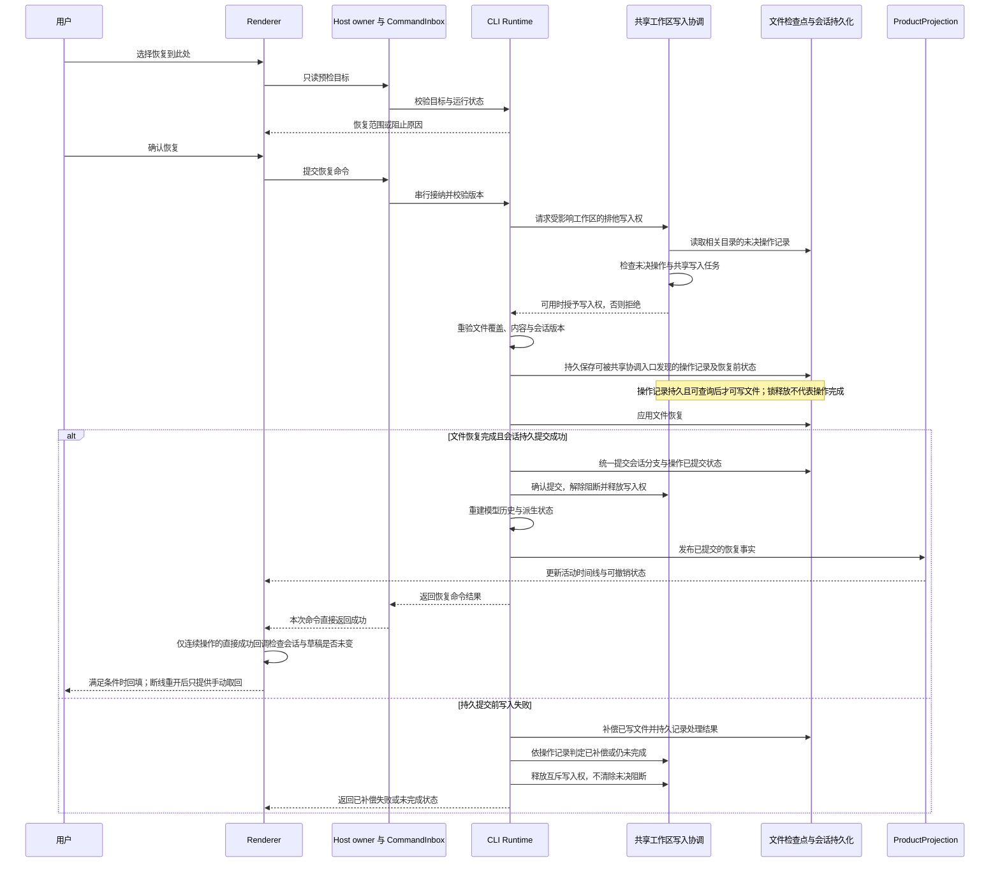

# 恢复检查点功能设计草案

状态：第四版，待评审，尚未进入实现。日期：2026-10-04。

本版收敛实现成本：持久保存恢复依据、按需计算覆盖结论；共享写入协调依据同一份恢复操作记录；命令查询和草稿管理复用现有机制。采用已确认的简化交互：断线或重开后手动取回原请求、首版始终确认、保留当前模型与模式、Undo 不改草稿。Todo／Goal 恢复范围及撤销窗口内其他回滚操作仍待确认。

本功能让用户回到某条请求执行前的状态：恢复检查点覆盖的文件，将该请求及后续内容移出当前会话分支，把原请求放回输入框，等待用户决定如何继续。恢复不自动发起新一轮 Agent 执行。

本文区分已确认的产品方向、建议交互和待确认边界。未确认项不作为实现授权；当前已有能力与拟新增能力分别列出。

## 一 产品目标与已确认规则

用户可以撤回一次或多次不满意的 AI 尝试，再从原请求继续修改。恢复操作同时处理文件、会话时间线和后续提供给模型的历史，不能只隐藏界面消息。

| 项目         | 规则                                                                            | 确认状态         |
| ------------ | ------------------------------------------------------------------------------- | ---------------- |
| 主入口       | 在历史用户消息上提供“恢复到此处”，执行前确认                                    | 已认可的设计方向 |
| 恢复位置     | 回到执行所选请求之前；所选请求成为草稿，不自动重发                              | 已认可的设计方向 |
| 文件范围     | 沿用现有检查点覆盖范围，不扩展为整个工作区快照                                  | 用户已确认       |
| 无法完整恢复 | 阻止整次恢复，不静默退化为只恢复文件或只恢复会话                                | 用户已确认       |
| 运行中操作   | Agent 运行期间不可恢复，用户先停止当前运行                                      | 用户已确认       |
| 撤销恢复     | 重新发送消息前可撤销；开始新一轮后失效                                          | 用户已确认       |
| 草稿回填     | 当前连续操作直接成功返回且草稿未变时自动回填；断线、重开或切换会话后手动取回    | 用户已确认       |
| 首版交互     | 始终确认；保留当前模型与模式；Undo 不自动改动草稿                               | 用户已确认       |
| 现有入口     | 保留末条请求的编辑重发和文件卡片的单独撤销；整合编辑框里的“对话 + 文件重置”入口 | 已认可的设计方向 |

“恢复检查点”不撤销终端进程、远端 API、数据库、部署等外部副作用。对已识别但不在检查点覆盖范围内的文件修改，按照无法完整恢复处理。未知的外部副作用不能通过文件检查点作出恢复保证。

首版以“准确恢复、可撤销、不覆盖用户修改”为必要性标准。复用已有会话分支、文件检查点、命令查询和草稿存储；只补足完成上述目标所缺的能力。覆盖结论、按钮可用性等派生结果按需计算，不增加独立持久状态；恢复与 Undo 共用一套操作记录及失败处理，不扩展成通用事务平台或历史分支管理功能。

## 二 用户可见流程

### 入口与恢复位置

桌面与宽屏 Web：用户消息的操作区新增恢复图标，悬停文案为“恢复到此处”，键盘聚焦时同样可访问。手机 Web：通过消息操作菜单访问同名操作，不依赖悬停。各端使用同一组可用性事实。

选择第二轮请求 B 时，恢复目标如下：

```text
恢复前：请求 A → 回答 A → 请求 B → 回答 B → 请求 C → 回答 C
恢复后：请求 A → 回答 A
输入框：请求 B 的原始输入，等待用户发送
文件：恢复到执行 B 之前，撤回 B 和 C 范围内受支持的修改
```

拟允许恢复当前活动分支中任意能够精确定位执行边界的用户请求。运行中追加输入、排队输入等若无法对应独立文件检查点，不能假装恢复到了该消息之前；具体入口处理见“待评审边界”。

### 确认弹窗

建议文案如下，统计值来自预检，不由 UI 估算：

```text
恢复到这条请求之前？

“把首页改成暗色主题……”

将撤回从这条请求开始的 3 轮对话，并恢复 4 个文件。
可以从原请求继续，不会自动发送。
发送新消息前，可以撤销此次恢复。

[取消]                         [恢复到此处]
```

预检期间显示“正在检查可恢复内容…”，确认按钮不可用。发现冲突时在同一弹窗列出受影响文件及简明原因，例如“文件后来被修改”“缺少恢复记录”“包含不支持恢复的文件修改”，按钮不可执行。取消不改变文件、会话或草稿。

首版始终显示确认弹窗，不增加“不再询问”设置。

### 恢复成功

时间线退回目标请求之前；发起端按下述草稿交付规则回填原请求。底部显示持续可见的状态条：

```text
已恢复到所选请求之前。                         [撤销此次恢复]
```

状态条不依赖短暂 toast 承载撤销入口。恢复不会创建新会话、自动发送请求、自动重试旧任务或执行原工具调用。其他客户端根据同一会话的新状态更新时间线，不自动替换它们自己的未发送草稿。

回填原请求保留当前模型与模式。正文、附件及结构化引用的回填范围与失效处理见待评审表，不能静默遗漏原请求中的附件。

### 草稿回填与断线重连

恢复结果包含操作 ID、目标会话与可取回的原请求引用。原请求引用保留在 Undo 同样需要的恢复操作记录中；实际草稿仍由发起端管理，不进入已接受输入队列，也不增加独立原请求归档。

自动回填只发生在发起端本次操作直接成功返回时：操作期间持续停留在原会话、没有断线或重建页面，确认时记录的草稿作用域与版本未变，且结果仍对应当前恢复状态。满足这些条件才回填并聚焦一次；其他客户端已撤销恢复或开启新一轮时，不应用晚到结果。预先存在非空草稿时的替换规则仍需按待评审项定案。

断线、页面重建、会话切换或草稿已改变时，不自动补填。恢复成功的文件与会话结果保持有效，用户可从当前有效恢复记录手动“取回原请求”；显式取回遇到非空草稿的替换方式仍待确认。重复事件、恢复快照和查询结果都不触发自动回填，不持久保存自动回填消费标记。

提交成功但 ACK 丢失时，扩展现有 `queryCommands` 按原命令 ID 查询恢复结果；重连后展示权威操作状态并提供手动取回，不新增结果查询或草稿投递系统。其他客户端只更新时间线和可撤销状态，不执行自动回填。

### 撤销此次恢复

撤销的目标是“点击恢复前的状态”，而不是重新执行已经发生过的 Agent 操作。成功后，文件和当前会话分支共同回到该状态，模型历史同步重建。

Undo 不自动改动当前草稿，也不恢复历史模型与模式；不为 Undo 保存旧草稿快照。撤销后是否继续编辑或发送输入框中的内容由用户决定。

撤销也要检查受影响文件是否发生后续变更。预检发现无法完整撤销时，在写入前拒绝，继续保留当前恢复后的状态，并展示原因；不能强行覆盖外部修改。执行中失败且补偿完成时，回到本次撤销开始前的状态；补偿失败或进程中断尚未收口时，显示“撤销未完成”并持续阻止相关工作区写入，不能宣称状态未变。Restore 与 Undo 共用下述提交、补偿及未完成操作处理规则。

用户已确认：重新发送消息前可以撤销；开始新一轮后失效。以 Runtime 接受新一轮执行请求为生效边界，不能仅因用户点击发送但请求未被接纳就清除撤销记录。其他客户端在同一会话开启新一轮，也使该撤销入口失效。

只修改草稿、切换页面或断线重连不会自行结束撤销窗口。新一轮开始后移除“撤销此次恢复”入口，不保留可跳回旧分支的历史管理界面。撤销本身不重新启动已经停止的 Agent、终端或后台任务。

恢复后再执行“仅撤销文件”或再次恢复，会改变本次撤销所依赖的状态，不能直接沿用上述有效期规则组合执行。例如，恢复 B 后再撤销 A 的文件，随后撤销恢复 B，可能出现旧会话已回来但 A 的文件仍被撤销的情况。待确认首版是在撤销窗口内禁用这两类操作，还是允许操作并明确结束或替换原撤销记录；定案后必须由 Runtime 统一执行，各端展示相同的可用性，不能只禁用发起端按钮。

## 三 文件与会话语义

### 文件恢复

恢复范围是从目标请求到当前活动分支末尾的相关文件修改，而不是只撤销目标轮。复用已有文件修改记录、内容校验和新增文件删除能力，不修改 Git HEAD、分支或暂存区。

同一文件被多轮连续修改时，预检应核对当前内容与整个待恢复区间的最终内容，并验证各次记录之间的状态连续性，再计算恢复到区间起点的结果。本区间内合法的连续修改不会被误判为冲突；夹在两次 Agent 修改之间、无法被记录解释的外部改动不能被跳过。

发生以下任一种情况时，在写文件前阻止整次恢复：所需检查点缺失、当前文件存在无法匹配的外部修改、已知文件修改不受支持或恢复目标失效。已撤销文件如何与多轮恢复组合，需以可证明的当前文件状态计算，不能重复应用反向修改。

建议允许纯对话区间恢复：如果该区间确实没有文件修改，则文件阶段为空操作，正常回退会话。该建议与当前编辑组合入口的“至少有一个可恢复文件”限制不同，列入本次评审。

### 恢复记录的完整性

“没有检查点”不能推导为“没有文件修改”。预检必须依据覆盖整个目标区间的执行事实，给出以下三类结论：

| 结论             | 必要依据                                                             | 恢复处理                                       |
| ---------------- | -------------------------------------------------------------------- | ---------------------------------------------- |
| 确认无文件修改   | 可证明该区间没有文件写入，不能仅凭检查点列表为空判断                 | 文件阶段可为空；纯对话入口是否开放仍按评审结果 |
| 修改记录完整     | 相关文件写入均有可读取、能连续衔接的恢复记录，且当前文件通过校验     | 可以继续执行恢复                               |
| 记录不完整或未知 | 已发生写入但检查点缺失／创建失败，或工具副作用无法证明是否受记录覆盖 | 阻止整次恢复，说明无法完整恢复                 |

Runtime 持久保存请求／工具执行边界、检查点关联及检查点创建失败或覆盖未知等依据，预检时据此计算目标区间的覆盖结论；不另行持久保存每个恢复区间的汇总结果。优先扩展已有检查点关联记录。工具修改成功而检查点保存失败，不能只留日志后把该区间当作无修改；失败或取消的工具若可能已部分写入，也不能仅凭工具失败状态认定未修改。

对终端或其他不支持恢复的写入，不扩大文件追踪范围；无法判定覆盖完整性时归为未知。已明确是只读的操作不因工具名称而被误判为写入。旧会话只能在已有事实足以证明完整时提供恢复入口，否则明确不可恢复，不用猜测补出检查点。

### 会话与模型历史

所选用户请求及其后的用户消息、助手消息、思考和工具记录退出当前活动分支。历史存储可以保留原记录，但这些记录不再作为当前分支的模型历史重新进入下一轮。

与被移出分支相关的压缩结果、读文件缓存和分支展示统计等派生状态，按恢复后的活动分支重建；实际已发生的用量和费用不会因恢复而撤销。旧运行的迟到结果不能重新写回新分支。重开会话、刷新页面或远端重连后仍看到同一恢复结果。

供模型正常读取的会话上下文也必须按被读取会话的当前活动分支筛选，不能只重建发起会话的 Runtime 历史。`ReadSessionContext` 无论读取当前会话还是被其他会话引用，都复用既有活动分支裁剪规则；摘要、检索片段和返回引用均来自裁剪后的内容，不能将被撤回的请求、回答或工具结果作为正常上下文返回。

取回原请求和 Undo 按恢复操作记录读取各自需要保留的历史内容，不经由普通上下文读取暴露旧分支；不为此增加历史分支浏览入口。活动分支仍由 Runtime 与 session store 管理，各读取入口消费同一分支边界。

本功能只恢复已有内容与状态，不再次调用模型，也不重放工具。恢复检查点与“创建会话分叉”保持独立。

### 待确认：Todo／Goal 等会话内部状态

当前 Todo 和 Goal 有独立的会话持久状态，后续运行会再次将其注入模型；仅裁剪消息历史不能保证模型回到目标请求之前。例如 B 将 Todo 标为完成，回到 B 前后如果仍注入当前 Todo，模型就会看到与时间线不一致的任务状态。

已提出两种选项，等待用户确认：随检查点恢复这些状态，缺少对应历史记录则阻止整次恢复；或者保留当前状态，并明确告知恢复不包含这些内容。本稿不把任一种选项写成已确认规则。

若选择一起恢复，需要保留目标请求之前的状态及本次恢复之前的状态，分别用于 Restore 和 Undo，并纳入同一持久提交点；状态所有者仍为 Runtime 与 session store。此时恢复后的逻辑内容不意味着重启已停止的 Goal 或后台执行，也不意味着实际发生的用量和费用被撤销。若选择保留当前状态，则需同步调整产品目标、确认文案及验收断言，不能继续承诺所有模型上下文都回到历史时点。

## 四 状态与不可用原因

| 状态                     | 页面行为                                                 | 允许的下一步                               |
| ------------------------ | -------------------------------------------------------- | ------------------------------------------ |
| 可恢复                   | 消息操作区可点击“恢复到此处”                             | 预检与确认                                 |
| 当前运行未停止           | 恢复操作不可用，提示“请先停止当前运行”                   | 用户停止后重新检查                         |
| 恢复记录不完整           | 显示缺失或无法确认的范围，不将其显示成“0 个文件”         | 关闭，保留现状                             |
| 工作区正在写入或无法协调 | 恢复操作不可用，说明相关工作区占用或能力限制             | 待相关写入停止且可协调后重新检查           |
| 正在预检                 | 显示检查进度，不能确认                                   | 取消或等待结果                             |
| 预检有冲突               | 展示阻止原因，不修改任何内容                             | 关闭并处理问题                             |
| 正在恢复或撤销           | Runtime 持有工作区写入权并串行提交；同一操作不重复执行   | 等待结果或重连查询结果                     |
| 已恢复且可撤销           | 展示恢复状态和“撤销此次恢复”                             | 修改草稿、撤销，或发送新请求并结束撤销窗口 |
| 操作被拒绝或失败且已补偿 | 保留或还原到本次操作开始前的状态，展示原因               | 处理问题后重新预检                         |
| 恢复／撤销未完成         | 明示文件可能只恢复了一部分，相关工作区持续阻止应用内写入 | 查询操作状态与原因，待 Runtime 确认收口    |

涉及已接受队列、权限问答或压缩中的可用性规则见“待评审边界”；不能仅以 UI 没有流式输出判断会话空闲。

## 五 状态所有者与事件顺序

以下为设计约束；接口名称为拟议名称，尚未实现。

| 状态                               | 唯一所有者                                     | UI 与其他进程的职责                                                           |
| ---------------------------------- | ---------------------------------------------- | ----------------------------------------------------------------------------- |
| 待恢复目标、弹窗、当前草稿         | Renderer 既有草稿及局部交互状态                | 选择和展示，不自行删除已接受消息                                              |
| 可恢复边界、当前活动分支、模型历史 | CLI Runtime 与 session store                   | Host 路由命令；Main 不保存这类业务状态                                        |
| 文件恢复计划、覆盖结论与执行结果   | 目标会话 Runtime                               | 复用文件检查点能力；不存在“一个工作区只有一个 Runtime”的假设                  |
| 应用内共享文件写入的协调权与阻断   | 文件执行端共享协调入口，具体实现待实施阶段确定 | 授予写权前读取相关目录的权威操作记录；覆盖多个 session 和窗口 Host            |
| 恢复操作记录与未决／可撤销事实     | Runtime 持久化存储                             | 同一记录供协调入口和结果查询读取，UI 消费派生状态；Main、relay 不保存这类状态 |
| 时间线显示                         | ProductProjection 发布，Renderer 消费          | Desktop 连续链路与 Web 可恢复链路表达同一提交结果                             |



恢复命令必须绑定稳定消息边界、会话版本与 workspace identity；过期页面的目标不能退化为最近检查点。请求沿用现有 owner/lease、CommandInbox 幂等与跨 Host 路由，远端继续携带 `workspaceIdentity` 和 `remoteSessionId`；身份 key 保持 `workspaceIdentity?.trim() || workspacePath`。

### 共享工作区的写入协调

CommandInbox 只解决同一会话的命令串行，不能充当共享文件锁。最终文件复验、恢复、失败补偿和撤销恢复，必须处于同一个排他写入窗口；相关应用内会话、子代理及文件操作遵守同一协调入口。只读预检不长期占用写入权，确认后获取不到写入权时不能继续恢复。

协调入口必须识别相关写入任务是否已经收口，不能把“当前尚未写文件”当作“任务已停止”。其他会话仍有受影响的写入任务时拒绝恢复，不自动停止其他会话，也不静默排队到未来执行；用户处理占用后重新预检和确认。

会话和恢复记录继续按 workspace identity 隔离。文件冲突的协调范围按同一文件系统执行端上的实际目录识别：不同 identity 映射到同一目录仍需协调；不同远端机器上的同名路径不共用协调状态。相关目录相互包含时，也不能绕过重叠文件的写入协调。

不同窗口 Host 访问同一实际目录时不能各自只使用进程内锁。若当前环境无法让相关应用内写入路径共享协调边界，则恢复和 Undo 暂不可用，说明“当前工作区无法协调并发写入”。不为此扩展为整工作区快照或引入历史分支系统；具体协调机制在实施设计中确定。

共享协调入口每次授予应用内写入权前，还必须依据同一份权威恢复记录检查相关目录是否有未决操作；新窗口、新进程以及重叠目录遵守同一规则。记录独立于原会话是否打开、进程是否存活及互斥锁是否释放。存在未决操作时，普通文件写入和新的 Restore／Undo 均不得进入；处理该未决操作本身仍在排他窗口内执行。

只有从操作记录确认已共同提交，或确认补偿完成、回到操作开始前的状态，才能解除阻断。进程退出后，下一次接入从持久记录判定终态，不重复执行已经提交的恢复。无法确定终态时继续阻断并提供状态与原因；仅关闭提示、重启进程或释放锁不能解除。协调入口可直接查询操作记录，不要求额外的持久登记流程或独立终态存储。

外部编辑器及其他不受控进程不属于应用门禁。执行前复核受影响文件；恢复或补偿阶段若检测到内容偏离事务预期状态，停止自动覆盖并报告未完成。此机制不承诺锁住任意外部进程，也不承诺任意并发外部修改都能被无损合并。

### 提交与失败恢复

拟新增独立的恢复预检、提交恢复和撤销恢复接口，不再通过编辑请求或伪造 slash prompt 承载。具体字段在实施设计时收敛到现有严格协议与校验入口。预检不是写入授权，提交阶段仍须验证文件和会话版本。

Restore 与 Undo 在首次写文件前，必须持久保存同一份权威操作记录及所需恢复数据，并确保共享协调入口可发现该记录。记录关联操作 ID、所属会话、文件执行端与实际目录、处理状态、操作开始前的会话边界及原请求／文件恢复数据引用；内容数据复用现有 ArtifactStore。具体存储和查询布局在实施阶段确定，不预设第二套登记服务。持久化或可发现性未成立时不能开始写入。

“成功”只在文件与会话共同提交后发布。持久提交点之前发生写入错误时补偿已写文件，不切换会话；补偿完成后持久记录终态，再解除阻断。若补偿也失败，必须明确显示未完成并保留工作区级写入阻断，不能报告恢复成功或文件状态未变。进程中断后先处理未决记录、判定或完成提交／补偿，再允许相关工作区后续写入，不能由客户端猜测。

文件系统与会话数据库不是同一个事务。拟将新活动分支和操作已提交状态作为统一持久提交点；提交后若投影发布或缓存重建失败，应从已提交事实重建，不能单独把文件回滚到旧状态。断线后可按原命令查询最终结果，同一命令重试不重复恢复。

现有 append-only 消息不等于已支持撤销恢复：需要保留恢复前的完整活动分支边界及文件正向恢复数据。撤销不能简单清除当前 revert 字段，也不能把分支代数降回旧值。撤销成功同样产生新版本，以隔离迟到事件。

## 六 现有入口调整与实现边界

| 入口或能力             | 当前源码                                   | 本设计方向                                                                 |
| ---------------------- | ------------------------------------------ | -------------------------------------------------------------------------- |
| 最后一条用户消息的编辑 | 编辑重发；可选择“对话 + 文件重置”          | 保留普通编辑重发；组合文件恢复移到独立恢复入口                             |
| 文件变更卡片的撤销     | 只恢复该轮文件，不裁剪会话                 | 保留，明确文案“仅撤销文件”                                                 |
| 历史消息恢复           | 没有独立 v4 恢复命令                       | 新增独立恢复入口与协议                                                     |
| 恢复结果查询与草稿管理 | 已有命令查询、草稿存储与作用域校验         | 扩展现有入口；正常成功回填，重连后手动取回，不增加持久消费状态             |
| 会话回退               | 已能持久化分支裁剪、重建模型历史           | 复用，不让 UI 成为第二个会话状态所有者                                     |
| 会话上下文读取         | ReadSessionContext 未传入会话分支裁剪信息  | 补齐当前活动分支筛选；取回原请求及 Undo 按操作记录读取所需历史内容         |
| 多轮文件回退           | CLI 有 cascade 能力；v4 编辑走单轮文件事务 | 复用可用记录和校验，补齐多轮统一恢复计划；不直接照搬无用户撤销记录的旧路径 |
| 撤销恢复               | 未找到已接通的产品链路                     | 新增恢复前状态记录、反向操作与 UI 状态                                     |
| 未完成操作隔离         | 文件补偿记录为内存状态，未形成持久写入阻断 | 补齐可被共享协调入口发现的权威操作记录与终态核验，跨窗口及重启生效         |

当前代码依据：

- `packages/ui/src/v4/ConversationRowView.tsx`：编辑框与组合按钮。
- `packages/shared/src/zcode-protocol-v4/command.ts`：当前命令没有独立会话恢复入口。
- `apps/zcode-cli/packages/bootstrap/src/zcode-protocol-v4/commands/handlers/fork-edit-retry.ts`：文件恢复后裁剪会话，再自动重发。
- `apps/zcode-cli/packages/core/src/runtime/methods/file-rewind.ts`：安全文件恢复与内存补偿记录。
- `apps/zcode-cli/packages/core/src/runtime/methods/rewind-message.ts`：分支裁剪、级联恢复及模型历史重建。
- `apps/zcode-cli/packages/core/src/tool/handlers/read-session-context.ts`、`apps/zcode-cli/packages/core/src/session-context/read-session-context.ts`：持久消息读取及模型上下文材料构建，目前未传入会话分支裁剪信息。
- `apps/zcode-cli/packages/contracts/src/rewind/index.ts`：共享活动分支选择器；未提供裁剪参数时不排除旧分支。
- `apps/zcode-cli/packages/contracts/src/interfaces/session-store.port.ts`：现有 `SessionRevert` 边界。
- `apps/zcode-cli/packages/core/src/runtime/methods/tools.ts`：文件检查点生成条件与保存失败处理。
- `apps/zcode-cli/packages/core/src/runtime/methods/workspace-checkpoint-persistence.ts`：已有检查点与会话的持久关联记录。
- `apps/zcode-cli/packages/core/src/runtime/methods/resume.ts`、`apps/zcode-cli/packages/core/src/runtime/methods/turn-loop.ts` 与 `apps/zcode-cli/packages/core/src/tool/handlers/todo.ts`：独立 Goal／Todo 状态的读取、模型上下文注入与写入。
- `apps/zcode-cli/packages/bootstrap/src/zcode-protocol-v4/command-inbox.ts`：当前按会话串行的接纳边界。
- `apps/zcode-cli/packages/bootstrap/src/zcode-protocol-v4/v4-gateway.ts`：现有 `queryCommands` 入口，新恢复命令仍需接入。
- `packages/ui/src/v4/composer/useDraftConfigControl.ts`：现有草稿作用域校验与替换操作。
- `packages/ui/src/v4/composer/composerDraftStore.ts`：已有草稿持久化；本功能不新增自动回填消费标记。

界面遵循 `DESIGN.md`，复用 Button、Dialog、Tooltip 和消息操作组件，沿用 `text-ui-*` 与语义主题色；同时覆盖中英文、明暗主题和手机布局。不引入新的视觉系统。

## 七 待评审边界

以下为明确提出的建议或选项，尚未定案，不得在实现时自行补全。

| 边界                   | 建议或选项                                                     | 需要评审的影响                                            |
| ---------------------- | -------------------------------------------------------------- | --------------------------------------------------------- |
| 无独立检查点的追加输入 | 建议显示不可用并说明原因，不静默退到该轮最初请求               | 保证“此处”对应准确执行边界                                |
| 已有非空草稿           | 建议在替换前提示；自动回填和手动取回的具体替换方式待确认       | 防止丢失未发送内容；Undo 不改草稿已确认，不依赖旧草稿快照 |
| 原请求内容与附件       | 建议回填正文、附件和结构化引用；失效引用需显式处理             | 不静默遗漏原请求内容；模型与模式保持当前值已确认          |
| Todo／Goal 等内部状态  | 已提问：一起恢复且无历史则阻止；或保留当前状态并说明排除范围   | 决定模型上下文、持久提交点与 Undo 的恢复范围              |
| 撤销窗口内的其他回滚   | 已提问：暂禁再次恢复与仅撤销文件；或允许并结束／替换原撤销记录 | 决定 Runtime 的命令互斥及各端可用性，不能默默失效         |
| 队列与待处理交互       | 建议有已接受待执行输入、权限问答或压缩任务时暂不允许恢复       | 避免静默取消队列或在恢复后立即自动执行                    |
| 无文件修改的区间       | 建议允许，只恢复会话并回填草稿                                 | 避免“只聊天不能恢复”的限制                                |

## 八 关键验收场景

以下为计划场景，尚未编写或执行功能测试。只覆盖影响行为的关键边界，不扩展成全组合矩阵；待评审项确定后补齐对应断言。

| 场景               | 操作与关键断言                                                                                                                       |
| ------------------ | ------------------------------------------------------------------------------------------------------------------------------------ |
| 跨多轮恢复         | A、B、C 三轮连续修改文件，选择 B；文件回到 B 前，B 与 C 退出时间线和模型历史，B 回填草稿，没有新模型调用                             |
| 同一文件连续修改   | B、C 修改同一文件；识别为本次范围内的合法修改链，最终恢复到 B 前，不错误报告外部冲突                                                 |
| 文件冲突与覆盖结论 | 检查“确认无修改”“完整记录”“写入后缺失记录”三种代表情况；缺失记录或外部冲突阻止整次恢复，不得误报为 0 个文件                          |
| 撤销恢复与有效期   | 恢复成功后执行撤销；文件与会话回到恢复前，不重放工具、不改当前草稿；若文件冲突则不执行。新请求被接纳后入口失效，仅改草稿或重连不失效 |
| 运行状态与过期页面 | 运行中不可恢复；打开确认框后会话版本变化或另一端先提交操作，旧请求不得作用到错误目标                                                 |
| 重开与远端恢复     | 恢复后重开会话；Desktop 连续链路和手机 Web 断线重连都得到已提交的同一分支与操作状态，无重复执行                                      |
| 同工作区并发写入   | A 会话确认恢复时，B 会话尝试写同一文件；包括不同窗口 Host，不能在 A 的最终校验与提交之间交错写入，补偿和 Undo 遵守同一边界           |
| 写入中断与持续阻断 | 在部分文件写入后中断操作，另一窗口及进程重启后均不得继续普通写入；确认提交或补偿完成后才能解除阻断。Restore 与 Undo 复用该机制       |
| 恢复后的上下文读取 | 恢复到 B 前，再通过 ReadSessionContext 读取该会话；返回内容与引用不含已撤回的 B／C 请求、回答或工具结果，原请求仍可按恢复记录取回    |
| 晚到结果与草稿     | 正常直接成功时草稿未变才回填一次；ACK 丢失后重连或切换会话再返回，只查询结果并提供手动取回，不自动补填，不覆盖新草稿                 |
| 既有入口           | 编辑重发仍可用；文件卡片撤销不改变聊天；新的独立恢复不自动重发                                                                       |
| 跨 workspace 隔离  | 路径相同但 identity 不同的远端 workspace，不共享恢复目标、操作记录或撤销状态                                                         |

实现阶段至少覆盖一条 Desktop 完整恢复与撤销交互、一条手机 Web 重连恢复交互，以及文件冲突、未决操作持续阻断、模型历史裁剪和会话上下文读取的关键测试。执行入口以届时实际测试文件和包脚本为准，结果另行记录，不将本设计视为已验证行为。

## 九 本次交付范围

本次仅修订功能设计，未新增协议、改动 UI 或执行任何实际文件／会话回滚。2026-10-04 本次工作区基线检查通过；现状描述沿用已核对的当前源码，不将拟新增能力写成现有能力。
