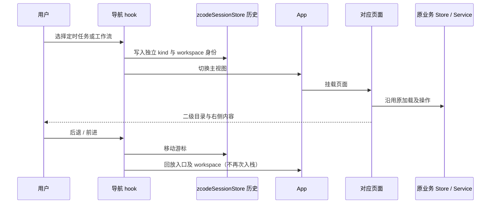

# 定时任务与工作流独立导航

## 产品规则

- 一级导航依次为项目、定时任务、工作流、插件市场。工作流沿用现有动态工作流可用性开关，关闭时不展示入口；关闭后原工作流页面回到定时任务，保持旧开关的回退规则。
- 定时任务页面只管理 Cron 定时任务，保留列表、模板、创建、编辑、启停、执行结果与聊天创建入口。进入时默认定时任务。
- 工作流页面独立管理已保存工作流。二级栏按全局和项目展示流程目录，选中流程后右侧展示详情及参数、运行、修订、删除、运行记录和产物等已有操作；列表概览仍可返回。
- 工作流目录在查看详情时保持可达；全局工作流沿用本地项目执行目标，项目工作流沿用对应 workspace identity 与目标服务。
- 工作流通过聊天创建和修订仍只预填草稿，不自动发送。工作流手动运行沿用原服务；本轮不新增定时任务绑定工作流协议。
- 定时任务与工作流拥有独立导航历史条目。旧 `handleOpenAutomations(undefined, "workflow")` 调用映射到工作流，前进、后退恢复正确的一级入口和 workspace。
- 删除旧自动化/工作流标题切换及 sessionStorage 标签偏好，旧标签记忆不影响定时任务入口。
- 复用现有二级栏 portal、宽度、折叠、移动抽屉、主题与国际化规则。

## 状态所有者与接口

| 状态              | 唯一所有者                       | 投影与接口                                                                 |
| ----------------- | -------------------------------- | -------------------------------------------------------------------------- |
| 一级视图          | App.workspaceMainView            | WorkspacePrimaryNavigation 发出选择，WorkspaceShellLayout 挂载页面         |
| 导航历史          | zcodeSessionStore.taskNavHistory | 独立 workflows kind；导航 hook 统一入栈与回放                              |
| 定时任务数据      | automationManagementStore        | AutomationsSection 原 hooks、原写入路径                                    |
| 已保存流程数据    | savedWorkflowStore               | 全局/项目 Group 原加载与操作；目录仅派生投影，不复制库存                   |
| 工作流选择、刷新  | SavedWorkflowsSection            | Group 持续挂载；同组只有一份查询和操作实例                                 |
| 二级栏 DOM 与布局 | WorkspaceShellLayout             | SavedWorkflowsSection.navigationContainer 可选 portal，null 表示插槽待挂载 |

## 边界与失败语义

- 修改限于 UI 导航、页面组合、文案与对应规格，不修改 scheduler、Agent 协议、Host、owner/lease 或远程恢复语义。
- 远程隔离继续采用 `workspaceIdentity?.trim() || workspacePath`；执行和展示仍使用 workspacePath。
- 加载失败、远程未就绪、无运行时、无本地项目及无效流程沿用原组组件的明确状态，不能显示成空库存。
- 查看详情时关闭对应项目回到概览；删除流程、移动全局流程后的目录更新沿用原刷新路径。

## 关键验收

1. 一级入口与标题分别显示定时任务、工作流，定时任务二级栏不再显示工作流。
2. 定时详情入口保持原目标，旧 workflow 标签入口落独立工作流；前进后退不串页，并保留远程身份。
3. 工作流全局/项目目录在查看详情时仍可选；创建、运行、修订、删除、记录与产物沿用原动作。
4. 窄 Web 可打开和关闭二级抽屉，选中项可访问；宽桌面复用原分隔线与布局。
5. 执行关键导航测试、typecheck、lint、架构检查及可用构建；交互 E2E 的已执行结果与环境限制另记 ACCEPTANCE.md。
