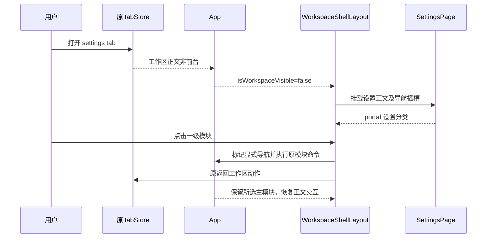

# 设置沿用工作区两级导航

## 产品规则

- 用户已确认采用「固定一级图标栏、二级设置分类、右侧设置正文」。进入设置后仍可访问项目、定时任务、工作流、插件及设置；设置入口高亮，其他模块不高亮。
- 设置分类使用现有分组、国际化和选中状态；二级栏标题为「设置」。复用工作区侧栏宽度、分隔线、调宽及显隐状态，不新增第三栏。
- 点击其他一级入口退出设置并进入指定模块。重复选择进入设置前的同一模块也有效，不被设置退出流程强制改为对话；项目入口恢复原任务或草稿。
- 打开设置展开二级栏；设置已打开时再次点击设置入口只展开二级栏，不重新挂载设置或重置分类。
- 窄 Web 沿用现有覆盖抽屉，分类保留文字；选择分类、点击遮罩或 Escape 收起抽屉。收起后一级栏仍可达。
- 设置分类以壳层可用高度为边界；窗口高度不足时只滚动分类列表，标题与一级入口保持可达。
- 原工作区、会话和终端保持挂载；设置打开时原正文不可交互、不可抢焦点。桌面窗控与平台安全区沿用原壳层；设置正文不再增加另一层窗口外框。
- 无工作区的独立设置入口仍沿用原独立容器；不改变设置保存、服务作用域、Host、协议、远控与会话投影。

## 所有者和接口

| 状态                   | 唯一所有者                          | 投影或动作                                                              |
| ---------------------- | ----------------------------------- | ----------------------------------------------------------------------- |
| 设置是否打开           | 原 tabStore 的 settings tab         | Root 传递 isWorkspaceVisible；沿原返回动作退出                          |
| 工作区主模块           | App.workspaceMainView 与原导航命令  | 一级栏显示设置或工作区模块，显式导航标记复用原 preserveNextSettingsExit |
| 二级栏显隐、宽度、抽屉 | useAppPanels / WorkspaceShellLayout | 设置复用同一壳层，不保存另一份显隐或宽度                                |
| 设置分类及表单         | SettingsPage                        | navigationContainer portal 投影分类；选择后通知壳层关闭窄屏抽屉         |

导航插槽只承载 DOM，不拥有业务数据。原页面 portal 和保活正文在设置期间停用交互，不新增超时或全局导航事件。

## 核心验收

1. 宽屏从项目打开设置：一级栏可见，设置高亮，二级栏显示现有文字分类；切换分类正文匹配，调宽沿用同一偏好。
2. 从插件或定时任务打开设置，再点击相同一级入口：恢复该模块；点击项目恢复原草稿或任务。设置展开与关闭不重建工作区实例。
3. 390px 窄屏：设置二级栏为抽屉，选择分类后收起，遮罩/Escape 可关闭；再次点击设置只展开，分类保持。设置正文和一级入口可操作。

执行最小浏览器交互验收、pnpm typecheck、pnpm lint、架构检查及改动文件格式检查；原生窗控和真实手机远控未运行时明确记录。
