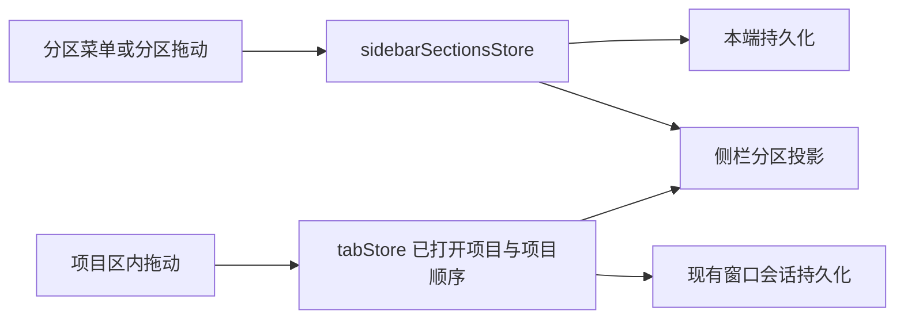

# 项目分区与任务分组退役

状态：已实现；验证结果与环境限制见 [ACCEPTANCE.md](./ACCEPTANCE.md)。日期：2026-09-30。

## 产品规则

- 移除任务分组功能及「分组 / 项目」切换。默认侧栏使用「分区 → 项目 → 任务」。保留既有置顶、时间列表、归档、自动化和独立任务入口。
- 自定义分区只容纳项目，不直接容纳任务；一个项目只属于一个分区。未分配项目显示在内置「项目」区域，独立会话显示在内置「任务」区域。
- 分区支持新建、重命名、删除、折叠和排序；不嵌套。新建/重命名须有非空名称，名称仅作展示，身份使用稳定 ID。
- 侧栏全局工具按钮统一右对齐，从左至右为全部展开/收起、视图与排序、归档；按钮使用相同间距。
- 项目右键菜单与更多菜单共用「分区」操作：勾选当前归属，选择已有分区、默认「项目」或「新建分区…」。从项目发起创建后，该项目立即归入新分区。手机通过更多按钮使用同一操作。
- 普通 Web 顶栏保留可触摸的侧栏开关，窄屏自动收起后仍能进入分区菜单；复用已有侧栏状态与切换动作。
- 删除分区后，其项目回到默认「项目」区域。项目和任务记录仍由原有服务管理。
- 项目区内排序继续使用现有项目顺序；通过菜单跨区移动修改归属并展开目标分区。默认「项目」区域保留添加本地或远程项目入口，项目自身的新建任务入口保持可用。
- 分区定义、归属、顺序和折叠按本端保存，刷新/重启恢复；不新增电脑与手机远控之间的分区配置同步。

## 状态与接口所有者

- UI 专用 sidebarSectionsStore 是分区定义、分区顺序、项目分区归属及分区折叠的唯一所有者，通过一个本地持久化入口写入。旧固定分区偏好迁入该模型，避免 React state/localStorage 双写。
- tabStore 继续拥有已打开 workspace 与项目顺序，useTabPersistence 继续负责现有窗口会话恢复。分区只过滤投影现有项目，不复制项目列表或项目排序。
- 项目归属 key 使用 workspaceIdentity?.trim() || workspacePath，不使用 tab.id、remoteSessionId 或远端路径单独作为身份。
- 分区组件与菜单通过 UI store/actions 操作；task service、任务索引和 CLI runtime 不接收分区状态。
- 取消 task group 的服务接口、adapter 方法、类型及生产调用；实际服务契约为 packages/services/src/session/zcodeTaskService.ts 中的 IZCodeTaskService。真实任务、草稿首发 admission、会话生命周期和自动化调度保持原所有者。

## 退役与迁移边界

- 旧 organizeBy=grouped 偏好迁移为 project；退役 grouped 展开、草稿位置、promotion、成员关系和混排排序缓存。
- 旧分组不转成项目分区：任务分组与项目分区的成员粒度不同。历史任务仍按原 workspace 进入项目/独立任务列表，已有置顶、归档、未读与标题保留。
- cron/off-peak 系统分组作为展示分类退役；保留 cronAutomationId/offPeakTaskId、任务记录、自动化配置、运行记录、标记回填和调度恢复。既有自动化导航承接管理入口；产生的任务沿用现有项目/任务列表规则。
- 现有自动归档原由分组结构读取触发，退役后由 listTasks 的活动任务读取承接；继续使用原设置、完成/过期/未置顶/已读条件和 task_meta_changed 通知，不另建调度。
- 不修改已应用的历史数据库迁移 SQL 与 checksum；追加迁移清理分组专属四表，任务和自动化数据表不属于清理范围。
- Desktop continuous 与 Web remote replayable 的运行时、Host owner/lease、队列、snapshot 和重连协议不属于分区状态；不得为整理项目改变这些链路。

## 失败语义

- 空名称无法提交；取消新建/重命名不写入状态。删除分区通过单个 store transition 清理归属。
- 没有归属的项目落在内置「项目」区域；读取旧分区偏好时只迁移已知字段。
- 本地存储不可用时，本轮界面操作仍可用，日志报告无法持久化，不扩展到远端保存或重试队列。

## 核心验收场景

1. 新建分区并归入项目、重命名、移动回默认区、删除分区后项目仍可打开；分区折叠/排序与归属刷新后恢复。
2. 同一路径的本地/不同远程 identity 项目归属互不覆盖；独立任务不能进入项目分区。
3. 含旧任务组、定时/闲时系统组的数据库升级后任务/自动化数据完整，迁移可重复启动；旧 grouped 偏好进入项目视图。
4. 普通新建和草稿首次提交仍创建正常会话；打开历史任务、置顶、归档和自动化入口可用。
5. 实际浏览器验证桌面宽屏及手机窄屏的新建/移动/重命名/删除入口；键盘可操作菜单与表单。真实远控链路未执行时单独说明，窄屏验证不等同于远控恢复验证。

## 验证计划

- 沿用仓库现有 node:test/tsx 入口补少量核心状态和数据库迁移测试，不建立穷举矩阵。
- 实施后执行 pnpm typecheck、pnpm lint、pnpm architecture:check --changed；记录失败与环境限制。
- E2E 使用隔离数据目录和命名浏览器会话，记录步骤、截图与结果。
