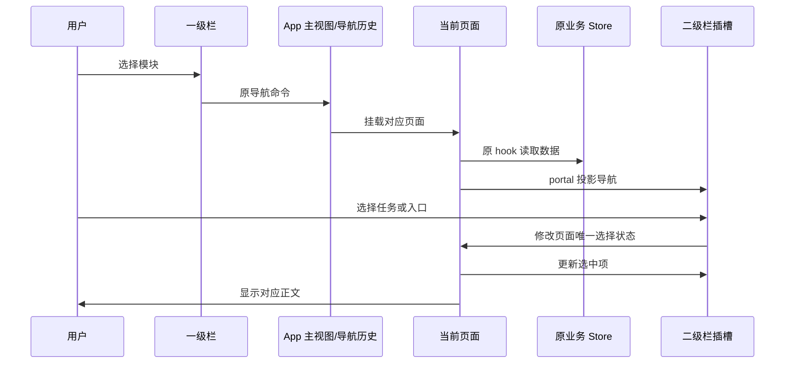

# 工作区两层导航

## 产品规则

- 左侧固定窄栏提供「项目」「定时任务」「工作流」「插件市场」「模型网关」五个一级入口，以图标、选中背景、tooltip 和可访问名称表达含义；工作流沿用现有可用性开关，设置及桌面远控入口置于窄栏底部。
- 一级导航的工作流、插件市场和模型网关分别使用 Lucide `GitBranch`（分支线）、`Puzzle`（拼图）和 `Cpu`（芯片），以不同轮廓区分入口；图标由 WorkspacePrimaryNavigation 统一声明，沿用现有尺寸、主题颜色、tooltip、可访问名称和点击接口。
- 第二栏随主模块切换；顶部保留侧栏开关和历史前进／后退。点击一级入口展示对应二级栏，重复点击当前入口只展开二级栏，不重置页面或创建任务。
- 项目二级栏保留新建任务、搜索、项目分区、项目／任务列表和文件树。前一轮分区配置、任务和项目归属不变。切回项目继续当前任务或草稿。
- 定时任务二级栏提供定时任务和现有条件允许的闲时任务入口，展示当前定时／闲时任务列表。任务点击复用现有详情编辑状态；切换分类返回该分类列表。工作流使用独立一级入口，二级栏按全局和项目展示流程目录，右侧复用 SavedWorkflowsSection 的概览和详情。
- 插件市场二级栏分为「发现」和「管理」：发现仅提供公开市场、个人来源；管理提供已安装插件、MCP 服务器、技能；市场源位于底部。二级栏移除「类别」整块菜单，公开市场正文继续按现有目录逻辑展示分类分组。管理项直接切换工作区正文，不再跳转设置。点击分段清空搜索并返回对应列表，详情返回保留所在分段。
- 市场浏览页移除重复的已安装图标条，标题跟随当前公开／个人位置。已安装插件使用完整管理列表，保留搜索、用户／项目作用范围、内置分组、启停、更新、配置及卸载；不新增状态筛选。MCP 和技能复用现有独立管理页面，保留原操作权限和插件派生能力的只读边界。
- 设置移除插件、MCP 服务器、技能三个菜单和重复页面。命令、钩子、记忆、子智能体继续保留。快捷搜索及旧设置直达请求转发到对应市场管理项，保留作用范围与 workspace identity；旧最后打开分区不能产生空白设置页。
- 浏览和管理组件按当前入口互斥挂载：浏览只初始化 User inventory；管理使用所选作用范围及目标 Host，不得同时初始化共享插件 store。重复选择当前管理入口不重置详情或编辑内容；主动切换到其他入口返回相应列表。
- 模型网关二级栏提供「模型设置」「使用统计」。每次从其他一级模块进入默认模型设置；已在网关内时重复点击一级入口保留当前子页，只展开二级栏。两个分类从设置迁出，具体规则见 [模型网关](../model-gateway/SPEC.md)。
- 桌面和宽 Web 中，窄栏固定，第二栏沿用现有宽度偏好、拖动调宽与显隐状态。收起第二栏仍可访问五个模块与设置。
- 第二栏与主内容之间只显示 1px 低对比分隔线；透明的 4px 拖拽热区覆盖在线两侧，不额外占据布局宽度。悬停、键盘聚焦或拖动时仅加深线条，不加粗。会话与底部终端不叠加左边框；侧栏收起后的布局宽度在 Desktop 和 Web 均为 0，由一级图标栏右边框提供唯一的 1px 分隔线，不残留窗口底色条。
- 主内容上、右、下三边不绘制装饰边框、圆角卡片外沿或灰色留白；正文贴齐可用窗口边缘。打开底部终端或右侧面板后，其相邻内部边界和 4px 调宽区域保留，接触窗口外沿的边不重新出现边框。macOS 原生窗口按钮所需的顶部安全区保留，底色与正文一致；Windows/Linux 顶部工具组同步移除旧外沿产生的 5px 偏移。
- 窄 Web 中，窄栏保持可达，第二栏以覆盖抽屉显示，不压缩右侧到屏幕外；支持遮罩或 Escape 关闭，选择项目任务后收起。手机远控原单列／抽屉容器不改业务语义。
- 使用现有主题、字体、Button、Tooltip 和国际化；不修改 Host、协议、远程恢复、自动化执行或插件安装语义。

## 所有者与接口

| 状态                 | 唯一所有者                                     | 使用方式                                                                                    |
| -------------------- | ---------------------------------------------- | ------------------------------------------------------------------------------------------- |
| 主模块               | App.workspaceMainView                          | 沿用任务导航命令和回调，一级栏按此值高亮                                                    |
| 模型网关分类         | App.modelGatewayTarget                         | ModelGatewayPage 读取受控目标，切换分类经原导航历史命令                                     |
| 侧栏显隐             | useAppPanels.isSidebarVisible                  | 窄栏、顶栏及窄屏遮罩复用 handleToggleSidebar                                                |
| 第二栏宽度／插槽 DOM | WorkspaceShellLayout                           | 原宽度存储；插槽仅承载页面投影                                                              |
| 项目、任务与分区     | tabStore、现有任务查询、sidebarSectionsStore   | WorkspaceSidebar 保持挂载，隐藏非当前项目面板                                               |
| 定时任务数据／选择   | automationManagementStore / AutomationsSection | 导航和正文共用已有 store 与 view/tab                                                        |
| 工作流数据／选择     | savedWorkflowStore / SavedWorkflowsSection     | 原组组件加载与操作，二级目录与详情共用一份选择状态                                          |
| 插件数据／选择       | 原业务 store / PluginStorePage                 | Page 拥有市场入口；浏览页拥有分段、搜索、详情，不保存类别选择；管理页拥有作用范围和编辑状态 |

AutomationsSection、SavedWorkflowsSection、PluginStorePage 与 ModelGatewayPage 提供可选 `navigationContainer?: HTMLElement | null`。未提供时保留嵌入式导航；提供时页面通过 React portal 将二级导航渲染至壳插槽，`null` 表示插槽尚未挂载。插槽不保存导航项或接受状态，不创建平行业务缓存。

WorkspaceSidebar 将 footer 渲染至一级栏的 footer 插槽。设置同样沿用一级栏和二级导航插槽，具体规则见 [设置两级导航](../settings-two-level-navigation/SPEC.md)；无工作区时保留独立设置容器。

## 边界与失败语义

- 本次变更只涉及 UI 模块。服务与远程 workspace identity 继续沿用原 hook 和命令，不引入新网络接口或迁移。
- 目录／任务请求失败沿用原页面的错误与重试行为；不得将失败伪装成正常空列表。
- 导航重复点击不重复入栈或重新加载插件页。返回操作遵循任务导航历史；管理已安装只由明确的管理入口触发。
- 窄屏抽屉与宽屏面板共享同一状态和 DOM，收起后不可键盘聚焦隐藏导航。
- 市场导航只选择界面，安装、启停、配置及删除仍经原 hooks/store/service 提交；不改变配置持久化、远程 Host 解析或 Desktop/Web 的恢复语义。

## 关键验收

1. 五个一级入口切换时选中项、二级栏和主内容一致；重复点击不重置正在编辑的内容。模型网关跨模块进入默认模型设置，前进／后退恢复记录中的子页。
2. 项目分区及任务仍可操作；切换模块后返回原任务或草稿，前进／后退正常。
3. 定时任务列表可以打开已有停用任务详情；分类切换不滞留旧详情；不为验收运行真实任务。
4. 插件二级栏不显示类别菜单，公开市场正文保留分类分组，个人来源及详情返回一致；已安装插件、MCP、技能均在市场内显示对应管理页，搜索和作用范围正确，市场源可打开；设置不再有这三个重复入口，命令与钩子仍可访问。
5. 收起第二栏后一级入口仍可用；390px 下可展开、关闭二级抽屉并访问主内容；宽屏可调宽。
6. 执行 typecheck、lint、架构检查和关键浏览器交互验证；记录无法验证的运行环境边界。
7. 宽屏分隔线常态与悬停均为 1px，鼠标拖动和方向键仍可调宽；侧栏收起后正文贴齐一级图标栏，二级栏占位为 0，左侧只有一级栏提供的细分隔线。再次展开恢复原宽度，标题栏按钮、设置及模型网关入口仍可访问。此次仅调整呈现，不改变宽度存储和事件处理。
8. 主内容及右侧面板不再有上、右、下三边装饰外框；标题栏、终端与右侧面板操作仍可访问，macOS 原生窗控安全区不被覆盖。
9. 快捷搜索与旧设置 intent 直达对应市场页面并保留作用范围；已安装插件切到项目范围后，后台不存在浏览页再次初始化 User inventory 的路径。关键导航测试与最小 Web 交互验证覆盖上述入口，不为验收安装插件或运行任务。
10. 工作流、插件市场和模型网关依次显示分支线、拼图和芯片；在浅色、深色及窄 Web 中保持现有图标尺寸、选中样式和可访问名称。本项只更换图标，不新增状态、导航路径或迁移。
