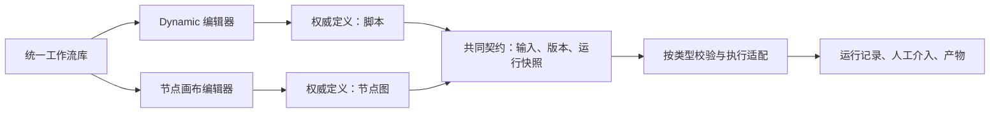
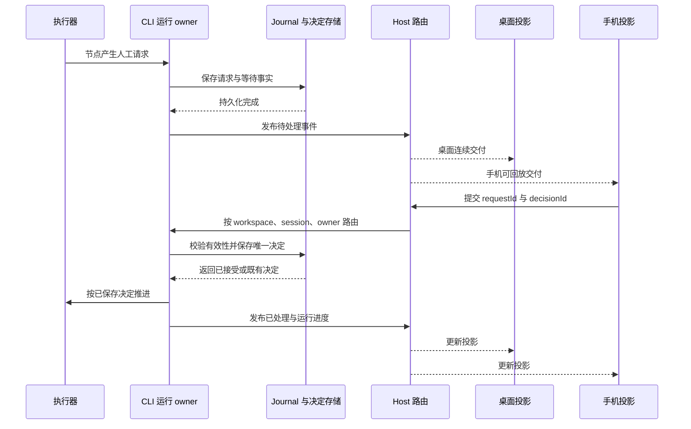
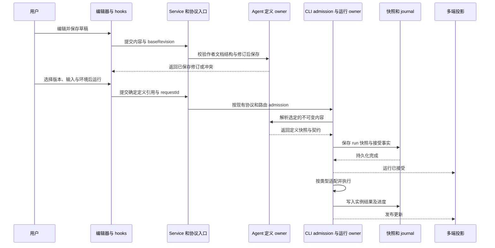

# 工作流平台功能设计：Dynamic workflow 与通用节点画布

> 状态：评审稿 v0.1，尚未批准实施。  
> 日期：2026-10-04。源码基线：`cbc0ef9`。  
> 范围：现有「工作流」功能的扩展，覆盖代码、调研、内容和数据任务。  
> 本次交付仅为设计文档，不包含功能实现。本文区分已确认需求、源码事实和拟议设计；第 23 节的待决策事项在确认前不作为实现要求。

## 1. 设计结论与确认记录

建议将现有工作流模块发展为一个支持两种工作流类型的平台：保留 Dynamic workflow，增加通用节点无限画布。两者共享工作流库、输入表单、版本、运行记录、人工介入和产物体验，各自保留适合自身的编辑器与权威定义。

画布中的 Agent 节点可以在单个步骤内部自主规划和使用工具，因此固定流程结构与动态行动可以组合。用户不需要为了处理调研或表格而离开代码工作空间，也不需要为了使用画布而放弃 Agent 的自主能力。

### 1.1 已确认需求

| 编号 | 已确认内容                                               | 对设计的约束                                         |
| ---- | -------------------------------------------------------- | ---------------------------------------------------- |
| C01  | 研究现有 Dynamic workflow 与固定／可视化工作流的能力差距 | 聚焦工作流产品，不扩展成整个 IDE 或 Agent 平台重设计 |
| C02  | 同时支持 Dynamic workflow 与通用节点无限画布             | 画布是正式工作流类型，不能用几个专用模板代替         |
| C03  | 同时服务代码、调研、内容、数据工作                       | 按任务需要选择编排方式，不按程序员／非程序员划分产品 |
| C04  | 先交付完整详细功能设计文档                               | 本轮不修改运行时、协议或 UI 行为                     |
| C05  | 文档保存在仓库 `specs/workflow-platform/SPEC.md`         | 以可评审、可追踪、可拆分实施的规格组织内容           |

### 1.2 本文如何使用

- 第 2 节及附录 A 是已核实的当前源码事实。
- 第 3—22 节是供评审的完整目标设计与交付建议。其中「应」「必须」描述方案成立时需要遵守的规则，不代表这些功能已经实现，也不替代用户对方案的确认。
- 第 23 节集中列出需要选择的产品与技术决策，给出建议、替代方案和影响。
- 不选择已有项目也能运行的「独立工作空间」、共用执行器、首版节点清单等仍是待决策项。

## 2. 当前能力基线与主要差距

### 2.1 当前 Dynamic workflow 是什么

当前能力由内置工具、随 CLI 分发的 `dynamic-workflows` Skill、`@zcode/dynamic-workflow` 和 `@zcode/dynamic-workflow-runtime` 等模块组成。它是产品内置能力，当前不依赖用户安装插件。功能开关、内置 Skill 和插件安装是不同机制。[S01]

保存的动态定义以 `.dwf.ts` 脚本为核心。脚本可以编排 Agent、数据处理、条件、循环及并行调用，执行时生成运行记录和阶段展示。已有工作流可保存到全局或项目范围，再带参数运行。当前 UI 支持查看源码、编辑说明与参数，并通过聊天发起修订；还没有面向用户的通用节点拓扑编辑器。[S02][S03]

### 2.2 能力对照

| 能力         | 当前事实                                                                  | 目标设计与差距                                                        |
| ------------ | ------------------------------------------------------------------------- | --------------------------------------------------------------------- |
| 创建与复用   | 聊天创建／修订、保存动态脚本、全局／项目目录                              | 增加类型选择、空白编辑器、模板和 AI 创建统一入口                      |
| 表达控制流   | TypeScript 条件、循环、并行与 Agent 编排                                  | 增加可编辑节点、端口、连接、容器和字段映射                            |
| 可视化       | 源码分析与运行阶段投影                                                    | 另建作者图；现有分析图不能直接作为可逆编辑定义                        |
| 参数         | string、number、boolean、json，支持必填和默认值                           | 补充文件、产物引用、结构化对象／列表及表格输入体验                    |
| 保存与版本   | 同名保存可覆盖；元数据没有发布修订字段                                    | 增加草稿、不可变版本和明确的运行快照绑定                              |
| Agent        | 动态调用与角色配置已有基础                                                | 画布需明确模型、工具范围、上下文和结构化输出契约                      |
| 直接工具调用 | Agent 可使用工具；`world.run` 可执行指定命令                              | 通用的指定 MCP／API 直接调用节点需要新契约，不能用 Agent 代选工具冒充 |
| 人工介入     | Actor 可向主 Agent 发出 Escalate 求助；等待登记在内存中，相关问题 UI 只读 | 持久化人工确认、表单回复、跨端处理与重启恢复需新增                    |
| 产物         | 已有文件／Markdown 字节存储与版本                                         | 补充节点间、跨运行输入引用、解析与可访问性检查                        |
| 恢复         | journal 保存源码、参数、hash、lineage；已有 Resume／Amend                 | 任意节点重算、批量条目重试、下游失效范围需新语义                      |
| 完成         | 脚本返回可结算为 completed                                                | 分开呈现执行完成、验证结果和人工验收                                  |
| 运行位置     | 全局工作流仍要求选择本地项目；项目流程沿用对应 workspace                  | 独立工作空间为建议，是否引入待 D01 决策                               |

### 2.3 不能直接复用的假设

1. **展示图不是执行定义。** 当前分析包含 may-flow 和不确定边，展示时还会折叠、裁剪；lowering 的输入是原始程序与站点信息，未提供图到源码的通用逆转换。[S04]
2. **源码站点不等于作者节点。** 当前 siteId 与源码顺序有关。画布移动、复制、改名不应导致节点身份漂移，需要稳定 nodeId 及独立映射。[S05]
3. **恢复不等于任意重算。** Resume／Amend 的快照与结果复用规则不能直接解释为「从任意节点重跑」。当前 Resume 会用存档源码重新编译，并未固定保存旧编译产物。[S06]
4. **并行语法不等于任意并发。** 同一 Actor 的调用受 FIFO 约束；多个分支需要独立执行上下文和明确并发配置。[S07]
5. **记录存在不等于外部副作用只发生一次。** 外部写入与 journal 落盘之间仍可能中断。不能承诺普遍 exactly-once。[S08]

## 3. 产品目标、边界与设计原则

### 3.1 用户价值

- 临时复杂任务可以让 AI 生成动态脚本，保留代码的表达力和调整速度。
- 重复任务可以在画布中明确检查步骤、条件、数据来源、人工节点和交付物。
- 同一个人可以用动态流程探索方法，再用画布整理适合复用的流程；是否提供辅助转换另行决策，不假设自动无损转换。
- 运行失败时，用户能看出失败位置、已有结果、恢复范围和需要处理的事项。
- 完成后的文件、报告、数据与代码变更可回访，并可明确引用到后续任务。

### 3.2 核心原则

1. **两种定义，一套产品语言。** 类型差异出现在编排与编辑方式，共享定义、输入、版本、运行、产物等概念。
2. **AI 创作与编排类型正交。** 两种类型都能由 AI 创建或修改，AI 创建不是第三种工作流类型。
3. **固定结构允许动态步骤。** 画布固定的是编排关系，不保证模型、工具、外部服务返回相同结果。
4. **定义与运行隔离。** 编辑草稿不修改正在执行的 run；历史运行始终能定位实际使用的快照。
5. **结构可见，数据可追溯。** 控制流、数据绑定、实际路径和产物来源分别可查。
6. **权限沿用现有体系。** 不为画布建立第二套凭据与授权机制；人工业务确认与工具权限分别处理。
7. **唯一事实所有者。** UI 是编辑与投影层，执行状态由运行 owner 管理，Host/Main 保持路由职责。

### 3.3 本设计不预先承诺的能力

以下均不属于已确认交付范围：任意脚本与画布双向无损转换、Dify DSL 导入、第三方节点市场、运行时自动改写作者图、多人实时协同编辑、云端托管执行、通用模型训练与全自动流程优化。可保留扩展接口，不因此提前建设完整子系统。

## 4. 概念模型与类型关系

| 概念             | 定义                                       | 关键边界                                   |
| ---------------- | ------------------------------------------ | ------------------------------------------ |
| 工作流定义       | 有名称、用途、输入输出和类型的可复用流程   | 全局／项目是保存作用域，不是运行状态       |
| Dynamic workflow | 以脚本为权威的编排定义                     | 阶段图是派生视图，不能反过来覆盖脚本       |
| 节点画布工作流   | 以节点、连接、作用域及配置为权威的定义     | 生成的执行程序属于派生产物，不与作者图双写 |
| 草稿             | 可编辑、可保存的当前内容                   | 保存草稿不等于发布稳定版本                 |
| 版本             | 某次可复用、不可变的定义修订               | 发布不等于公开分享或上架市场               |
| 运行 run         | 使用确定定义快照、输入和执行环境的一次执行 | 与草稿、版本、单个节点尝试分别标识         |
| 作者节点         | 画布里的一个逻辑步骤                       | nodeId 在改名、移动、重排后保持不变        |
| 节点实例         | 某次运行中节点在特定分支／批次／迭代的位置 | 一个作者节点可以产生多个实例               |
| 尝试 attempt     | 节点实例的一次执行尝试                     | 重试保留此前结果和错误证据，不覆盖历史     |
| 产物 Artifact    | 可被查看、下载或继续引用的内容及其版本     | 不等同于所有中间 JSON 值                   |
| 人工决定         | 与运行及节点实例关联的持久化回复           | 不用聊天中任意一条自然语言消息代替确定回复 |
| 执行环境         | 本次运行的 workspace、Host、能力与连接     | 与工作流保存位置分别确定                   |

拟议标识关系：`workflowId → revisionId / draftRevision → runId → nodeId + instancePath → attemptId`。这些是概念字段，不是现有协议字段清单。实例路径应能定位分支、批量条目和迭代；最终编码方式由实现设计确定。



## 5. 典型使用场景

场景用于检验通用性，不形成四套不同编辑器。创建者、运行者和处理确认的人是操作角色，同一个用户可以承担全部角色；团队权限体系不由本设计默认引入。

| 场景     | 示例流程                                              | 适合 Dynamic 的部分                  | 适合画布的部分                             |
| -------- | ----------------------------------------------------- | ------------------------------------ | ------------------------------------------ |
| 代码工作 | 理解需求 → 修改 → 执行验证 → 根据结果修订 → 输出 diff | 探索仓库、定位原因、动态选择修改步骤 | 固定验证环节、失败分支、人工检查与交付要求 |
| 调研     | 输入问题 → 多路收集 → 核验 → 汇总 → 生成报告          | 自主扩展检索、识别信息缺口           | 来源结构、并行范围、复核步骤、输出模板     |
| 内容处理 | 导入材料 → 提取结构 → 批量改写 → 审阅 → 导出          | 复杂表达、上下文理解与修订           | 输入字段、批量处理、人工审阅和格式化导出   |
| 数据处理 | 导入表格 → 校验字段 → 清洗 → 分类 → 汇总              | 非规则文本分类、解释异常             | 确定转换、列映射、失败条目、计算与导出     |

工作流详情应说明预期输入、必要工具、可能修改的资源和交付形式。复用者无需先阅读全部脚本或逐个打开节点才能知道如何启动。

## 6. 信息架构与工作流库

### 6.1 入口与目录

沿用现有一级「工作流」入口和全局／项目二级目录，不再按类型创建两套入口。与「定时任务」「闲时任务」保持各自导航职责，继续遵守现有 [导航规格](../scheduled-workflow-navigation/SPEC.md)。

目录项显示名称、类型和简短用途。详情显示保存位置、草稿保存状态、当前稳定版本、最近运行和可用操作。工作流的草稿状态与最近 run 的成功／失败是不同字段，不合并为一个状态标签。

建议提供名称／用途搜索和类型筛选。空目录显示「创建工作流」及模板入口；加载失败、目标未连接、无匹配结果分别呈现，不把失败显示为空目录。

### 6.2 详情页

详情页包含「定义」「运行历史」「版本」三个视图。页头承担名称、类型、作用域和主要操作；运行详情使用独立 run 上下文，返回后保留之前选中的工作流。

通用设置包括名称、说明、何时使用、输入、预期输出和环境依赖。节点参数、脚本、布局属于各自编辑器。运行参数只保存到本次运行；「设为默认值」作为明确的定义编辑操作处理。

复制产生新的工作流身份。删除定义与清理历史运行、产物是分开的操作，不能通过删除目录项隐式删除仍被引用的产物；具体保留周期待 D06 确定。

### 6.3 与聊天及自动化的关系

聊天仍可发起创建或修订，并能打开对应草稿。沿用当前「预填聊天草稿，不自动发送」的导航语义，除非用户明确执行发送。

工作流负责「执行什么」，定时／闲时任务负责「何时触发」。后续接入触发器时复用现有调度体系，不在画布内部另建 scheduler。版本固定还是跟随更新、触发时的输入和环境选择需在 D11 决策后补充，不宣称当前已实现双类型调度。

## 7. 创建流程与共用编辑体验

### 7.1 创建入口

创建面板分开表达三个维度：

| 维度       | 选项                         | 行为                   |
| ---------- | ---------------------------- | ---------------------- |
| 保存位置   | 全局／指定项目               | 决定定义存放和目录归属 |
| 工作流类型 | Dynamic workflow／节点画布   | 决定权威定义与编辑器   |
| 创建方式   | 描述需求／使用模板／空白创建 | 决定初始内容来源       |

用户选定类型后，AI 不能静默切换类型。模板携带类型与环境需求，选中时明确展示。独立工作空间如果获批，应出现在运行环境选择中，不混进工作流类型列表。

### 7.2 创建后的落点

AI 生成内容先进入可编辑草稿，展示输入、主要步骤和缺少的连接器／环境。空白动态流程提供可运行骨架；空白画布提供输入与输出起点。模板实例化为独立草稿，模板后续更新不覆盖用户修改。

建议自动保存草稿，并显示「保存中／已保存／未保存」。保存失败保留本地未提交内容，不能显示已保存。离开含未保存改动的编辑器时提供继续编辑或丢弃操作；自动保存与多端冲突规则需随 D10 确认。

草稿保存只要求作者文档结构可解析、写入不存在未解决的修订冲突。未配置节点、失效引用或尚未编译通过的脚本可以保存，并保留诊断；可运行性校验在试运行或发布准入处执行。「已保存」不等于「可以运行」。

### 7.3 页面布局

```text
工作流 / 全局 / 资料研究                  节点画布 · 草稿已保存
[定义] [运行历史] [版本]                 [试运行] [发布版本] [更多]
┌────────────┬─────────────────────────────┬─────────────────┐
│ 工作流目录 │ [+步骤] [撤销] [重做]       │ 选中：核验来源  │
│ 全局       │                             │ 配置 / AI       │
│  资料研究  │ [输入] → [并行收集]         │                 │
│ 项目 A     │              ↓              │ 目标与工具      │
│  修复流程  │          [核验来源]         │ 输入映射        │
│            │              ↓              │ 输出字段        │
│            │          [生成报告]→[输出]  │                 │
│            │ [适应画布] [缩放]           │ [测试此步骤]    │
└────────────┴─────────────────────────────┴─────────────────┘
```

目录与配置面板可折叠。AI 提案、节点配置与运行数据使用按需切换面板，避免同时常驻多栏。进入 run 视图时，页头明确显示版本／草稿快照与 run 标识，不能把历史状态覆盖在当前草稿上。

## 8. Dynamic workflow 编辑器

保留动态脚本作为正式工作流类型，而非仅作为画布的高级模式。现有创建、保存、参数启动、运行图和 Resume／Amend 能力应继续可达。

### 8.1 拟增加的编辑能力

- 在工作流详情直接编辑源码，提供语法、类型与编译诊断；当前只读 CodeBlock 不等于已有源码编辑器。
- 说明、输入输出契约和源码在同一详情中维护，保存时形成一致的草稿修订。
- 支持向 AI 描述修改需求并查看源码 diff，应用后形成新草稿。
- 点击阶段定位关联源码；无可靠定位时说明来源，不假造一对一映射。
- 区分编译失败与执行失败。编译失败表示未开始执行，不生成误导性的成功产物或节点完成标记。

### 8.2 与画布的关系

动态流程的阶段图用于理解和观察执行。节点拖动若只是显示布局，不改变脚本语义；不能让用户以为拖动运行图可以修改代码控制流。

「整理为画布」「封装为子流程」「导出执行代码」可以作为后续独立功能评审。动态脚本可能包含画布无法表达的计算和运行时结构，因此不承诺无损转换。若以后提供 AI 辅助转换，产物应是新草稿，并列出不支持或改变的部分，由用户检查后使用。

## 9. 通用节点无限画布

### 9.1 画布操作

目标基础能力包括平移、缩放、适应全部、定位选中节点、小地图、节点搜索、拖入节点、端口连线、框选、多选、复制粘贴、删除、撤销／重做和自动布局。具体首版范围在 D03 确认。

提供「添加下一步」「插入步骤」「选择连接目标」等非拖拽入口，供键盘与触屏使用。自动布局只修改坐标；分组和批注只表达组织关系，不隐式改变依赖、并发或作用域。

节点标题可修改，nodeId 不随标题、位置或顺序变化。复制节点产生新 nodeId；复制节点组时只重映射组内引用，组外引用应保留并可见，目标环境不可解析的引用标为待配置。

### 9.2 连线与结构

- 控制连线表示执行依赖与分支，不把节点的横纵坐标解释为先后顺序。
- 条件出口有明确标签与规则，默认分支需要可见。
- 并行与汇合使用显式结构；分支间的数据依赖不得隐藏在提示词中。
- 批量与循环使用明确容器，入口、内部作用域及出口分别可见。普通回连不自动解释为循环。
- 引用数据时若需要新增控制依赖，应让用户看到并一并应用；不悄悄增加边，也不允许运行时读取尚未产生的数据。
- 删除被引用节点可执行为草稿修改，但立即标出失效绑定；试运行或发布前必须解决必需字段的失效引用。

### 9.3 节点卡片与详情

作者视图卡片展示类型、标题、核心配置摘要及未解决问题。运行视图额外展示实例状态、耗时、重试次数和产物数量；点击批量／循环节点可展开实例，不用一个绿色状态掩盖部分失败。

配置面板统一组织为「任务配置」「输入」「输出」。只显示该节点需要的选项。模型高级参数、并发策略和错误分支等按需展开，避免首屏充满运行时术语。

## 10. 节点体系与行为规则

以下是目标节点模型，具体首版开放范围待 D03、D04、D05 确认。分类、摘要、审查、翻译等优先实现为 Agent／转换节点预设，避免为每个提示词任务新增底层节点类型。

| 节点       | 配置与输入                                       | 输出                           | 执行规则                                         |
| ---------- | ------------------------------------------------ | ------------------------------ | ------------------------------------------------ |
| 输入       | 参数定义、必填、默认值、说明、文件／表格要求     | 本次运行输入对象               | 启动前校验；不把空值自动解释成缺失               |
| Agent      | 目标、上下文、模型选择、工具范围、结构化输出要求 | 文本／对象／产物引用及执行记录 | 内部可动态行动，外层依据真实结果推进             |
| 直接工具   | 指定工具及连接引用、参数映射                     | 工具实际返回值／产物           | 不通过模型临时选工具或重写参数                   |
| 转换／代码 | 字段转换或代码、显式输入、输出 schema            | 可复用结构化结果               | 语言、依赖和运行环境待 D04；不是隐式通用 shell   |
| 条件       | 基于输入字段的条件与出口                         | 选中分支及其可用值             | 只调度命中路径；默认分支规则可见                 |
| 并行／汇合 | 分支列表、并发限制、结果映射                     | 按分支标识组织的结果           | 同级分支隔离，汇合按声明策略等待                 |
| 批量       | 列表、条目标识、内部步骤、并发限制               | 每条状态、结果、错误与汇总     | 条目实例独立；成功结果不因另一个条目失败而被覆盖 |
| 循环       | 初始值、迭代体、状态映射、结束条件、上限         | 最终值与选定的历史结果         | 区分当前、上一轮、累计值；达到上限给出明确结果   |
| 人工确认   | 展示内容、选项／表单、后续出口                   | 持久化决定及回复数据           | 无回复不推进；恢复后仍指向同一请求               |
| 输出       | 最终字段、文件／报告、验收证据映射               | 运行交付结果                   | 明确哪些中间内容成为用户交付物                   |

### 10.1 Agent 节点

用户配置的是任务边界与输出要求，不需要穷举内部工具调用。运行详情展示可解释的行动记录、使用的工具、子任务、产物和阻塞原因，不要求暴露模型内部思维链。

输出 schema 用于验证结构，不证明内容正确。结构校验失败应呈现具体字段，是否重试由节点策略决定；禁止仅凭模型说「已完成」就把无效输出传给下游。代码验证、来源核查等业务证据由明确步骤产生。

上下文只包含显式输入与授权可用资源。批量条目和并行分支默认隔离可变执行上下文；需要共享信息时通过明确输入输出传递。跨运行记忆和共享 Actor 策略另行评审，不默认继承上次运行全部对话。

节点模型选择、工具范围需由执行环境验证。当前动态 persona 配置不能被描述为已具备完整画布级工具白名单。

### 10.2 直接工具与代码节点

直接工具节点适用于已知操作，例如读取指定资料、调用确定接口、执行选定工具。固定调用方式不意味着返回值确定，也不意味着可以无限自动重试。

配置使用工具／连接的稳定引用和参数 schema；凭据由现有连接系统提供，不保存进定义、模板或运行参数展示中。环境缺少连接时提示配置缺口，不自动借用其他 workspace 的连接。

转换节点优先覆盖字段选择、重命名、过滤、映射和汇总。需要代码时明确运行语言、依赖、文件访问和输出结构。当前 `world.run` 指定命令可作为适配候选，但通用网络、脚本沙箱或 Python 支持必须另行实现验证。

### 10.3 分支、并行与失败处理

互斥条件汇合只读取已执行分支；后续步骤使用统一输出时，应通过出口映射或分支结果对象提供，不伪造另一路输出。

建议并行汇合默认等待全部必要分支；若允许可选分支失败，定义中显式标注并输出失败信息。失败不能被转换成空字符串或空数组来伪装成功。

批量节点配置「遇错停止」或「继续收集条目结果」。具体默认值待 D03；两种行为都必须保留已完成条目、展示失败条目，并在汇总处报告缺失结果。若后续步骤要求全部成功，则在该依赖处阻塞。

循环达到上限而未满足目标时，显示「达到迭代上限」及当前结果，不自动标记业务验收通过。暂停、取消在可停止边界生效，不声称已经撤销执行中的外部操作。

## 11. 数据类型、引用与作用域

### 11.1 数据类型

共同数据模型建议覆盖文本、数字、布尔、对象、列表、文件引用、产物引用和表格引用。表格至少表达列名、列类型、行数与预览；大表格按引用访问，不把全部内容塞进节点配置或事件。

字段定义包括名称、类型、说明、必填、默认值与必要约束。`missing`、`null`、空字符串和空列表分别处理；类型不符时定位到输入字段。隐式类型转换限于明确、可见的规则，不默认把所有内容转成字符串。

### 11.2 输入绑定

输入支持三种基本来源：固定值、工作流输入、可到达上游的输出。选择器显示节点名称、字段路径、类型和样例；样例标明来自测试、历史运行还是手填，不能冒充当前真实值。

概念示例：生成报告节点的 `evidence` 绑定到「核验来源.result.acceptedSources」，不是复制一段无法追踪的文本。引用依赖 nodeId 与字段路径，节点改名后保持有效。

一个节点引用另一个节点的输出，必须在执行依赖上保证后者先完成。路径上可能缺失的字段应在汇合处显式处理；不提供静默跨分支取值。

### 11.3 容器作用域

| 结构 | 内部可用值                                          | 对外输出                           |
| ---- | --------------------------------------------------- | ---------------------------------- |
| 条件 | 进入条件前可用的数据、命中路径产生的数据            | 选中分支输出或显式统一映射         |
| 并行 | 分叉前输入、当前分支结果                            | 按分支标识汇总；不依赖完成先后顺序 |
| 批量 | 当前 item、稳定 item 标识、输入上下文、条目内部结果 | 带条目标识和状态的结果列表         |
| 循环 | 当前轮状态、上一轮输出、显式累积值                  | 最终状态及声明保留的历史           |

批量输入包含重复值时，条目标识仍应唯一；不能只用内容 hash 把两个条目合并。循环与重试标识分别存在，第二轮不是第一轮重试。

### 11.4 文件与产物

跨节点、跨端与跨运行传递采用可解析的引用，包含所属范围、产物标识和版本；本地绝对路径只用于所属环境内的实际 IO 和显示，不能直接当作跨端身份。

当前 `ArtifactRef` 的 id／version 可作为基础，但新增引用契约还需解决来源 run、workspace、访问能力和输入解析。导入文件与历史产物须展示来源和选定版本，运行期间文件变化的处理策略待 D06。

引用失效时说明是源文件缺失、版本被清理还是目标环境无法读取，并定位受影响输入。涉及产物清理时遵守引用关系与保留策略，不在节点失败时顺带删除其他成功产物。

## 12. AI 创建与局部修改

AI 可以根据自然语言生成完整草稿，也可以修改选中步骤或区域。修改流程包括：读取当前草稿及范围 → 生成变更提案 → 显示差异和影响 → 用户应用到草稿 → 校验。

| 类型     | 差异展示                                 | 应用规则                         |
| -------- | ---------------------------------------- | -------------------------------- |
| Dynamic  | 源码 diff、参数／元数据变化              | 修改脚本草稿，不改历史快照       |
| 节点画布 | 新增／删除节点、连线、配置与字段映射变化 | 保留未受影响节点的身份和用户布局 |

选区外必要修改必须列入影响范围。例如为新输入建立依赖时，应显示被新增的连线；不能以「局部修改」隐藏全局调整。普通手动拖动与配置修改可直接撤销，不增加逐步批准流程。

提案绑定生成时的草稿修订。用户在 AI 生成期间修改同一区域时，应用前显示冲突；可重新生成或选择保留哪一侧，不覆盖较新的人工改动。无冲突合并应符合作者文档的结构要求；可运行性问题作为诊断保留，不因此丢弃尚未配置完整的草稿。具体合并方式待 D10。

AI 推荐节点或连接器时应检查目标环境能力，未提供的能力显示为待配置，不生成看似可运行但不可解析的节点。自动搜索最优流程、自动改变已发布版本属于后续研究范围。

## 13. 草稿、稳定版本与模板

### 13.1 生命周期

建议采用「编辑草稿 → 校验／试运行 → 发布稳定版本 → 复用运行」。草稿也可试运行，每次冻结所用内容；是否强制试运行成功后才能发布由 D07 决定。

发布建立不可变 revision，记录类型、定义内容、输入输出契约、依赖能力、创建信息和兼容版本。发布不是公开分享，不能隐含对其他用户开放权限。

运行已发布版本时选择明确版本；运行草稿时显示「草稿快照」。按钮与启动表单必须说明将使用哪份内容，不能在启动过程中自动切到刚更新的版本。

恢复旧版本会生成新草稿，不修改旧 revision。AI 修改、手工编辑和从历史恢复都进入同一草稿写入路径。首版是否自动保存、是否提供版本备注与 diff 在 D07、D10 评审。

### 13.2 模板与交换

模板描述类型、用途、输入、依赖环境和示例产物。代码、调研、内容、数据模板共用底层节点体系。实例化后形成独立工作流身份，不与模板保持隐式同步。

原生导入／导出可作为后续交付：文件需携带 schema 版本、类型和依赖引用，导入先进入草稿并列出缺失配置。凭据和真实运行数据不随定义导出。是否支持 Dify DSL、子工作流引用或插件节点在 D08 决策，不因结构相似而承诺兼容。

## 14. 启动、运行观察与状态

### 14.1 启动表单

启动页依次确认所用版本／草稿快照、运行位置、参数与文件、必要连接和运行限制。可复用上一次输入，但应显示来源并重新校验引用可用性；复用输入不复用上次 run 的身份。

工作流输入校验与环境能力校验在提交前提供反馈。run 的建立以权威 owner 接受为准；按钮处的「正在提交」只是客户端 pending，不代表运行已被接受。重复点击、重连重送需使用同一提交标识关联到同一次已接受请求。

同一工作流可存在多个运行记录，实际并发由执行环境能力与限制决定。排队位置与执行状态来自 owner，不由 UI 推测。发布新版本、切换目录或修改参数默认值，不影响已接受的运行快照。

### 14.2 产品状态模型

下表是拟议的用户可见逻辑状态，**不是当前协议 enum**。实现时需映射现有状态，并明确新增状态的事实来源。

| 状态     | 用户看到的含义                               | 允许的主要操作                           |
| -------- | -------------------------------------------- | ---------------------------------------- |
| 排队中   | 请求已接受，等待可用执行资源                 | 查看输入、取消排队                       |
| 执行中   | 正在执行一个或多个步骤                       | 查看进度、请求暂停／取消                 |
| 等待处理 | 至少一个步骤需要人工输入或权限，显示具体原因 | 打开对应请求、回复或处理权限             |
| 已暂停   | owner 已确认到达暂停边界，不再调度新步骤     | 继续、取消；编辑另一个草稿               |
| 已完成   | 执行按定义结束                               | 查看交付与验收证据、重新运行             |
| 失败     | 必要步骤失败且当前无自动恢复路径             | 查看原因、按允许范围重试／修订           |
| 已取消   | 取消请求已由 owner 结算                      | 查看已产生结果、明确哪些外部操作仍需核对 |

暂停中／取消中是控制请求的中间反馈，不与 owner 确认后的暂停／取消混淆。等待人工输入时其他独立分支可能仍在执行，运行摘要需同时显示活动步骤和待处理项，而不是用单一状态抹掉并行事实。

运行结束与业务验收分别展示。例如定义允许收集失败证据并正常交付修订建议时，可以显示「执行已完成；验证有 1 项未通过」；必要节点存在未处理失败时，运行应为失败。无验证步骤时显示「未配置验证」，不能显示「全部验证通过」。

流程内人工验收尚未回复时，run 仍为等待处理，不能提前结算为已完成。流程结束后提示用户检查产物，只是交付说明，不自动产生另一套正式验收待办或状态。产物摘要、证据和需要人判断的事项分别可见。

### 14.3 运行详情

共同详情包含概览、步骤／时间线、输入输出、产物与诊断记录。概览回答五个问题：现在做什么、哪里受阻、已经得到什么、实际使用什么版本与环境、下一步可做什么。

画布运行视图使用本次快照，突出实际执行路径、未命中分支与失败位置。动态运行沿用适合脚本的阶段／时间线。没有开始的步骤不能仅因拓扑位于已完成节点之后就标记成功。

节点详情记录输入来源、已解析值的可读预览、输出、工具调用、时间、错误与 attempt。大量数据提供分页或文件入口。模型使用量与费用仅在执行提供方给出可靠数据时显示，缺失时标为不可用，不推测精确费用。

## 15. 可恢复的人工确认

### 15.1 产品行为

人工确认节点暂停自身下游，向用户展示待确认内容、可选操作、表单字段以及选择后的流程出口。用户可以查看相关文件、报告或 diff，再提交明确决定。

确认记录包含请求标识、run、节点实例、显示内容的版本、允许的回答结构、当前状态和最终决定。首版是否允许修改中间数据、谁可以处理、是否过期及过期后如何处理，待 D05 决策。

建议首轮实现至少支持明确的选择和说明文字；结构化表单是目标能力。拒绝应走定义中的拒绝分支或明确终止，不作为系统异常。无回复不等于同意；关闭窗口、断网或等待超时不能隐式选择同意。

### 15.2 持久化与多端一致性

owner 先持久化待处理请求，再发出通知。用户提交时携带请求标识和提交标识；owner 校验该请求仍有效，持久化决定，再推进下游。重复提交返回已保存结果，不消费两次；过时请求显示已经处理及其结果。

这与当前 Escalate 的内存等待登记不同，需要补充持久化契约。不能靠重启后重新生成一个相同问题来冒充恢复原请求。



### 15.3 与权限审批的区别

「认可这份报告」是业务决定；「允许访问某目录／调用某工具」是执行权限。两者在运行待办中可同时展示，但各自使用对应 owner 和授权规则。业务同意不自动扩大工具权限，已有工具授权也不能替代流程中的人工验收。

## 16. 调试、恢复与重新计算

### 16.1 调试入口

建议提供整流程试运行、选中节点测试、输入输出查看与失败定位。单节点测试必须说明采用手填样例、某次历史输入，还是执行必要上游后获得的输入。缺少可用输入时要求补充或选择依赖范围，不偷偷执行整条流程。

试运行是真实执行，可能修改文件或调用外部服务。执行前沿用正常参数、权限与环境检查，界面显示实际目标。提供模拟值时明确标为模拟数据，不把未执行工具显示成真实调用成功。

### 16.2 操作语义

| 操作           | 定义与快照                    | 结果复用与执行范围                                                 | 设计状态                         |
| -------------- | ----------------------------- | ------------------------------------------------------------------ | -------------------------------- |
| 继续 Resume    | 使用原 run 已保存的定义和输入 | 按原恢复规则复用已确认完成的结果，继续未完成工作                   | 当前已有基础；画布需验证映射     |
| 重试 Retry     | 不修改当前 run 的定义         | 对符合条件的失败节点／条目产生新 attempt；界面列出会再次执行的操作 | 画布新增语义，内部承载方式需验证 |
| 重新运行 Rerun | 选择版本与输入，创建新 run    | 默认重新执行；若支持显式复用应单独说明                             | 共享产品操作                     |
| 修订后运行     | 从修改后的定义创建后继运行    | 复用条件必须可解释，不能把旧输出当作新定义已执行结果               | 现有 Amend 可作为动态类型基础    |
| 从此处重新计算 | 选择节点、输入和新执行范围    | 使相关下游结果失效，并处理分支、循环和文件依赖                     | 待 D09；不是现成 Resume API      |

Retry 与局部重算需要分开：前者重试同一逻辑步骤，后者可能改变输入并影响下游。是否在同一 run 内记录 Retry，或用 lineage 关联后继 run，由 D02／D09 的可恢复性验证决定；产品必须保留尝试历史和明确的血缘。

### 16.3 副作用与未知结果

已确认完成的操作可按恢复契约复用。对外部写操作，应记录工具能够提供的请求标识、目标与回执；工具支持幂等键时沿用它，不假定全部工具都支持。

若调用可能已经写入但没有可靠回执，界面显示「结果待核对」。恢复时优先查询实际结果；无法核实时由用户选择处理方式或修订流程，不能隐式重复提交外部写入。无需对所有纯计算和只读操作弹出确认，仅处理真实的不确定副作用。

更改节点后重新计算，应列出因依赖变化而失效的下游结果。旧结果保留在历史中，不能删除 journal 记录伪装从未运行；外部系统的状态也不能通过清空缓存回滚。

## 17. 保存位置、项目与独立工作空间

### 17.1 保存位置与运行位置分离

「全局／项目」决定定义的归属、查找和复用范围；「在哪里运行」决定文件访问、命令 cwd、工具连接与 workspace identity。全局不等于无工作目录，项目也不等于必须使用 Git。

当前行为仍是全局工作流选择本地项目后运行，项目工作流使用对应目标。本节提出的扩展不能被当作当前已有能力。

### 17.2 独立工作空间建议——待 D01

建议支持用户无需先选择已有项目即可执行通用任务。界面可提供「独立工作空间」与「已有项目」两种运行位置，不把它们绑定到某一种工作流类型。代码任务若需要已有仓库，仍选择相应项目。

如果采纳独立工作空间，建议规则为：

- 每次新运行获得明确的真实工作目录和稳定身份；恢复原 run 使用原环境，不重新创建空目录。
- 输入文件按选定策略导入或引用；输出保存为可回访产物。
- 后续任务通过显式产物引用继续使用结果，不隐式共享所有历史目录。
- 用户能查看实际运行位置、导出结果、转存到项目或清理环境；保留周期依赖 D06。
- 本地、远程、云端是执行承载问题。支持独立工作空间不自动承诺云运行，也不要求为无 Git 任务创建 worktree。

若首期不采纳，启动表单继续要求项目，并清楚说明这是执行位置要求。底层数据模型仍应分离 scope 和 execution target，避免后续扩展时重写定义身份。

## 18. 多端、权限与运行环境

### 18.1 Desktop、Web 与手机

遵守 [DESIGN.md](../../DESIGN.md)：紧凑信息密度、语义色、现有组件和 `text-ui-*` 字体规范。画布状态同时使用图标／文字，不只依赖颜色；连接、节点和配置提供键盘焦点与可读名称。

宽屏使用目录、主编辑区和按需面板；窄屏采用单列页面、抽屉和全屏配置。手机应能查看定义与运行、填写输入、处理人工确认；完整结构编辑作为目标能力，具体首版范围待 D03。

如果手机提供结构化列表编辑，必须保留分支、并行、批量和循环容器，不能把任意图压成线性步骤而改变语义。不能拖拽时仍可通过添加下一步、选择目标和输入映射完成同义操作。

### 18.2 连接与离线

本地草稿、已保存定义与远端运行事实分别显示。失去连接时保留已显示内容，注明状态可能不是最新；未获 owner 接受的控制请求保持 pending 或失败，不能伪装已暂停／已取消。

执行依赖的 Host 不可用时说明连接问题，不自动切换到本地 workspace。设备离线时不能保证任务继续运行；实际行为取决于执行环境是否仍在线，界面须呈现该环境。

### 18.3 现有架构不变量

- 身份 key 统一使用 `workspaceIdentity?.trim() || workspacePath`；文件操作与显示使用 `workspacePath`。
- 远端请求继续携带 `workspaceIdentity` 与 `remoteSessionId`，不按路径字符串猜测目标。
- Desktop 保留 `desktop-continuous` 连续交付；手机远控保留 `web-remote-replayable` 快照与事件恢复。
- 手机连接桌面已有 Host attachment，复用会话运行时，不额外建立 Agent／Local Host。
- Main、relay 和 Host 不保存工作流业务队列、快照或节点决定；owner/lease、跨 Host 路由和 stale run 校验继续存在。
- 工具、文件与网络权限复用平台接口和现有授权；凭据引用不进入可复制模板内容。

## 19. 逻辑架构、状态所有者与接口

### 19.1 架构建议

先统一产品契约和运行投影，再通过类型 adapter 接入执行。优先验证「画布编译成现有执行器可接受的程序」；是否采用同一个 runner 待 D02，不因为想复用运行 UI 就提前绑定执行实现。

画布权威定义应保存稳定节点、控制关系、数据绑定、容器作用域与配置；布局作为作者文档的一部分或关联数据保存。派生程序、分析图与编译缓存不成为第二个可编辑事实源。

如果单一 runner 无法可靠表达持久化人工节点、直接工具或结构化恢复，可以使用不同执行 adapter，但仍只保留一套面向用户的定义／版本／运行／产物契约和每个 run 的唯一 owner。

### 19.2 状态归属

| 状态                               | 唯一所有者／写入职责                                  | 客户端或其他层职责                                  |
| ---------------------------------- | ----------------------------------------------------- | --------------------------------------------------- |
| 尚未提交的文本、节点配置、布局     | 当前编辑器本地草稿                                    | 可保存、撤销；不能冒充已保存定义                    |
| 已接受草稿、定义元数据与不可变版本 | 拟新增 Agent 侧定义管理职责，沿保存工作流存储边界扩展 | UI store 仅缓存目录与读取结果                       |
| 已接受启动与运行控制               | CLI/runtime 命令 admission 与 run service             | UI 只保留 pending overlay；Host 按 owner/lease 路由 |
| 步骤调度、实例及结算               | 当前 run 所属执行器，经 run service 管理              | adapter 不额外维护同一 run 的业务副本               |
| 快照、事件、输出与尝试历史         | 运行 owner 经统一 journal 持久化路径写入              | 查询、重放和 UI 投影只读取事实                      |
| 待确认请求与决定                   | 运行 owner 下的持久化决定记录                         | 多端提交决定，不自行推进流程                        |
| 文件产物字节与版本                 | 现有产物存储职责                                      | 新增可解析引用、预览与输入适配                      |
| 选择项、面板、缩放等展示偏好       | UI 局部状态                                           | 不参与 run 调度；需共享的布局经定义写入             |
| 连接、attachment 和 owner 路由     | 现有 Host 连接注册及 lease 机制                       | 不成为工作流业务 owner                              |

当前 `savedWorkflowStore` 是工作流目录的 UI 状态与缓存，不能据此让它成为新运行队列。当前每个父会话的 run service、执行器与 journal 边界应延续；新增职责的具体文件归属在实施前按受控模块上下文确定。

### 19.3 编辑与运行事件顺序



实现不能用延时等待 UI 同步代替保存完成回执。草稿提交与启动若连续发生，应引用已确认保存的修订，或在受控命令中冻结提交内容，避免启动到旧定义。

### 19.4 逻辑接口职责

下列是新增或扩展接口应承担的职责，**不是宣称已有的命令名**。

| 逻辑操作               | 必需信息                              | 返回及影响                               |
| ---------------------- | ------------------------------------- | ---------------------------------------- |
| 查询工作流／草稿／版本 | 定义身份、scope、目标 workspace       | 类型化定义、修订与兼容信息               |
| 保存草稿               | 内容、baseRevision、请求身份          | 新草稿修订或具体冲突，不覆盖较新提交     |
| 校验／编译             | 确定定义、目标能力                    | 节点／字段级诊断、执行能力需求、映射信息 |
| 发布版本               | 已保存草稿修订与必要元数据            | 不可变版本；发布准入规则由 D07 决定      |
| 启动运行               | 版本或冻结草稿、输入、环境、requestId | 接受结果及 runId；复用同一请求的接受事实 |
| 控制运行               | run 范围、动作、请求标识              | owner 接受／拒绝、随后权威状态事件       |
| 提交人工决定           | run、请求、内容版本、decisionId、回复 | 已接受决定、既有决定或过时说明           |
| 查询进度／节点／产物   | workspace、session、run、游标／实例   | 有范围的快照、事件、数据与可解析引用     |

UI 通过 `packages/ui/src/hooks/` 访问服务。协议变动需同步共享类型和运行时校验；Service 不导入 Runtime 具体实现，adapter 经公开入口或依赖注入接入。平台文件选择等操作通过 `IPlatformService`，不直接调用 `window.zcode`。

### 19.5 持久化与编译映射

建议 run 快照记录定义类型、确定内容／hash、修订来源、输入及文件版本、执行环境身份、schema／编译器版本、模型和工具解析信息、作者节点到执行站点映射。能否取得精确外部模型或工具版本取决于提供方，应记录实际可得信息，不虚构可复现性。

一个作者节点可对应多个执行站点、多个 item 和多个 iteration；映射必须支持一对多。编译改版后仍须解释旧 run 的节点记录，不能把新编译的 site 顺序套到历史数据。

定义存储、journal、产物字节与 UI 缓存各有职责，不为方便列表展示复制出另一份运行事实。具体文件格式与存储拆分需随 D02 验证，不在本稿固定未经验证的数据库或文件扩展名。

## 20. 兼容与迁移

1. 旧 `.dwf.ts` 继续可读、可启动；读取适配层可标识为 dynamic，不批量重写用户文件。
2. 不要求旧定义先重新发布才能继续使用。新增版本能力是可渐进采用的能力；旧定义运行仍冻结实际内容。
3. 旧 run 使用自身存档源码、参数和 lineage，不切换到最新定义。可在确认兼容后重新编译；若无法保持历史节点映射或恢复语义，应拒绝恢复并说明原因，不静默套用新映射。这是目标兼容规则，不表示当前已具备全部编译版本检查。
4. 现有动态阶段图、聊天入口和产物路径保持可达；引入共同运行视图不丢失动态类型专属信息。
5. 新客户端识别旧定义；不支持画布的旧客户端应显示不支持的类型，不把未知格式当动态脚本执行。
6. 功能开关负责入口与可用性，能力协商负责执行端是否支持类型／节点。两者不能相互替代；未支持的运行提交应有明确错误。
7. 关闭画布入口不删除其定义与历史；旧产物引用应继续可读，清理遵守 D06。

本轮不修改既有 [工作流导航规格](../scheduled-workflow-navigation/SPEC.md)。本方案获得确认并实施时，需同步更新其中已改变的产品规则，避免留下互相矛盾的现状描述。

## 21. 分阶段交付建议与效果衡量

以下是建议拆分，不是已确认排期。首版节点范围、独立空间和调试深度必须在评审后确定，不以阶段划分替代用户决策。

| 阶段                  | 交付目标                                                                           | 完成依据                                                               |
| --------------------- | ---------------------------------------------------------------------------------- | ---------------------------------------------------------------------- |
| A：确认规则与能力验证 | 决定关键待决策项；验证执行适配、映射、人工持久化和引用                             | 代表性纵向样例证明方案可承载，记录不能复用的能力                       |
| B：双类型闭环         | 统一库、类型选择、两类编辑器、通用节点画布、输入、保存、运行快照、启动、运行与产物 | 用户能创建两种定义并完成真实任务；定义与输入冻结，编辑不改变已接受运行 |
| C：稳定复用与恢复     | 不可变发布版本、人工介入深化、批量局部恢复、输入追踪、关键多端恢复                 | 历史版本可复用；跨端恢复不丢决定和成功结果                             |
| D：扩展复用           | 更多连接器、原生交换、可复用子流程及可选调度接入                                   | 基于已验证需求逐项扩展，不提前建设节点市场                             |

阶段 B 若含人工节点或批量节点，其必要持久化与失败语义必须随节点一起交付，不能等阶段 C 才补。阶段 C 表示深化已有闭环，不允许把不可靠恢复包装成已支持。阶段 B 的「通用」至少应通过不同领域、不同结构的任务验证，不能只支持预置演示图。

### 21.1 共用执行器的验证重点

选择少量样例验证：直接工具调用与输出 schema、分支／并行／循环的 nodeId 映射、重启后的人工请求、文件产物作为下游输入、外部写入结果不明时的恢复。任一关键语义无法成立时，应调整 adapter 或执行后端，不用 UI 状态补丁掩盖。

### 21.2 效果与体验指标

建议在试用阶段关注：从创建到首次有效交付的完成率／耗时、失败后能够继续的比例、重复运行前的修改成本、数据引用配置错误、运行完成但验收失败的比例。模型成本与工作流使用次数属于辅助指标，不能替代结果质量。

画布规模、批量大小、并发、加载速度和移动端交互目标需通过真实样例测量后设定，待 D12 确认；本稿不编造吞吐和延迟承诺。复杂图应支持定位与按实例查看，不要求一次把所有运行数据常驻渲染。

## 22. 关键验收场景

**以下均为拟议验收，尚未执行。** 与未确认能力有关的场景在对应决策通过后纳入实施验收。采用代表性路径，不构建所有类型、终端、节点与错误的穷举矩阵。

| 编号               | 准备与操作                                            | 核心断言                                                       | 所需证据                           |
| ------------------ | ----------------------------------------------------- | -------------------------------------------------------------- | ---------------------------------- |
| A01 双类型与旧定义 | 读取旧动态定义；分别由 AI／空白入口创建两类流程并运行 | 旧流程仍可用；类型选择与编辑器一致；使用确定输入和定义         | 关键 UI 路径、提交快照与运行结果   |
| A02 调研交付       | 收集资料、核验来源并输出报告                          | 报告可追溯至实际来源；缺失证据可见；产物可回访                 | 来源字段映射、真实输出与产物引用   |
| A03 代码验证失败   | 流程修改代码后执行验证，产生失败结果                  | 保留 diff 和失败证据；不显示验收通过；可进入已声明修订路径     | 验证返回、运行状态与交付摘要       |
| A04 批量部分失败   | 多文件中部分解析失败，重试失败条目                    | 成功结果保留；重试范围和新 attempt 可见；不误覆盖原结果        | 条目标识、尝试记录与产物版本       |
| A05 分支与循环     | 选择互斥一路，并进行至少两轮修订                      | 不读取未执行分支；当前／上一轮／累计值明确；结束条件或上限生效 | 调度路径、实例输入输出与结算记录   |
| A06 版本隔离       | 启动版本 A，执行期间编辑并保存 B                      | 原 run 仍用 A；新运行明确选择 B；历史视图不套用新图            | 两份定义快照、映射与运行详情       |
| A07 AI 草稿冲突    | AI 基于旧草稿提案，用户先修改相同区域再应用           | 不覆盖新编辑；呈现冲突及处理选择                               | baseRevision、保存回执与最终草稿   |
| A08 跨端人工决定   | 桌面等待，手机回复；重连并重复提交同一请求            | 显示同一决定；下游基于已接受决定推进；不生成第二个人工请求     | 持久化记录、两端事件与进度         |
| A09 中断与副作用   | 外部写入后回执丢失，再恢复                            | 已知结果被复用；未知结果待核对；不隐式重复写入                 | 工具请求／回执、journal 与恢复操作 |
| A10 手机结构编辑   | 编辑包含并行与批量的流程并保存                        | 非拖拽操作可达；结构和数据依赖不被线性化改变                   | 编辑前后定义及窄屏关键路径         |
| A11 产物再输入     | 将某 run 的文件产物指定版本用于后续运行               | 跨端能解析同一来源；版本变化不静默切换；不可用时定位输入       | 引用范围、解析结果与新运行快照     |
| A12 独立工作空间   | 在没有已有项目时启动通用任务并恢复                    | 仅 D01 通过后验收：生成可回访环境；恢复沿用原身份；产物可导出  | 环境身份、恢复记录、产物访问       |

实施阶段需根据实际变更选择核心单元／集成测试与交互 E2E；测试入口以目标包当时的 `package.json` 和实际测试文件为准。本文不声称已存在上述测试，也不预设统一 E2E 命令。

## 23. 待决策清单

以下事项均为**未确认**。建议用于下一次集中评审，不需要为完成本设计稿提前选择。

| 编号 | 需要决定的问题                   | 推荐方案                                                                   | 其他选择与主要影响                                                               |
| ---- | -------------------------------- | -------------------------------------------------------------------------- | -------------------------------------------------------------------------------- |
| D01  | 是否支持不选择已有项目运行       | 支持独立工作空间，类型与运行位置分离                                       | 先要求项目可减少环境管理，但增加通用任务启动成本；目录保留依赖 D06               |
| D02  | 两类流程是否共用 runner          | 先验证画布经 adapter 复用现有引擎，产品契约统一                            | 不同后端也可共用产品契约；需避免双份运行 owner，不能提前假设编译可行             |
| D03  | 首版节点、基础交互和手机编辑范围 | 以第 10 节通用节点体系为目标，纵向验证后确定首批，至少覆盖数据与控制流闭环 | 可延后复杂循环、部分移动编辑等，但需明确能力边界；并行／批量默认错误策略一并确认 |
| D04  | 直接工具与代码环境支持到哪里     | 优先接入现有工具／连接体系；代码环境只开放已验证的语言和依赖机制           | MCP、HTTP、命令、Python 等选择影响沙箱、部署与恢复，当前不默认全部支持           |
| D05  | 人工节点的回复能力和处理者       | 持久化决定，优先明确选择／说明；表单与编辑中间数据逐项确认                 | 是否允许修改产物、谁能处理、过期后行为影响状态模型；不能沿用内存 Escalate 替代   |
| D06  | 输入快照与运行产物如何保留       | 小型输入冻结内容，文件引用绑定可识别版本；清理时显示引用影响               | 全量复制更可复现但成本高；外部引用更轻但可能变化；阈值、保留期和独立目录清理未定 |
| D07  | 发布规则与版本操作               | 草稿试跑、不可变版本；发布至少通过静态校验                                 | 是否必须试运行成功、是否要求版本备注待确认；运行旧定义不强制重新发布             |
| D08  | 转换、子流程、导入和插件扩展     | 两类独立定义先成立，后续按需求提供辅助转换／子流程                         | 不承诺无损互转；Dify 导入和节点市场成本独立，不能当作首版默认范围                |
| D09  | 是否首版支持从任意节点重新计算   | 首先保证 Resume／失败重试／新 run；局部重算经失效与副作用验证后开放        | 首版纳入则需完整定义影响范围、输入变化与血缘，不能通过删缓存实现                 |
| D10  | 草稿保存与并发编辑策略           | 自动保存＋baseRevision 校验；冲突不覆盖人工编辑                            | 显式保存更简单；实时多人合并另立需求；布局与语义修改如何合并需实现设计           |
| D11  | 何时接入定时／闲时等触发         | 复用现有 scheduler，工作流引用固定版本优先                                 | 跟随最新版本需显式选择；Webhook／事件触发和调用 API 不自动纳入本轮               |
| D12  | 规模、成本、并发及性能目标       | 用真实代码、调研和批量数据样例确定限制，并展示可得的使用量                 | 不设未经测量的 SLA；预算达到阈值是暂停还是失败、是否允许继续均需确定             |

建议评审顺序为 D01、D03—D07（产品闭环），随后 D02、D09、D10（执行与状态），最后 D08、D11、D12（扩展和交付规模）。技术验证可与产品评审并行，不能据实现方便静默替用户决定产品规则。

## 24. 实施交接与本稿核查

### 24.1 实施前需要补齐的内容

确认首阶段范围后，在本规格记录决策与版本，再生成目标模块的架构上下文。重点检查定义保存、启动、run service、journal、工具适配、产物、人工决定以及运行投影链路。新增代码按仓库 architecture-governance 流程执行。

feature-boundary-planner 的现有种子图覆盖工作流导航等已实现边界；画布作者图、定义版本 owner 和持久化人工决定尚未实现。本稿将它们列为新增职责，未伪造 codeSeeds。实施落位后再更新可核实的功能种子与引用。

涉及协议与异步状态时，补充确切命令、字段校验、事件顺序、幂等边界和 Desktop／手机恢复用例。实现测试应覆盖关键语义，不增加仅镜像实现的测试或全组合防御矩阵。

### 24.2 本次文档核查记录

- 已按当前检出源码核实内置能力、定义格式、编辑入口、执行与恢复边界；关键来源见附录 A。
- 已运行 `node scripts/check-workspace-freshness.mjs`：基线检查通过；本次只新增本文档。
- 已有未跟踪的 `specs/restore-checkpoint/` 与本任务无关，保持不动。
- `pnpm typecheck` 通过；`pnpm lint` 执行成功，0 errors、60 条现有 warnings。本次未修改这些警告对应代码。
- `pnpm exec oxfmt --check specs/workflow-platform/SPEC.md` 通过；24 个正文章节顺序、12 个决策引用、34 处本地文件链接和代码围栏检查通过，无失效本地链接。
- 未实现新功能，未运行本稿提出的功能验收或 E2E；参考资料不能代替本仓库运行验证。

## 附录 A：当前源码证据

以下路径相对于本文件，可用于实施前复核。行号会随后续改动变化，优先按文件与符号定位。

| 引用 | 当前文件与定位                                                                                                                                                                                                                                                                                                                                                                                                                                     | 支撑事实                                                       |
| ---- | -------------------------------------------------------------------------------------------------------------------------------------------------------------------------------------------------------------------------------------------------------------------------------------------------------------------------------------------------------------------------------------------------------------------------------------------------- | -------------------------------------------------------------- |
| S01  | [create-app.ts](../../apps/zcode-cli/packages/bootstrap/src/app/create-app.ts) 约 221 行；[bundled-skills.ts](../../apps/zcode-cli/packages/bootstrap/src/app/bundled-skills.ts) 约 65 行；[handlers/index.ts](../../apps/zcode-cli/packages/core/src/tool/handlers/index.ts) 约 112 行                                                                                                                                                            | 内置 Skill roots 与插件加载分离；工作流工具注册到 builtInTools |
| S02  | [saved-workflow.ts](../../apps/zcode-cli/packages/contracts/src/tools/saved-workflow.ts) 参数及 metadata schema；[store.ts](../../apps/zcode-cli/packages/core/src/tool/handlers/saved-workflows/store.ts) 约 264、278 行                                                                                                                                                                                                                          | 现有参数、元数据、脚本保存及同名覆盖                           |
| S03  | [SavedWorkflowDetailView.tsx](../../packages/ui/src/settings/saved-workflows/SavedWorkflowDetailView.tsx)；[SavedWorkflowProjectGroup.tsx](../../packages/ui/src/settings/saved-workflows/SavedWorkflowProjectGroup.tsx)；[SavedWorkflowLaunchDialog.tsx](../../packages/ui/src/settings/saved-workflows/SavedWorkflowLaunchDialog.tsx)；[useSavedWorkflowLauncher.ts](../../packages/ui/src/settings/saved-workflows/useSavedWorkflowLauncher.ts) | 参数／说明编辑、只读源码、聊天修订、全局启动需项目与提交链路   |
| S04  | [analysis/core.ts](../../apps/zcode-cli/packages/dynamic-workflow/src/analysis/core.ts)；[analysis/analyze.ts](../../apps/zcode-cli/packages/dynamic-workflow/src/analysis/analyze.ts)；[lowering/lower.ts](../../apps/zcode-cli/packages/dynamic-workflow/src/lowering/lower.ts)                                                                                                                                                                  | 分析图与 lowering 的源程序边界；当前未提供图编辑逆转换         |
| S05  | [analysis/sites.ts](../../apps/zcode-cli/packages/dynamic-workflow/src/analysis/sites.ts) 约 44 行                                                                                                                                                                                                                                                                                                                                                 | 当前 siteId 的生成依据，不应直接用作作者 nodeId                |
| S06  | [dynamic-workflow-run-service.ts](../../apps/zcode-cli/packages/bootstrap/src/app/dynamic-workflow-run-service.ts)；[dynamic-workflow-run-submit.ts](../../apps/zcode-cli/packages/bootstrap/src/app/dynamic-workflow-run-submit.ts)；[dwf-journal.ts](../../apps/zcode-cli/packages/adapters/src/storage/session-store/repositories/dwf-journal.ts)                                                                                               | run owner、Resume／Amend、源码／参数／hash／lineage 持久化     |
| S07  | [facade/dts.ts](../../apps/zcode-cli/packages/dynamic-workflow/src/facade/dts.ts)；[workflow-actor-tools.ts](../../apps/zcode-cli/packages/bootstrap/src/app/workflow-actor-tools.ts)；[workflow-world-read.ts](../../apps/zcode-cli/packages/bootstrap/src/app/workflow-world-read.ts)                                                                                                                                                            | Agent、world 能力及直接工具节点需要补足的边界                  |
| S08  | [harness.ts](../../apps/zcode-cli/packages/dynamic-workflow-runtime/src/harness.ts)；[engine-settlement.ts](../../apps/zcode-cli/packages/dynamic-workflow/src/engine/engine-settlement.ts)；[engine-world.ts](../../apps/zcode-cli/packages/dynamic-workflow/src/engine/engine-world.ts)                                                                                                                                                          | 脚本结算、完成结果回放和运行中操作重试的实际语义               |
| S09  | [workflow-escalation-registry.ts](../../apps/zcode-cli/packages/bootstrap/src/app/workflow-escalation-registry.ts)；[WorkflowRunQuestionRow.tsx](../../packages/ui/src/app-shell/WorkflowRunQuestionRow.tsx)                                                                                                                                                                                                                                       | 现有求助等待为内存登记，UI 不能当作持久化人工节点              |
| S10  | [workflow-artifact-publish.ts](../../apps/zcode-cli/packages/bootstrap/src/app/workflow-artifact-publish.ts)；[facade/dts.ts](../../apps/zcode-cli/packages/dynamic-workflow/src/facade/dts.ts)                                                                                                                                                                                                                                                    | 产物字节与版本能力，以及 ArtifactRef 范围信息的扩展需要        |
| S11  | [dynamic-workflow-run-progress.ts](../../apps/zcode-cli/packages/core/src/runtime/methods/dynamic-workflow-run-progress.ts)；[agentConversationTransportWorkflowRuns.ts](../../packages/ui/src/v4/agentConversationTransportWorkflowRuns.ts)                                                                                                                                                                                                       | 父会话进度事件与客户端运行投影链路                             |
| S12  | [zcode-protocol/index.ts](../../packages/shared/src/zcode-protocol/index.ts)；[platform.ts](../../packages/shared/src/platform.ts)；[AGENTS.md](../../AGENTS.md)                                                                                                                                                                                                                                                                                   | 协议、平台与 workspace／Host／交付语义不变量                   |

## 附录 B：竞品与研究对设计的影响

本附录只保留与双类型设计直接相关的依据，不把厂商文档当作本产品已实测能力，也不声称穷尽截至当前日期的所有竞品与论文。厂商资料主要访问于 2026-10-03；Codex 文档与论文书目信息于 2026-10-04 补核。

### B.1 竞品能力与取舍

| 产品／体系        | 本次资料确认的相关能力                                                                             | 对本设计的启发与边界                                                                         |
| ----------------- | -------------------------------------------------------------------------------------------------- | -------------------------------------------------------------------------------------------- |
| Codex             | Skills 封装指令、资源与可选脚本；Scheduled tasks 可组合 Skills；Goal mode 强调结果、约束与验收条件 | 复用格式、触发与运行目标可分开；本次资料未核实通用拖拽节点编辑器，不能据此断言产品绝无此能力 |
| Claude Code       | Dynamic workflows 以脚本编排子代理，支持保存、参数、编辑、阶段查看与恢复                           | 保留动态类型的代码表达力与可复用性；已读文档没有承诺将阶段图作为拖拽编辑定义                 |
| Cursor            | Skills 组织指令与资源；Plan Mode 支持生成、修改和执行计划                                          | AI 创建、计划与可复用资源可共存；文本计划不自动具备节点数据契约，本次未核实通用节点图编辑器  |
| Dify              | 可视节点画布、Agent 节点、版本管理、单节点调试、人工输入节点                                       | 画布价值在结构、数据、运行与调试完整闭环；增加节点图需要完整执行语义                         |
| LangGraph／Studio | 代码定义 workflows 与 agents，运行可视化、checkpoint 重放与分叉                                    | 编辑图与运行图要分开；重放会执行后续步骤，需清楚说明恢复范围                                 |

原始资料：

- Codex：[Build skills](https://learn.chatgpt.com/docs/build-skills)、[Scheduled tasks](https://learn.chatgpt.com/docs/automations)、[Long-running work](https://learn.chatgpt.com/docs/long-running-work)。Scheduled 管理界面的端侧范围依官方文档，不能泛化到全部客户端。
- Claude Code：[Dynamic workflows](https://code.claude.com/docs/en/workflows.md)。
- Cursor：[Skills](https://cursor.com/docs/skills.md)、[Plan Mode](https://cursor.com/docs/agent/plan-mode.md)。
- Dify：[Workflow & Chatflow](https://docs.dify.ai/en/cloud/use-dify/build/workflow-chatflow.md)、[Agent](https://docs.dify.ai/en/cloud/use-dify/nodes/agent.md)、[Version Control](https://docs.dify.ai/en/cloud/use-dify/build/version-control.md)、[Single Node](https://docs.dify.ai/en/cloud/use-dify/debug/step-run.md)、[Human Input](https://docs.dify.ai/en/cloud/use-dify/nodes/human-input.md)。
- LangGraph：[Workflows and agents](https://docs.langchain.com/oss/python/langgraph/workflows-agents.md)、[Studio](https://docs.langchain.com/oss/python/langgraph/studio.md)、[Time travel](https://docs.langchain.com/oss/python/langgraph/use-time-travel.md)。

### B.2 代表性论文与证据边界

**AFlow: Automating Agentic Workflow Generation。** ICLR 2025 Oral；[OpenReview](https://openreview.net/forum?id=z5uVAKwmjf)，研究内容参考 [arXiv v4 正文](https://arxiv.org/html/2410.10762v4)，该版修订于 2025-04-15。论文通过执行反馈搜索和修改代码表达的工作流，支持「AI 生成 → 执行评估 → 修改复用」的设计方向。设计阶段的自动搜索不等于运行时动态改图，基准结果不能证明画布比代码更易用，也不能直接预测本产品收益。

**FlowForge: Guiding the Creation of Multi-Agent Workflows with Design Space Visualization as a Thinking Scaffold。** IEEE VIS 2025 接收，正式书目为 IEEE TVCG 32(1)，1032–1042，2026-01；[DOI](https://doi.org/10.1109/TVCG.2025.3634627)，方法与实验参考已读取的 [arXiv v1](https://arxiv.org/abs/2507.15559v1)，未逐页核对期刊最终版。系统结合自然语言、结构化指导、图形编辑与方案比较。其 9 人、单一任务的研究提供交互设计线索；对照同样包含图形工具，不能把收益归因于拖拽，或推断画布普遍优于自然语言／代码。

两项研究共同支持把生成、表达、人工编辑、评估与复用设计为可组合能力。它们没有证明双类型方案必然最优，也没有证明任意脚本可无损转换成画布；FlowForge 的研究也未验证执行中动态改图能力。双类型是本次已确认产品方向，共同运行契约与节点体系是本文待评审设计。

### B.3 可采纳的趋势判断

从上述资料可以归纳出三个与本产品相关的方向：可复用流程与 Agent 自主步骤组合；AI 生成与人工结构编辑互补；长任务对版本、状态、恢复和证据的要求提升。这里的「趋势」是样本归纳，不是市场份额结论，也不表示所有厂商已收敛到同一种架构。

因此，建议优先投资工作流定义、数据引用、运行观察和恢复的完整性。可视画布是这些能力的用户入口之一，其实际价值需要通过第 22 节的真实任务验证。
